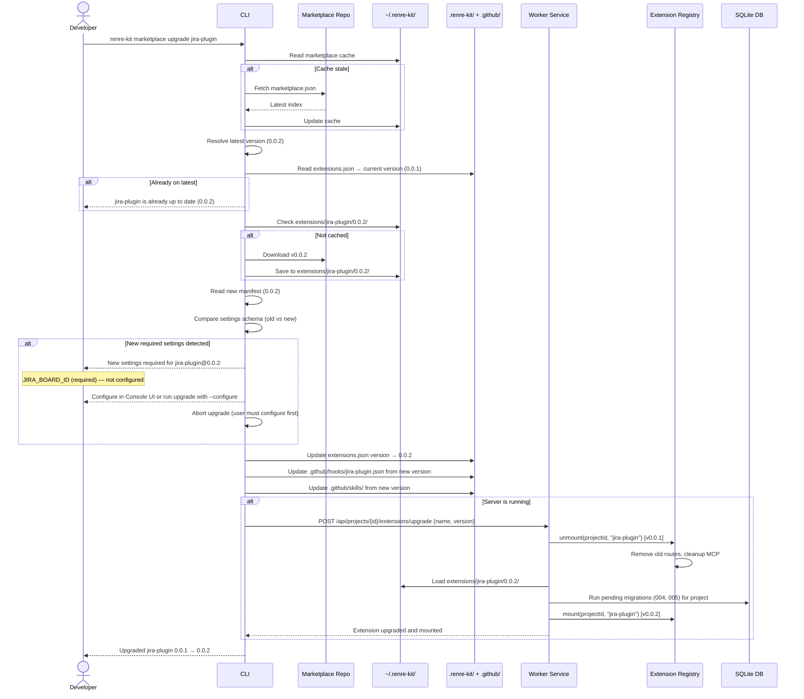

# ADR-016: Extension Upgrade Flow

## Status
Accepted

## Context
Extension authors publish new versions. Users need to discover, review, and apply updates across their projects. The upgrade flow must handle new migrations, new settings requirements, hooks/skills updates, and multi-project version coexistence.

## Decision

### Dedicated Upgrade Command
```bash
# Upgrade single extension to latest
renre-kit marketplace upgrade jira-plugin

# Upgrade single extension to specific version
renre-kit marketplace upgrade jira-plugin@0.0.3

# Upgrade all extensions in current project to latest
renre-kit marketplace upgrade --all
```

### Auto-Check for Updates
On `renre-kit start`, the CLI silently checks the marketplace for newer versions of installed extensions (using cached marketplace index, refreshed if stale). If updates are available, it prints a notice:

```
Console running at localhost:42888

Updates available:
  jira-plugin      0.0.1 → 0.0.2
  figma-mcp        1.0.0 → 1.1.0
Run `renre-kit marketplace upgrade --all` to update.
```

This check is non-blocking — it doesn't delay server startup.

### Console UI Notifications
The Extension Manager page in the Console dashboard shows:
- Badge on sidebar "Extensions" item when updates are available
- Per-extension indicator: `installed: 0.0.1  latest: 0.0.2  [Upgrade]` button
- Upgrade button triggers the same flow as CLI upgrade

### Upgrade Flow (Single Extension)



### Upgrade All Flow
`renre-kit marketplace upgrade --all` iterates through all installed extensions:
1. Fetch latest marketplace index
2. Compare installed versions vs latest
3. Skip up-to-date extensions
4. For each outdated extension, run single upgrade flow
5. If any extension has new required settings → skip it, report at the end
6. Summary output:

```
Upgraded 2 of 3 extensions:
  ✓ jira-plugin      0.0.1 → 0.0.2
  ✓ figma-mcp        1.0.0 → 1.1.0
  ⚠ vault-connect    0.5.0 → 0.6.0  (new settings required — configure in Console)
```

### Extension Author Side — Publishing Updates

**Manual flow (v1):**
1. Author pushes new version tag to their extension repo
2. Author submits PR to marketplace repo updating `marketplace.json` version field
3. PR merged → marketplace index reflects new version

**Future (automated):**
- Extension repos can have a GitHub Action that auto-submits a PR to marketplace repo on new release tag
- Marketplace repo CI validates the extension manifest before merge

### Migration Compatibility
Migrations are cumulative and version-independent:
- v0.0.1 ships migrations: 001, 002, 003
- v0.0.2 ships migrations: 001, 002, 003, 004, 005
- On upgrade: `_migrations` table shows 001-003 applied → only 004, 005 run
- Migrations never change between versions — only new ones are added
- If an author needs to modify an existing migration, they must add a new corrective migration

### Settings Schema Evolution
When a new version adds settings:
- **New optional setting** → upgrade proceeds, default value used
- **New required setting** → upgrade blocked until user configures it
- **Removed setting** → old value ignored, cleaned up from extensions.json
- **Changed type** → treated as new required setting (user must reconfigure)

### Pre-Migration Backup

Before running any migrations during an upgrade, the worker service creates a backup of `data.db`:

```
~/.renre-kit/backups/data-{timestamp}-pre-{extension}-{oldVersion}-to-{newVersion}.db
```

**Rules:**
1. Backup is a `fs.copyFileSync()` of the main DB file (fast, atomic for reads since WAL mode checkpoints first)
2. Before copying, the worker runs `PRAGMA wal_checkpoint(TRUNCATE)` to ensure the WAL is flushed to the main DB file
3. If the backup fails (e.g., disk full), the upgrade is aborted before migrations run
4. Backups older than 30 days are automatically cleaned up on server start
5. Maximum 10 backups retained — oldest are pruned first

**Restore procedure:**
```bash
# List available backups
ls ~/.renre-kit/backups/

# Restore (requires server to be stopped)
renre-kit stop
cp ~/.renre-kit/backups/data-20260308-pre-jira-0.0.1-to-0.0.2.db ~/.renre-kit/data.db
renre-kit start
```

### Rollback

If a migration fails during upgrade, the worker:
1. Runs `down.sql` for any migrations that succeeded in this upgrade batch (reverse order)
2. Restores the previous extension version in `extensions.json`
3. Remounts the old version
4. Reports the failure with the specific migration that failed and the error message

If `down.sql` rollback also fails, the worker:
1. Logs the critical error
2. Leaves the pre-migration backup intact (see above)
3. Marks the extension as `status: "failed"` — routes return `503`
4. Reports: `"Migration rollback failed. Restore from backup: ~/.renre-kit/backups/data-{timestamp}...db"`

**Manual downgrade:**
```bash
# Downgrade by installing the old version explicitly
renre-kit marketplace add jira-plugin@0.0.1
```
This unmounts v0.0.2, skips already-applied migrations (001-003), and remounts v0.0.1.

**Note:** Manual downgrade does NOT automatically run `down` migrations. Use `renre-kit marketplace remove --purge` + re-install for a clean slate, or restore from the pre-migration backup.

## Consequences

### Positive
- Dedicated `upgrade` command is explicit and safe
- `--all` enables quick batch updates
- Auto-check on start keeps users informed without being intrusive
- Console UI badge makes updates discoverable for non-CLI users
- New required settings block upgrade — prevents broken extensions
- Migration compatibility is simple (append-only)

### Negative
- Manual marketplace.json update is a friction point for extension authors
- Downgrade doesn't automatically run `down` migrations (data may be orphaned)
- Pre-migration backups consume disk space

### Mitigations
- Automatic rollback on migration failure (runs `down.sql` in reverse order)
- Pre-migration backup provides recovery path even when rollback fails
- Backup retention policy (30 days, max 10) limits disk usage
- Future: GitHub Action template for auto-publishing to marketplace
- Migration append-only convention prevents most rollback issues
- `marketplace remove --purge` + `marketplace add@old-version` is the clean-slate escape hatch
