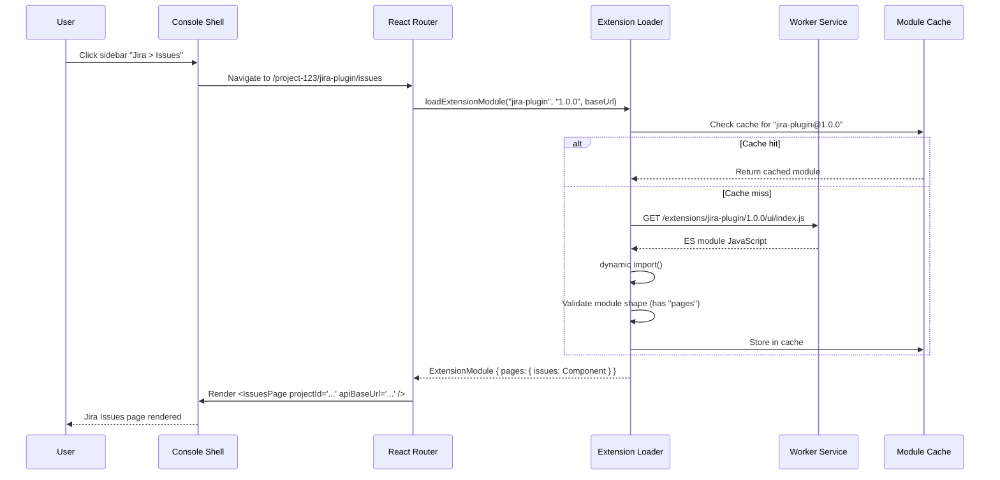

# ADR-022: Console UI Tech Stack & Dynamic Extension Loading

## Status
Accepted

## Context
The Console UI is a React SPA served by the worker service. We need to formalize the tech stack, routing strategy, state management, component library, and how extension UI bundles are dynamically loaded at runtime.

## Decision

### Tech Stack

| Layer | Choice | Rationale |
|-------|--------|-----------|
| **Framework** | React 19 | Standard, extension authors know it |
| **Build** | Vite | Fast dev server, optimized builds, used by extension SDK template |
| **Router** | React Router v7 | File-based routing, nested layouts, loader patterns |
| **State** | Zustand | Lightweight, no boilerplate, works outside React components |
| **UI Components** | shadcn/ui | Copy-paste components, Tailwind-based, fully customizable |
| **Styling** | Tailwind CSS | Utility-first, consistent with shadcn/ui |
| **Icons** | Lucide React | Used by shadcn/ui, comprehensive icon set |

### Application Structure

```
packages/console-ui/
  src/
    main.tsx                          # React entry point
    App.tsx                           # Root layout — toolbar, sidebar, content area
    routes/
      index.tsx                       # Dashboard (home)
      vault.tsx                       # Vault page (global secrets)
      extensions.tsx                  # Extension manager
      logs.tsx                        # Log viewer
      settings.tsx                    # Global settings
      [projectId]/
        [extensionName]/
          [pageId].tsx                # Dynamic extension page loader
    components/
      layout/
        Toolbar.tsx                   # Project dropdown, Vault icon, notifications
        Sidebar.tsx                   # Dynamic sidebar from extension manifests
        ContentArea.tsx               # Main content with error boundary
      ui/                            # shadcn/ui components (Button, Card, Input, etc.)
      extensions/
        ExtensionLoader.tsx           # Dynamic import + loading state
        ExtensionErrorBoundary.tsx    # Catches extension UI crashes
        ExtensionSettingsForm.tsx     # Auto-generated from settings.schema
    stores/
      project-store.ts               # Zustand — active project, project list
      extension-store.ts             # Zustand — mounted extensions, manifests
      vault-store.ts                 # Zustand — vault keys (no values)
      notification-store.ts          # Zustand — update badges, toasts
    api/
      client.ts                      # HTTP client to worker service
      hooks.ts                       # React Query or SWR hooks for data fetching
    lib/
      extension-loader.ts            # Core dynamic import logic
      utils.ts                       # cn() helper, formatters
```

### Zustand Stores

```typescript
// stores/project-store.ts
interface ProjectStore {
  activeProjectId: string | null;
  projects: ActiveProject[];
  setActiveProject: (id: string) => void;
  fetchProjects: () => Promise<void>;
}

// stores/extension-store.ts
interface ExtensionStore {
  extensions: Record<string, MountedExtension[]>; // keyed by projectId
  fetchExtensions: (projectId: string) => Promise<void>;
  getExtensionsForProject: (projectId: string) => MountedExtension[];
}

interface MountedExtension {
  name: string;
  displayName: string;
  version: string;
  ui?: {
    pages: { id: string; title: string; path: string; icon?: string }[];
    bundleUrl: string;
  };
}
```

### Dynamic Extension UI Loading

This is the core mechanism for loading extension UI bundles at runtime without rebuilding the Console.

#### How It Works

1. Extension UI is pre-built as an ES module bundle (`ui/index.js`) during extension development
2. Worker service serves extension assets at: `GET /extensions/{name}/{version}/ui/index.js`
3. Console shell uses dynamic `import()` to load the module at runtime
4. Loaded module exports `ExtensionModule` (pages map) per SDK contract (ADR-019)
5. Module is cached in memory after first load

#### Extension Loader Implementation

```typescript
// lib/extension-loader.ts
import type { ExtensionModule } from "@renre-kit/extension-sdk";

// In-memory cache of loaded extension modules
const moduleCache = new Map<string, ExtensionModule>();

export async function loadExtensionModule(
  extensionName: string,
  version: string,
  baseUrl: string
): Promise<ExtensionModule> {
  const cacheKey = `${extensionName}@${version}`;

  if (moduleCache.has(cacheKey)) {
    return moduleCache.get(cacheKey)!;
  }

  // Dynamic import from worker service static URL
  const bundleUrl = `${baseUrl}/extensions/${extensionName}/${version}/ui/index.js`;

  try {
    const module = await import(/* @vite-ignore */ bundleUrl);
    const extModule: ExtensionModule = module.default;

    // Validate the module shape
    if (!extModule.pages || typeof extModule.pages !== "object") {
      throw new Error(`Extension "${extensionName}" UI module missing "pages" export`);
    }

    moduleCache.set(cacheKey, extModule);
    return extModule;
  } catch (error) {
    throw new Error(
      `Failed to load UI for "${extensionName}@${version}": ${error}`
    );
  }
}

// Clear cache on extension upgrade/remount
export function invalidateExtensionModule(extensionName: string): void {
  for (const key of moduleCache.keys()) {
    if (key.startsWith(`${extensionName}@`)) {
      moduleCache.delete(key);
    }
  }
}
```

#### Extension Page Component (Route Handler)

```tsx
// routes/[projectId]/[extensionName]/[pageId].tsx
import { useParams } from "react-router-dom";
import { Suspense, lazy, useMemo } from "react";
import { useProjectStore } from "../../../stores/project-store";
import { useExtensionStore } from "../../../stores/extension-store";
import { loadExtensionModule } from "../../../lib/extension-loader";
import { ExtensionErrorBoundary } from "../../../components/extensions/ExtensionErrorBoundary";
import { Skeleton } from "../../../components/ui/skeleton";

export default function ExtensionPage() {
  const { projectId, extensionName, pageId } = useParams();
  const workerPort = useProjectStore((s) => s.workerPort);

  const PageComponent = useMemo(
    () =>
      lazy(async () => {
        const ext = useExtensionStore.getState()
          .getExtensionsForProject(projectId!);
        const manifest = ext.find((e) => e.name === extensionName);

        if (!manifest) throw new Error(`Extension "${extensionName}" not found`);

        const module = await loadExtensionModule(
          extensionName!,
          manifest.version,
          `http://localhost:${workerPort}`
        );

        const page = module.pages[pageId!];
        if (!page) throw new Error(`Page "${pageId}" not found in "${extensionName}"`);

        return { default: page };
      }),
    [projectId, extensionName, pageId, workerPort]
  );

  return (
    <ExtensionErrorBoundary extensionName={extensionName!}>
      <Suspense fallback={<Skeleton className="w-full h-96" />}>
        <PageComponent
          projectId={projectId!}
          extensionName={extensionName!}
          apiBaseUrl={`http://localhost:${workerPort}/api/${projectId}/${extensionName}`}
        />
      </Suspense>
    </ExtensionErrorBoundary>
  );
}
```

#### Worker Service — Static Asset Serving

```typescript
// worker-service: serves extension UI bundles
import express from "express";
import path from "path";
import { GLOBAL_EXTENSIONS_DIR } from "./paths";

// Serve extension UI assets
// GET /extensions/{name}/{version}/ui/*
app.use(
  "/extensions",
  express.static(GLOBAL_EXTENSIONS_DIR, {
    setHeaders: (res) => {
      // Allow dynamic import from Console origin
      res.setHeader("Access-Control-Allow-Origin", "*");
      // Cache pre-built bundles aggressively (version in URL = immutable)
      res.setHeader("Cache-Control", "public, max-age=31536000, immutable");
    },
  })
);
```

#### Loading Flow Diagram



### React Shared Dependencies

Extension UI bundles must externalize React — the Console shell provides it globally:

```typescript
// Console shell — expose React globally for extensions
// vite.config.ts
export default defineConfig({
  // ... other config
  define: {
    // React is available globally for dynamically imported extensions
  },
  optimizeDeps: {
    include: ["react", "react-dom"],
  },
});
```

Extensions build with React externalized (see ADR-019 Vite config). At runtime, the Console shell's React instance is shared.

### Routing Structure

```
/                                    → Dashboard
/vault                               → Vault page (global)
/extensions                          → Extension manager
/logs                                → Log viewer
/settings                            → Global settings
/:projectId/:extensionName/:pageId   → Extension page (dynamic)
```

The sidebar is generated from the active project's extension manifests. Each extension's pages become nested routes under the project + extension namespace.

## Consequences

### Positive
- Vite + React is a familiar, fast development stack
- Zustand is minimal — no Redux boilerplate, works with dynamic extensions
- shadcn/ui provides polished, accessible components out of the box
- Dynamic `import()` is native browser feature — no custom module loader needed
- Extension UI bundles are cached aggressively (version in URL = immutable content)
- Error boundaries isolate extension UI crashes from the shell

### Negative
- Extensions must use React (no Vue/Svelte/vanilla)
- Shared React version coupling between shell and extensions
- Dynamic import requires CORS headers on worker service
- shadcn/ui adds Tailwind dependency

### Mitigations
- React is the most common framework — widest extension author pool
- React version pinned in extension-sdk peer dependency
- CORS is local-only (localhost) — minimal security concern
- Tailwind is build-time only — no runtime cost
