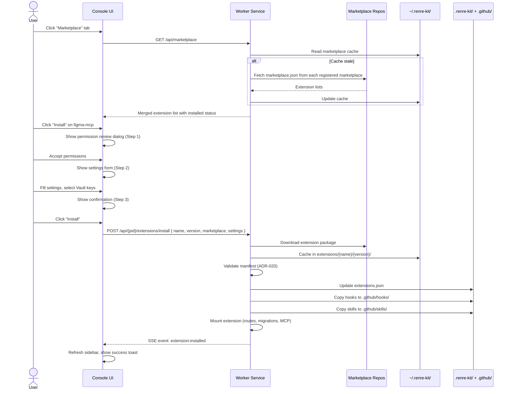

# ADR-025: Console Marketplace UI — Install & Configure Extensions from Console

## Status
Accepted

## Context
Currently, extension installation is CLI-only (`renre-kit marketplace add`). Users should be able to browse, install, configure, and manage extensions directly from the Console UI without leaving the browser. This is especially important for business users who may not be comfortable with CLI.

## Decision

### Marketplace UI as Core Console Page
The Extension Manager page (`/extensions`) becomes a full marketplace experience — browse, install, configure, remove, and upgrade extensions from the Console.

### Page Sections

#### 1. Installed Extensions Tab

Shows extensions installed in the active project with management actions.

```
┌─ Extension Manager ─────────────────────────────────────┐
│                                                         │
│  [Installed (3)]  [Marketplace]                         │
│                                                         │
│  ┌───────────────────────────────────────────────────┐  │
│  │  Jira Plugin                         v1.0.0       │  │
│  │  Jira integration for AI agents                   │  │
│  │  ✓ Healthy  │  MCP: none  │  Source: official     │  │
│  │                                                   │  │
│  │  [Settings]  [Disable]  [Remove]  [⬆ Update 1.1] │  │
│  └───────────────────────────────────────────────────┘  │
│                                                         │
│  ┌───────────────────────────────────────────────────┐  │
│  │  GitHub MCP                          v0.5.0       │  │
│  │  GitHub tools via MCP (stdio)                     │  │
│  │  ✓ Healthy  │  MCP: stdio (connected)             │  │
│  │                                                   │  │
│  │  [Settings]  [Disable]  [Remove]                  │  │
│  └───────────────────────────────────────────────────┘  │
│                                                         │
│  ┌───────────────────────────────────────────────────┐  │
│  │  Slack Notify                        v0.2.0       │  │
│  │  Send notifications to Slack channels             │  │
│  │  ⓘ Needs setup — 2 required settings missing     │  │
│  │                                                   │  │
│  │  [Settings ⓘ]  [Disable]  [Remove]               │  │
│  └───────────────────────────────────────────────────┘  │
│                                                         │
└─────────────────────────────────────────────────────────┘
```

#### 2. Marketplace Tab

Browse and install extensions from registered marketplaces.

```
┌─ Extension Manager ─────────────────────────────────────┐
│                                                         │
│  [Installed (3)]  [Marketplace]                         │
│                                                         │
│  Search: [jira________________]  Marketplace: [All ▼]   │
│                                                         │
│  ┌───────────────────────────────────────────────────┐  │
│  │  Jira Plugin                         v2.1.0       │  │
│  │  official — Jira integration for AI agents        │  │
│  │  Tags: jira, project-management, mcp              │  │
│  │  Author: renre-kit  │  Tags: jira, project-mgmt   │  │
│  │                                                   │  │
│  │  Permissions:                                     │  │
│  │    Database, Network (atlassian.net), Hooks (2)    │  │
│  │                                                   │  │
│  │  [Installed ✓]                                    │  │
│  └───────────────────────────────────────────────────┘  │
│                                                         │
│  ┌───────────────────────────────────────────────────┐  │
│  │  Figma MCP                           v1.0.0       │  │
│  │  official — Figma design tools via MCP (SSE)      │  │
│  │  Tags: figma, design, mcp, sse                    │  │
│  │  Author: renre-kit  │  Tags: figma, design, mcp   │  │
│  │                                                   │  │
│  │  Permissions:                                     │  │
│  │    MCP (SSE), Vault (figma_token)                 │  │
│  │                                                   │  │
│  │  [Install]                                        │  │
│  └───────────────────────────────────────────────────┘  │
│                                                         │
│  ┌───────────────────────────────────────────────────┐  │
│  │  DB Explorer                         v0.3.0       │  │
│  │  company-internal — Database query tool           │  │
│  │  Tags: database, sql, internal                    │  │
│  │                                                   │  │
│  │  Permissions:                                     │  │
│  │    Database, Network (*.internal.corp)             │  │
│  │                                                   │  │
│  │  [Install]                                        │  │
│  └───────────────────────────────────────────────────┘  │
│                                                         │
└─────────────────────────────────────────────────────────┘
```

#### 3. Install Flow (Modal/Dialog)

When user clicks **[Install]**, a dialog guides them through permissions and initial setup:

```
┌─ Install Figma MCP v1.0.0 ──────────────────────────┐
│                                                      │
│  Step 1 of 3 — Review Permissions                    │
│  ━━━━━━━━━━━━━━━━━━━━━━━━━━━━━━━━━━━━━━━━━━━━━━━━━  │
│                                                      │
│  This extension requests:                            │
│                                                      │
│    ✓ MCP Server (SSE)                                │
│      Connects to: https://figma-mcp.example.com/sse  │
│                                                      │
│    ✓ Vault Secrets                                   │
│      Needs: FIGMA_TOKEN                              │
│                                                      │
│                          [Cancel]  [Accept & Next →]  │
└──────────────────────────────────────────────────────┘

┌─ Install Figma MCP v1.0.0 ──────────────────────────┐
│                                                      │
│  Step 2 of 3 — Configure Settings                    │
│  ━━━━━━━━━━━━━━━━━━━━━━━━━━━━━━━━━━━━━━━━━━━━━━━━━  │
│                                                      │
│  FIGMA_TOKEN *                                       │
│  Select from Vault: [figma_token ▼] [+ Create new]   │
│                                                      │
│  FIGMA_TEAM_ID                                       │
│  [________________________] (optional)                │
│                                                      │
│                            [← Back]  [Next →]         │
└──────────────────────────────────────────────────────┘

┌─ Install Figma MCP v1.0.0 ──────────────────────────┐
│                                                      │
│  Step 3 of 3 — Confirm                               │
│  ━━━━━━━━━━━━━━━━━━━━━━━━━━━━━━━━━━━━━━━━━━━━━━━━━  │
│                                                      │
│  Ready to install:                                   │
│                                                      │
│    Extension:   Figma MCP v1.0.0                     │
│    Source:      official marketplace                  │
│    MCP:         SSE → figma-mcp.example.com          │
│    Vault:       FIGMA_TOKEN → figma_token            │
│                                                      │
│  This will:                                          │
│    • Mount extension routes in worker service        │
│    • Connect to MCP server                           │
│    • Add hooks to .github/hooks/                     │
│    • Add skills to .github/skills/                   │
│                                                      │
│                           [← Back]  [Install →]       │
└──────────────────────────────────────────────────────┘
```

#### 4. Extension Settings Page

Accessed via **[Settings]** button or sidebar ⓘ icon. Auto-generated from `settings.schema` in manifest.

```
┌─ Jira Plugin — Settings ────────────────────────────┐
│                                                      │
│  JIRA_BASE_URL *                                     │
│  [https://mycompany.atlassian.net___________]        │
│                                                      │
│  JIRA_API_TOKEN *                                    │
│  Vault key: [jira_token ▼]  [+ Create new]          │
│                                                      │
│  JIRA_DEFAULT_PROJECT                                │
│  [PROJ________________________] (optional)           │
│                                                      │
│  JIRA_MAX_RESULTS                                    │
│  [50_____] (default: 50)                             │
│                                                      │
│  ⚠ Saving will remount the extension (~1-3 sec)     │
│                                                      │
│                              [Cancel]  [Save]         │
│                                                      │
│  ┌─ Permissions ─────────────────────────────────┐   │
│  │  ✓ Database                                   │   │
│  │  ✓ Network: https://api.atlassian.net/*       │   │
│  │  ✓ Hooks: sessionStart, userPromptSubmitted   │   │
│  │  ✓ Vault: JIRA_API_TOKEN, JIRA_BASE_URL      │   │
│  └───────────────────────────────────────────────┘   │
│                                                      │
│  Extension info:                                     │
│  Version: 1.0.0  │  Source: official  │  Author: x   │
│  Installed: 2026-03-07                               │
│                                                      │
└──────────────────────────────────────────────────────┘
```

#### 5. Vault Key Picker (Inline Component)

When a setting has `type: "vault"`, the input shows a Vault key picker:

```
┌─ Select Vault Key ──────────────────────┐
│                                          │
│  Existing keys:                          │
│    ● jira_token                          │
│    ○ github_token                        │
│    ○ slack_webhook                       │
│                                          │
│  ─────────────────────────────────────   │
│  [+ Create new secret]                   │
│    Key:   [new_key_name_______]          │
│    Value: [••••••••••••••_____]          │
│    [Save to Vault & Select]              │
│                                          │
└──────────────────────────────────────────┘
```

### Internal API Endpoints (for Marketplace UI)

| Endpoint | Method | Description |
|----------|--------|-------------|
| `GET /api/marketplace` | GET | Fetch merged extension list from all registered marketplaces |
| `GET /api/marketplace/search?q=jira` | GET | Search across all marketplaces |
| `POST /api/{pid}/extensions/install` | POST | Install extension `{ name, version, marketplace, settings }` |
| `DELETE /api/{pid}/extensions/{name}` | DELETE | Remove extension from project |
| `POST /api/{pid}/extensions/{name}/upgrade` | POST | Upgrade extension `{ version }` |
| `GET /api/{pid}/extensions/{name}/settings` | GET | Get extension settings + schema |
| `PUT /api/{pid}/extensions/{name}/settings` | PUT | Save extension settings (triggers remount) |
| `GET /api/vault/keys` | GET | List Vault keys (for picker dropdown) |
| `POST /api/vault/secrets` | POST | Create new Vault secret (inline from picker) |

### Marketplace Data Flow



## Consequences

### Positive
- Full extension lifecycle from browser — no CLI required for installation
- Step-by-step install dialog prevents misconfiguration
- Settings page with Vault picker makes secret management intuitive
- Inline "Create new secret" avoids context-switching to Vault page
- Marketplace search across all registered marketplaces
- ⓘ indicators guide users to complete setup
- Business users can manage extensions without terminal access

### Negative
- Duplicates some CLI functionality (install, remove, upgrade)
- Worker service needs marketplace fetch capability (previously CLI-only)
- Install dialog has multiple steps — could feel slow for power users

### Mitigations
- CLI remains the primary tool for developers and AI agents — Console is complementary
- Worker marketplace fetch reuses same logic as CLI (shared service code)
- Power users can skip steps with keyboard shortcuts (Enter to accept defaults)
- One-click install for extensions with no required settings (skip Step 2)
