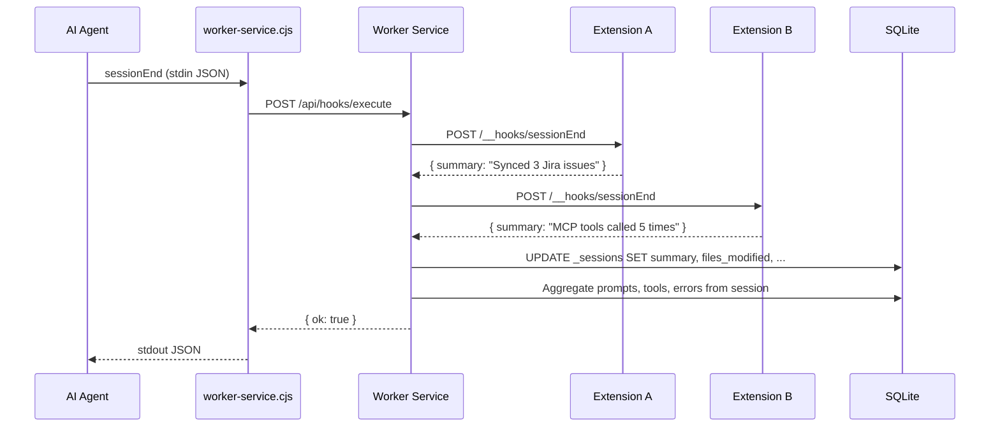
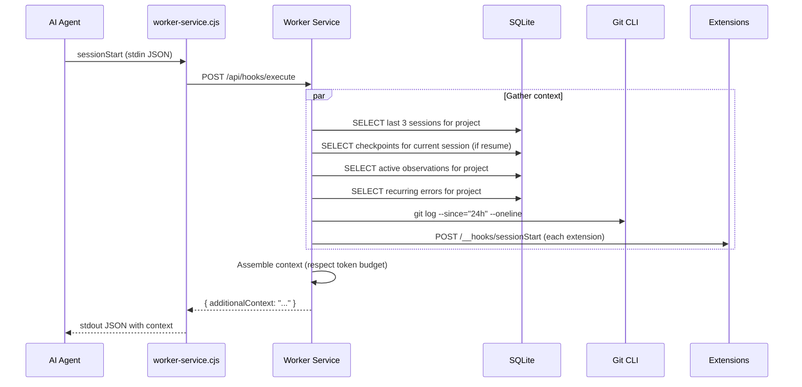
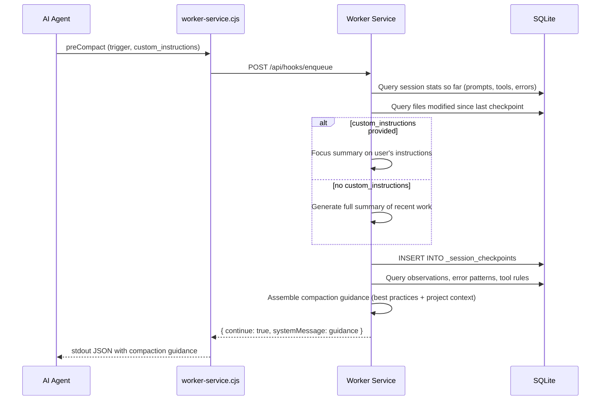
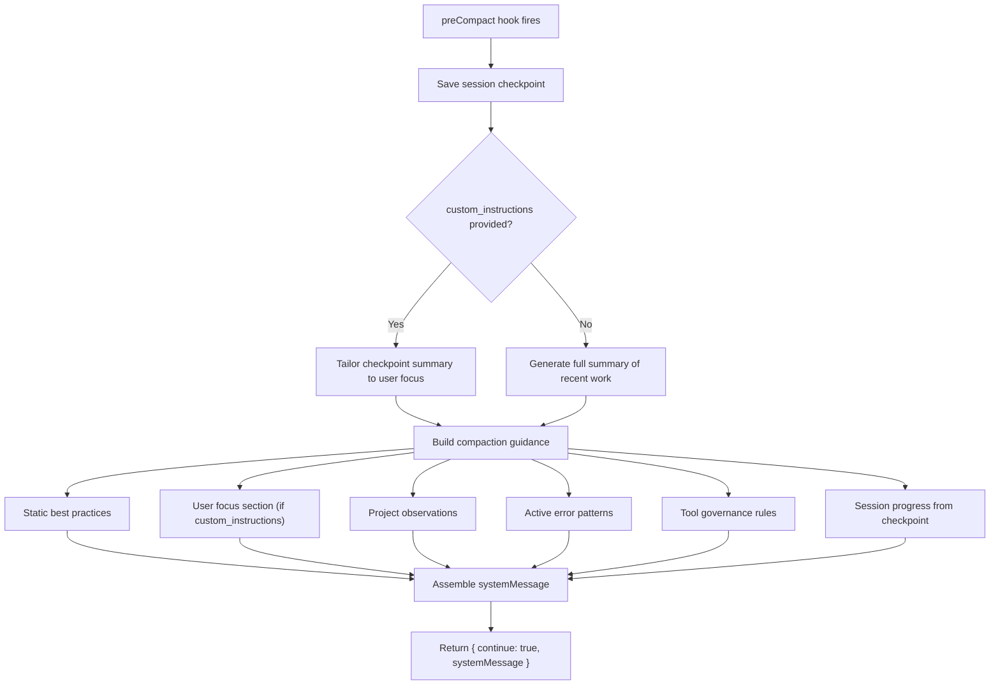

# ADR-027: Session Memory & Context Continuity

## Status
Accepted

## Context
AI coding agents suffer from **context amnesia** — every new session starts cold with zero knowledge of previous work. Developers waste time re-explaining project state, recent changes, and past decisions. RenRe Kit sits between the agent and the codebase via hooks, making it the ideal place to capture and replay session context.

## Decision

### Core Feature: Session Memory
RenRe Kit captures structured session summaries on `sessionEnd` and injects relevant context on `sessionStart`. This creates **continuity across sessions** without requiring the AI agent to have built-in memory.

### Data Model

```sql
-- Session records (extends existing sessions table)
CREATE TABLE _sessions (
  id TEXT PRIMARY KEY,
  project_id TEXT NOT NULL,
  agent TEXT NOT NULL,              -- copilot, claude-code, cursor
  started_at TEXT NOT NULL,
  ended_at TEXT,
  status TEXT DEFAULT 'active',     -- active, ended, error
  reason TEXT,                      -- complete, error, abort, timeout, user_exit

  -- Session memory fields
  summary TEXT,                     -- AI-generated or aggregated summary
  files_modified TEXT,              -- JSON array of file paths
  decisions TEXT,                   -- JSON array of key decisions made
  tools_used_count INTEGER DEFAULT 0,
  errors_count INTEGER DEFAULT 0,
  prompts_count INTEGER DEFAULT 0,

  -- Context that was injected at start
  context_injected TEXT,            -- JSON: what context was provided

  FOREIGN KEY (project_id) REFERENCES _projects(id)
);

CREATE INDEX idx_sessions_project ON _sessions(project_id, started_at DESC);
```

### Session End — Capture

On `sessionEnd` / `Stop` hook, the worker service:

1. Receives session end payload (reason, transcript path if available)
2. Queries extensions for session observations (via `/__hooks/sessionEnd`)
3. Aggregates data collected during the session (prompts, tool usage, errors)
4. Generates a structured summary
5. Persists to `_sessions` table



### Session Start — Inject

On `sessionStart` hook, the worker service:

1. Resolves project from cwd
2. Queries last N sessions for this project (configurable, default 3)
3. **Queries checkpoints for current session** (if `source: "resume"` — post-compaction)
4. Queries active observations (ADR-028)
5. Queries recent git activity (last 24h commits)
6. Queries known recurring errors (ADR-031)
7. Asks extensions for context contributions
8. Assembles context payload respecting token budget
9. Returns as `additionalContext` in hook output



### Injected Context Format

```
## Session Context (from RenRe Kit)

### Current Session Progress (checkpoint)
> Included when source is "resume" (after compaction) and checkpoints exist.

- **15 min ago** (before compaction): Fixed auth.ts validation bug,
  updated 3 test files. 5 prompts, 18 tools used, 1 error resolved.
  Files modified: auth.ts, auth.test.ts, utils.ts
- **45 min ago** (before compaction): Started work on login flow refactor.
  3 prompts, 12 tools used. Files modified: auth.ts, login.tsx

### Previous Sessions
- **2h ago** (Copilot, 45min): Fixed login bug in auth.ts, added null check to validateToken.
  2 files modified. All tests passing.
- **Yesterday** (Claude Code, 1h20m): Implemented user profile API endpoints.
  Created /api/users/:id route. Migration 003 applied. PROJ-456 marked done.

### Recent Changes (git, last 24h)
- abc1234 Fix: null check in validateToken (auth.ts)
- def5678 Feat: user profile API endpoints

### Active Observations (5)
- Project uses pnpm (not npm)
- Tests must pass before committing (CI rejects)
- Auth tokens expire after 1h, use refresh flow
- API base URL differs per environment (.env.local)
- React 19 with strict mode enabled

### Known Issues
- FLAKY: test "user login timeout" fails intermittently (seen 3 times)

### Extension Context
- jira-plugin: 2 open issues assigned (PROJ-789, PROJ-790)
- github-mcp: PR #42 has 1 pending review
```

**Checkpoint injection logic:**
- On `source: "resume"` — include all checkpoints for the current session (most recent first)
- On `source: "new"` or `source: "startup"` — skip checkpoints (new session, no prior compaction)
- Checkpoints appear **above** previous sessions in the injected context — they're more relevant (current session work > past sessions)

### Pre-Compact — Mid-Session Checkpoint

On `preCompact` hook, the worker service creates a **session checkpoint** — a snapshot of progress before the AI agent compacts its context window. This prevents loss of session state during long sessions.



**Checkpoint data model:**

```sql
CREATE TABLE _session_checkpoints (
  id TEXT PRIMARY KEY,
  session_id TEXT NOT NULL,
  project_id TEXT NOT NULL,
  created_at TEXT NOT NULL,
  trigger TEXT NOT NULL,           -- 'auto' or 'manual'
  custom_instructions TEXT,        -- User's compaction focus (if manual, e.g. "Focus on auth changes")

  -- Snapshot at checkpoint time
  summary TEXT,                    -- Compact summary of work since last checkpoint
  prompts_count INTEGER,
  tools_count INTEGER,
  errors_count INTEGER,
  files_modified TEXT,             -- JSON array

  FOREIGN KEY (session_id) REFERENCES _sessions(id),
  FOREIGN KEY (project_id) REFERENCES _projects(id)
);

CREATE INDEX idx_checkpoints_session ON _session_checkpoints(session_id, created_at);
```

**How checkpoints improve sessionStart context:**

When a session resumes after compaction (`source: "resume"`), the context recipe engine (ADR-035) includes checkpoint summaries above previous sessions — see "Injected Context Format" above.

### Pre-Compact — Compaction Guidance

Beyond saving checkpoints, the `preCompact` hook returns **compaction guidance** — best practices for what the agent should preserve when summarizing its context.

#### Using `custom_instructions` from Input

The `preCompact` input includes a `custom_instructions` field — user-provided focus instructions for manual compaction (e.g., "Focus on the authentication changes"). RenRe Kit reads this and:

1. **Tailors the checkpoint summary** — prioritizes files and decisions related to the user's focus area
2. **Weaves it into the guidance** — adds a "User Focus" section so the agent knows what the user cares about most
3. **Stores it in the checkpoint** — so sessionStart can reference the user's intent if the session resumes

When `custom_instructions` is empty (auto-compaction), RenRe Kit provides full general guidance.

#### Compaction Guidance Output

```json
{
  "continue": true,
  "systemMessage": "## Compaction Guidance (from RenRe Kit)\n\nWhen compacting this conversation, preserve the following:\n\n### User Focus\n> \"Focus on the authentication changes\"\nPrioritize retaining all context related to authentication.\n\n### Must Preserve\n- File paths and their current state (modified, created, deleted)\n- Key decisions made and their rationale\n- Active task/goal and current progress\n- Error patterns encountered and their resolutions\n- Test results (passing/failing) and what was tested\n\n### Should Preserve\n- Specific code changes (function names, line ranges)\n- Dependencies installed or removed\n- Git operations performed (commits, branches)\n- Extension context (Jira issues, PR references)\n\n### Safe to Discard\n- Intermediate file reads that led to the final edit\n- Exploratory searches that didn't yield results\n- Verbose tool output (full test logs, large diffs)\n- Repeated attempts at the same operation\n\n### Project-Specific Notes\n- Observations: \"Project uses pnpm\", \"Auth tokens expire after 1h\"\n- Active error patterns: ECONNREFUSED on port 5432 (seen 5x)\n- Tool governance: rm -rf is denied, git push requires confirmation\n\n### Session Progress (checkpoint saved)\n- Files modified: auth.ts, auth.test.ts, utils.ts\n- 5 prompts, 18 tools, 1 error resolved\n- Summary: Fixed auth.ts validation bug, updated 3 test files"
}
```

Note: The "User Focus" section is only included when `custom_instructions` is provided. For auto-compaction, guidance starts directly with "Must Preserve".

#### Guidance Assembly Flow



#### Dynamic Guidance Sources

The static best practices ("preserve file paths", "discard intermediate reads") are always included. RenRe Kit enriches them with **project-specific context** from the intelligence system:

| Source | Guidance Added | Condition |
|--------|---------------|-----------|
| `custom_instructions` | "User Focus: Focus on auth changes" | Only when user provides |
| Active observations | "Remember: project uses pnpm, not npm" | Always |
| Error patterns (3+ occurrences) | "Known issue: ECONNREFUSED on port 5432" | Always |
| Tool governance deny rules | "Note: rm -rf and force push are blocked" | Always |
| Session checkpoint | "Progress: fixed auth.ts, 3 tests updated" | Always |
| Files modified this session | "Key files: auth.ts, auth.test.ts, utils.ts" | Always |

This means the agent's compacted summary retains the most important project context — even if the original messages are discarded. When the user provides focus instructions, those topics get the highest preservation priority.

#### Configuration

```json
{
  "compactionGuidance": {
    "enabled": true,
    "includeUserFocus": true,
    "includeObservations": true,
    "includeErrorPatterns": true,
    "includeToolRules": true,
    "includeSessionProgress": true,
    "maxGuidanceTokens": 500
  }
}
```

### API Endpoints

| Endpoint | Method | Description |
|----------|--------|-------------|
| `GET /api/{pid}/sessions` | GET | List sessions (paginated, filterable) |
| `GET /api/{pid}/sessions/:id` | GET | Session detail with full summary |
| `GET /api/{pid}/sessions/context-preview` | GET | Preview what would be injected on next sessionStart |

### Configuration

Stored in project settings (`.renre-kit/extensions.json` or global config):

```json
{
  "sessionMemory": {
    "enabled": true,
    "maxPreviousSessions": 3,
    "includeGitHistory": true,
    "gitHistoryHours": 24,
    "includeObservations": true,
    "includeErrors": true,
    "maxContextTokens": 2000
  }
}
```

## Consequences

### Positive
- Every session starts with relevant context — no cold starts
- Cross-agent continuity (Copilot session context available to Claude Code next session)
- Extensions can contribute domain-specific context
- Developers can preview and tune what gets injected

### Negative
- Context injection adds to agent's context window (token cost)
- Stale summaries may mislead the agent
- Sensitive information could leak across sessions

### Mitigations
- Configurable token budget keeps context size bounded
- Sessions older than 7 days auto-archived (not injected)
- Vault secrets never included in session summaries
- Users can view/edit/delete session summaries from Console UI
