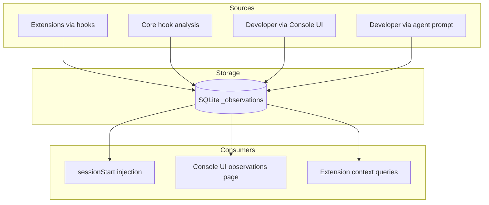
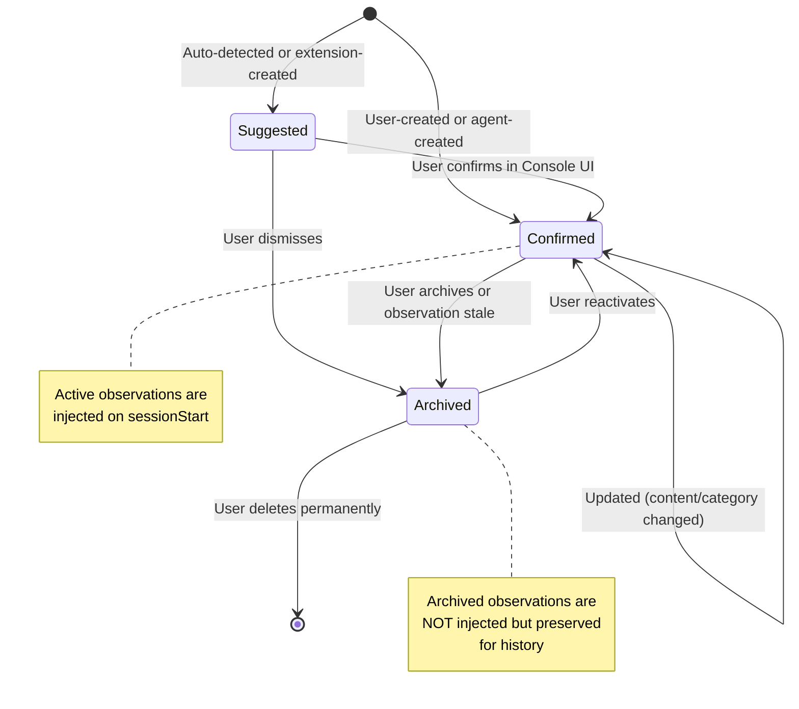

# ADR-028: Observations System — Cross-Session Learning

## Status
Accepted

## Context
During coding sessions, AI agents discover project patterns, preferences, and gotchas that are valuable for future sessions. Today this knowledge is lost when the session ends. RenRe Kit needs a system to capture, store, and replay these **observations** — persistent facts about the project that improve agent effectiveness over time.

## Decision

### Core Feature: Observations
Observations are short, factual statements about a project that persist across sessions. They represent accumulated knowledge — things worth remembering that make future agent interactions better.

### Observation Sources



### Data Model

```sql
CREATE TABLE _observations (
  id TEXT PRIMARY KEY,
  project_id TEXT NOT NULL,
  content TEXT NOT NULL,              -- The observation text
  source TEXT NOT NULL,               -- 'extension:jira-plugin', 'core:error-pattern', 'user', 'agent'
  category TEXT DEFAULT 'general',    -- general, tooling, architecture, testing, workflow, security
  confidence TEXT DEFAULT 'confirmed',-- confirmed, suggested, auto-detected

  created_at TEXT NOT NULL,
  updated_at TEXT,
  last_injected_at TEXT,              -- Last time this was included in sessionStart
  injection_count INTEGER DEFAULT 0,  -- How often it's been injected

  active INTEGER DEFAULT 1,           -- 0 = archived/dismissed

  FOREIGN KEY (project_id) REFERENCES _projects(id)
);

CREATE INDEX idx_obs_project ON _observations(project_id, active, category);
```

### How Observations Are Created

#### 1. Extensions via hooks
Extensions can return observations from any hook handler:

```typescript
// Extension hook handler
router.post("/__hooks/sessionEnd", (req, res) => {
  res.json({
    summary: "Synced Jira issues",
    observations: [
      {
        content: "Sprint deadline is Friday — prioritize PROJ-101",
        category: "workflow",
        confidence: "confirmed"
      }
    ]
  });
});
```

#### 2. Core auto-detection
The worker service detects patterns from hook data:

- **Error patterns**: "Test 'user login' has failed 3 times across sessions" → auto-observation
- **Tool patterns**: "Agent always runs `pnpm test` not `npm test`" → "Project uses pnpm"
- **File patterns**: "Agent frequently edits files in src/auth/" → "Auth module is actively developed"

#### 3. Developer via Console UI
Manual observation management:

```
┌─ Observations (12 active) ─────────────────────────────┐
│                                                          │
│  Search: [________________]  Category: [All ▼]           │
│                                                          │
│  ┌────────────────────────────────────────────────────┐  │
│  │ 🔧 Tooling                                         │  │
│  │ "Project uses pnpm, not npm"                       │  │
│  │ Source: auto-detected │ Injected 12 times           │  │
│  │                              [Edit] [Archive] [×]  │  │
│  ├────────────────────────────────────────────────────┤  │
│  │ 🏗 Architecture                                     │  │
│  │ "Auth tokens expire after 1h, use refresh flow"    │  │
│  │ Source: user │ Injected 8 times                     │  │
│  │                              [Edit] [Archive] [×]  │  │
│  ├────────────────────────────────────────────────────┤  │
│  │ 🧪 Testing                                         │  │
│  │ "Test 'user login timeout' is flaky — seen 3x"    │  │
│  │ Source: auto-detected │ Confidence: suggested       │  │
│  │                       [Confirm] [Edit] [Archive]   │  │
│  ├────────────────────────────────────────────────────┤  │
│  │ 📋 Workflow (from jira-plugin)                      │  │
│  │ "Sprint deadline is Friday — prioritize PROJ-101"  │  │
│  │ Source: extension:jira-plugin │ Injected 2 times    │  │
│  │                              [Edit] [Archive] [×]  │  │
│  └────────────────────────────────────────────────────┘  │
│                                                          │
│  [+ Add Observation]                                     │
│                                                          │
└──────────────────────────────────────────────────────────┘
```

#### 4. Developer via agent prompt
The agent can be instructed to save observations through the `userPromptSubmitted` hook:

```
User: "Remember that this project uses pnpm, not npm"
→ userPromptSubmitted hook detects "remember" pattern
→ Worker creates observation: "Project uses pnpm, not npm"
→ Injected in all future sessions
```

### Observation Lifecycle



### Injection Priority

When assembling context for `sessionStart`, observations are prioritized:

1. **Recently injected** — observations the agent has seen before (continuity)
2. **High confidence** — confirmed > suggested > auto-detected
3. **Recently created/updated** — newer observations first
4. **Category relevance** — match observation category to initial prompt if available
5. **Injection count** — frequently injected observations are likely important

If token budget is limited, lower-priority observations are omitted.

### API Endpoints

| Endpoint | Method | Description |
|----------|--------|-------------|
| `GET /api/{pid}/observations` | GET | List observations (filterable by category, active, source) |
| `POST /api/{pid}/observations` | POST | Create observation `{ content, category, confidence }` |
| `PUT /api/{pid}/observations/:id` | PUT | Update observation |
| `DELETE /api/{pid}/observations/:id` | DELETE | Permanently delete |
| `POST /api/{pid}/observations/:id/archive` | POST | Archive (soft delete) |
| `POST /api/{pid}/observations/:id/confirm` | POST | Promote suggested → confirmed |

### Extension Interface

Extensions contribute observations through the standard hook response:

```typescript
interface HookResponse {
  // ... existing fields
  observations?: Array<{
    content: string;
    category?: 'general' | 'tooling' | 'architecture' | 'testing' | 'workflow' | 'security';
    confidence?: 'confirmed' | 'suggested' | 'auto-detected';
  }>;
}
```

Worker deduplicates by content similarity before inserting.

## Consequences

### Positive
- Project knowledge accumulates over time — agents get smarter per-project
- Extensions can contribute domain-specific observations
- Auto-detection reduces manual effort
- Console UI gives full control over what the agent "knows"
- Cross-agent: observations from Copilot sessions benefit Claude Code sessions

### Negative
- Stale observations can mislead agents
- Auto-detection may create noise (false positives)
- Storage grows over time

### Mitigations
- Suggested observations require user confirmation (don't auto-inject unreviewed)
- Observations not injected for 30 days auto-archive
- Console UI makes review/cleanup easy
- Categories and search help manage large observation sets
