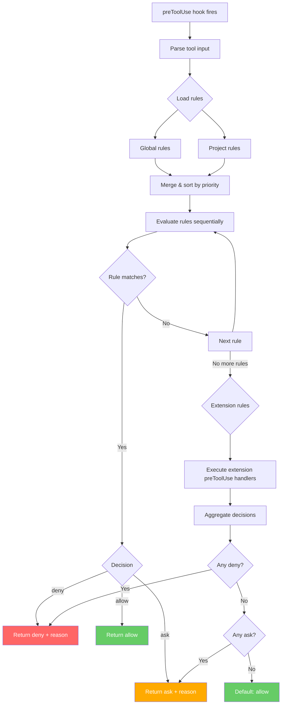

# ADR-029: Tool Governance — UI-Configurable preToolUse Rules

## Status
Accepted

## Context
AI agents can execute dangerous commands — `rm -rf`, `git push --force`, `DROP TABLE`, etc. The `preToolUse` hook allows denying these, but today this requires writing shell scripts. RenRe Kit should provide a **UI-driven rule engine** for tool governance — no scripting required, deterministic enforcement that cannot be bypassed by prompt injection.

## Decision

### Core Feature: Tool Governance Rules
A rule-based system evaluated on every `preToolUse` hook invocation. Rules are managed from Console UI and stored in SQLite. The worker service evaluates rules and returns allow/deny/ask decisions.

### Rule Data Model

```sql
CREATE TABLE _tool_rules (
  id TEXT PRIMARY KEY,
  project_id TEXT,                    -- NULL = global rule

  -- Matching
  tool_type TEXT DEFAULT '*',         -- bash, edit, view, create, * (all)
  pattern TEXT NOT NULL,              -- Regex pattern to match against command/args
  pattern_type TEXT DEFAULT 'regex',  -- regex, contains, exact, glob

  -- Decision
  decision TEXT NOT NULL,             -- deny, ask, allow
  reason TEXT,                        -- Shown to agent on deny, shown to user on ask

  -- Metadata
  name TEXT,                          -- Human-readable rule name
  enabled INTEGER DEFAULT 1,
  priority INTEGER DEFAULT 100,       -- Lower = evaluated first
  created_at TEXT NOT NULL,
  created_by TEXT DEFAULT 'user',     -- user, system (built-in defaults)

  hit_count INTEGER DEFAULT 0,        -- Times this rule matched
  last_hit_at TEXT                     -- Last time this rule matched
);

CREATE INDEX idx_rules_project ON _tool_rules(project_id, enabled, priority);
```

### Rule Evaluation Flow



### Decision Precedence

When multiple rules and extensions return decisions:

```
deny > ask > allow
```

If **any** rule or extension returns `deny`, the tool is denied. If none deny but any return `ask`, the user is prompted. Only if all return `allow` (or no rules match) does the tool execute freely.

### Built-in Default Rules

RenRe Kit ships with sensible defaults (created_by = 'system'):

| Rule | Tool | Pattern | Decision | Reason |
|------|------|---------|----------|--------|
| Block recursive force delete | bash | `rm\s+-rf\s+[/~]` | deny | Recursive force delete of root/home directories is not allowed |
| Block force push | bash | `git\s+push\s+.*--force` | deny | Force push can destroy remote history |
| Block DROP TABLE | bash | `DROP\s+TABLE` | deny | Direct database table drops are not allowed |
| Confirm git push | bash | `git\s+push` | ask | Confirm before pushing to remote |
| Confirm npm publish | bash | `npm\s+publish` | ask | Confirm before publishing package |
| Block env file display | bash | `cat\s+\.env` | deny | Prevent displaying environment secrets |
| Confirm destructive git | bash | `git\s+(reset\s+--hard\|checkout\s+--\s+\.\|clean\s+-f)` | ask | Destructive git operations require confirmation |

Users can disable or modify defaults from Console UI.

### Console UI — Rule Management

```
┌─ Tool Governance ──────────────────────────────────────────┐
│                                                             │
│  Scope: [Global ▼]  │  [Project: my-app]                   │
│                                                             │
│  ┌─ Rules (sorted by priority) ──────────────────────────┐  │
│  │                                                        │  │
│  │  P:10  ✗ DENY  [bash] rm -rf /                        │  │
│  │        "Recursive force delete of root is not allowed" │  │
│  │        System rule │ Hits: 2 │ Last: 2h ago            │  │
│  │                              [Edit] [Disable] [Delete] │  │
│  │  ──────────────────────────────────────────────────── │  │
│  │  P:20  ✗ DENY  [bash] git push.*--force               │  │
│  │        "Force push can destroy remote history"         │  │
│  │        System rule │ Hits: 0                           │  │
│  │                              [Edit] [Disable] [Delete] │  │
│  │  ──────────────────────────────────────────────────── │  │
│  │  P:50  ? ASK   [bash] git push                        │  │
│  │        "Confirm before pushing to remote"              │  │
│  │        System rule │ Hits: 5 │ Last: 30min ago         │  │
│  │                              [Edit] [Disable] [Delete] │  │
│  │  ──────────────────────────────────────────────────── │  │
│  │  P:100 ✓ ALLOW [bash] pnpm test                       │  │
│  │        "Always allow running tests"                    │  │
│  │        User rule │ Hits: 23                            │  │
│  │                              [Edit] [Disable] [Delete] │  │
│  └────────────────────────────────────────────────────────┘  │
│                                                             │
│  [+ Add Rule]                                               │
│                                                             │
│  ┌─ Audit Log (last 20 decisions) ───────────────────────┐  │
│  │                                                        │  │
│  │  14:23  DENIED  rm -rf node_modules/ tmp/              │  │
│  │         Rule: "Block recursive force delete"           │  │
│  │         Agent: copilot │ Session: session-abc           │  │
│  │                                                        │  │
│  │  14:10  ASKED   git push origin main                   │  │
│  │         Rule: "Confirm git push" → User: APPROVED      │  │
│  │         Agent: copilot │ Session: session-abc           │  │
│  │                                                        │  │
│  │  14:05  ALLOWED pnpm test                              │  │
│  │         Rule: "Always allow tests"                     │  │
│  │         Agent: copilot │ Session: session-abc           │  │
│  │                                                        │  │
│  └────────────────────────────────────────────────────────┘  │
│                                                             │
└─────────────────────────────────────────────────────────────┘
```

### Add Rule Dialog

```
┌─ Add Tool Governance Rule ──────────────────────────┐
│                                                      │
│  Name:     [Block production deploys__________]      │
│                                                      │
│  Tool:     [bash ▼]  (bash, edit, view, create, *)   │
│                                                      │
│  Pattern:  [deploy.*production________________]      │
│  Type:     (●) Regex  ( ) Contains  ( ) Glob         │
│                                                      │
│  Decision: ( ) Allow  (●) Deny  ( ) Ask              │
│                                                      │
│  Reason:   [Production deploys must go through CI__] │
│                                                      │
│  Priority: [50____] (lower = evaluated first)        │
│                                                      │
│  Scope:    (●) Global  ( ) This project only         │
│                                                      │
│  Preview matches:                                    │
│    ✓ "deploy --env production" → DENY                │
│    ✓ "bash deploy-production.sh" → DENY              │
│    ✗ "deploy --env staging" → no match               │
│                                                      │
│                        [Cancel]  [Save Rule]          │
└──────────────────────────────────────────────────────┘
```

### Audit Log Data Model

```sql
CREATE TABLE _tool_audit (
  id TEXT PRIMARY KEY,
  project_id TEXT NOT NULL,
  session_id TEXT,
  agent TEXT,
  timestamp TEXT NOT NULL,

  tool_name TEXT NOT NULL,            -- bash, edit, view, create
  tool_args TEXT,                     -- Full tool arguments (JSON)
  command_preview TEXT,               -- Short preview for display

  decision TEXT NOT NULL,             -- allow, deny, ask
  decided_by TEXT,                    -- rule:{id}, extension:{name}, default
  rule_name TEXT,                     -- Human-readable rule name if rule-based
  user_override TEXT,                 -- If 'ask': approved, denied (user's choice)

  FOREIGN KEY (project_id) REFERENCES _projects(id)
);

CREATE INDEX idx_audit_project ON _tool_audit(project_id, timestamp DESC);
```

### API Endpoints

| Endpoint | Method | Description |
|----------|--------|-------------|
| `GET /api/tool-rules` | GET | List global rules |
| `GET /api/{pid}/tool-rules` | GET | List project + global rules (merged) |
| `POST /api/tool-rules` | POST | Create rule `{ pattern, decision, ... }` |
| `PUT /api/tool-rules/:id` | PUT | Update rule |
| `DELETE /api/tool-rules/:id` | DELETE | Delete rule |
| `POST /api/tool-rules/:id/toggle` | POST | Enable/disable rule |
| `GET /api/{pid}/tool-audit` | GET | Audit log (paginated) |
| `POST /api/tool-rules/test` | POST | Test pattern against sample input |

## Consequences

### Positive
- Security policies enforced deterministically — can't be bypassed by prompt injection
- No scripting required — full GUI management
- Built-in defaults provide immediate value
- Audit trail for compliance and debugging
- Extensions can layer additional rules via `preToolUse` hooks
- Rule hit counters help identify which rules matter

### Negative
- Overly broad regex patterns may block legitimate commands
- "Ask" decisions interrupt agent flow (by design)
- Rule evaluation adds latency to every tool call

### Mitigations
- Pattern preview in rule editor shows what would match/not match
- Priority system ensures specific rules override broad ones
- Allow rules can whitelist known-safe commands (skip further evaluation)
- Rule evaluation is in-memory (sub-millisecond for typical rule sets)
- Disabled rules are skipped, not deleted — easy to toggle
