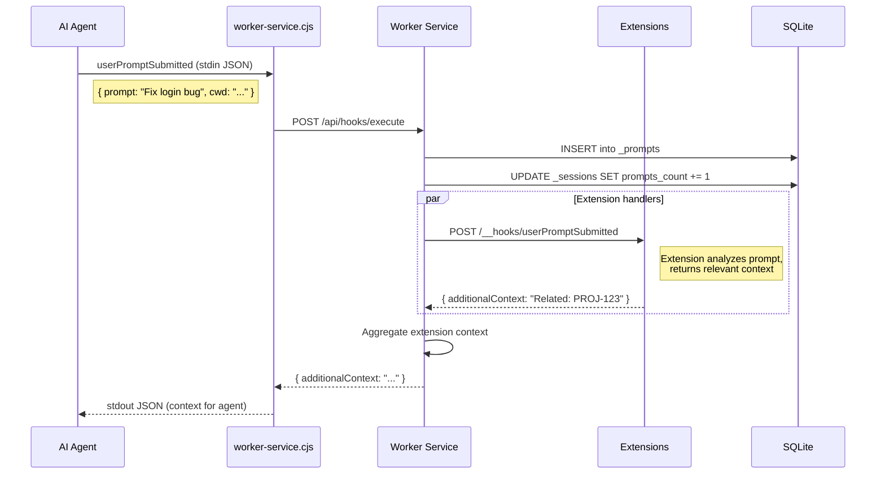

# ADR-030: Prompt Journal — User Prompt Tracking & Analytics

## Status
Accepted

## Context
Every prompt a developer sends to an AI agent is a signal — it reveals intent, recurring tasks, pain points, and workflow patterns. Today these prompts vanish after the session ends. By capturing them via the `userPromptSubmitted` hook, RenRe Kit can provide searchable prompt history, identify automation opportunities, and inject relevant past context.

## Decision

### Core Feature: Prompt Journal
Every prompt submitted to an AI agent is captured, stored, and made searchable. Extensions can react to prompts and inject context. Console UI provides analytics and search.

### Data Model

```sql
CREATE TABLE _prompts (
  id TEXT PRIMARY KEY,
  project_id TEXT NOT NULL,
  session_id TEXT NOT NULL,
  agent TEXT NOT NULL,
  timestamp TEXT NOT NULL,

  prompt TEXT NOT NULL,                -- Full prompt text
  prompt_preview TEXT,                 -- First 200 chars for list display

  -- Extension-contributed context
  context_injected TEXT,               -- JSON: what context extensions returned

  -- Analytics (computed)
  intent_category TEXT,                -- bug-fix, feature, refactor, question, debug, test, deploy

  FOREIGN KEY (project_id) REFERENCES _projects(id),
  FOREIGN KEY (session_id) REFERENCES _sessions(id)
);

CREATE INDEX idx_prompts_project ON _prompts(project_id, timestamp DESC);
CREATE INDEX idx_prompts_session ON _prompts(session_id, timestamp);
CREATE INDEX idx_prompts_search ON _prompts(project_id, prompt);
```

### Capture Flow



### Intent Detection

The worker service categorizes prompts by intent (lightweight keyword matching, no LLM required):

| Category | Detection Pattern |
|----------|------------------|
| `bug-fix` | "fix", "bug", "broken", "error", "issue", "not working" |
| `feature` | "add", "implement", "create", "new", "build" |
| `refactor` | "refactor", "clean up", "reorganize", "simplify" |
| `question` | "how", "what", "why", "explain", "where" |
| `debug` | "debug", "investigate", "why is", "log", "trace" |
| `test` | "test", "spec", "coverage", "assert" |
| `deploy` | "deploy", "release", "publish", "push" |

### Extension Context Injection on Prompt

Extensions receive the prompt and can return relevant context:

```typescript
router.post("/__hooks/userPromptSubmitted", (req, res) => {
  const { input } = req.body;
  const prompt = input.prompt.toLowerCase();

  // Jira plugin: detect issue references or related keywords
  if (prompt.includes("login") || prompt.includes("auth")) {
    const issues = ctx.db!.prepare(
      "SELECT key, summary FROM jira_issues WHERE project_id = ? AND summary LIKE '%auth%'"
    ).all(ctx.projectId);

    if (issues.length > 0) {
      res.json({
        additionalContext: `Related Jira issues:\n${issues.map(
          (i: any) => `- ${i.key}: ${i.summary}`
        ).join("\n")}`
      });
      return;
    }
  }
  res.json({});
});
```

### Console UI — Prompt Journal

```
┌─ Prompt Journal ───────────────────────────────────────────┐
│                                                             │
│  Search: [auth________________]  Category: [All ▼]          │
│  Agent: [All ▼]  Period: [Last 7 days ▼]                    │
│                                                             │
│  ┌─ Prompt Analytics ────────────────────────────────────┐  │
│  │                                                        │  │
│  │  Total prompts (7d): 47                                │  │
│  │                                                        │  │
│  │  By intent:  bug-fix ████████░░  34%                   │  │
│  │              feature █████░░░░░  21%                    │  │
│  │              debug   ████░░░░░░  17%                    │  │
│  │              refactor ███░░░░░░░  13%                   │  │
│  │              question ██░░░░░░░░   9%                   │  │
│  │              other    █░░░░░░░░░   6%                   │  │
│  │                                                        │  │
│  │  By agent:   copilot ███████░░░  62%                   │  │
│  │              claude  █████░░░░░  38%                    │  │
│  │                                                        │  │
│  │  Top keywords: "auth" (12), "test" (8), "API" (7)     │  │
│  │                                                        │  │
│  └────────────────────────────────────────────────────────┘  │
│                                                             │
│  ┌─ Prompt History ──────────────────────────────────────┐  │
│  │                                                        │  │
│  │  14:23  [bug-fix] copilot  session-abc                 │  │
│  │  "Fix the login bug in auth.ts — token validation..."  │  │
│  │  Context injected: Jira PROJ-123                       │  │
│  │                                                        │  │
│  │  14:01  [feature] copilot  session-abc                 │  │
│  │  "Add rate limiting to the /api/users endpoint"        │  │
│  │                                                        │  │
│  │  Yesterday 16:30  [debug] claude-code  session-xyz     │  │
│  │  "Why is the API returning 401 for valid tokens?"      │  │
│  │  Context injected: Jira PROJ-101, github-mcp PR #42    │  │
│  │                                                        │  │
│  └────────────────────────────────────────────────────────┘  │
│                                                             │
└─────────────────────────────────────────────────────────────┘
```

### API Endpoints

| Endpoint | Method | Description |
|----------|--------|-------------|
| `GET /api/{pid}/prompts` | GET | List prompts (paginated, filterable) |
| `GET /api/{pid}/prompts/analytics` | GET | Prompt analytics (counts by category, agent, keywords) |
| `GET /api/{pid}/prompts/search?q=term` | GET | Full-text search across prompts |

### Privacy Considerations
- Prompts are stored locally only (SQLite on developer's machine)
- No prompts are sent to any external service
- Console UI shows prompts only for the local server
- Cleanup: prompts older than 30 days auto-purged (configurable)

## Consequences

### Positive
- Searchable history of all agent interactions
- Intent analytics reveal workflow patterns and automation opportunities
- Extensions can inject domain-specific context based on prompt content
- Cross-session prompt search: "When did I ask about auth?"
- Data for improving observations: recurring prompts become observations

### Negative
- Storage grows with usage (mitigated by auto-purge)
- Prompts may contain sensitive information
- Intent detection is keyword-based (imprecise)

### Mitigations
- Auto-purge configurable (default 30 days)
- Local storage only — never transmitted
- Intent categories are for analytics display, not critical logic
- Users can delete individual prompts from Console UI
