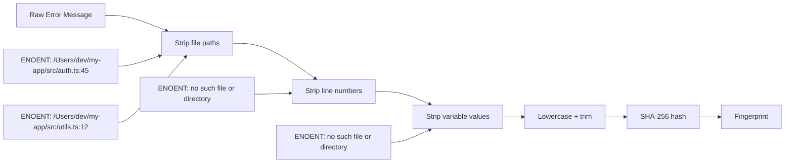
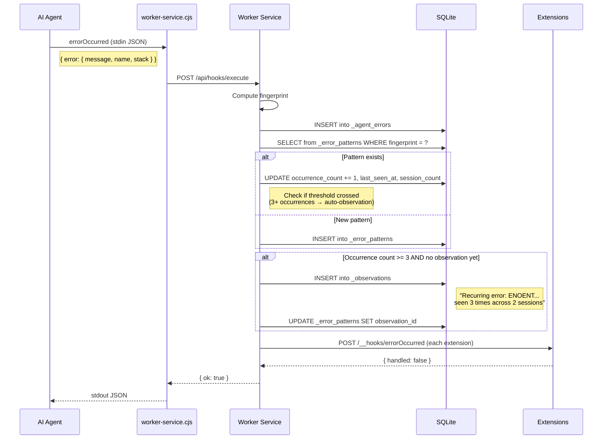
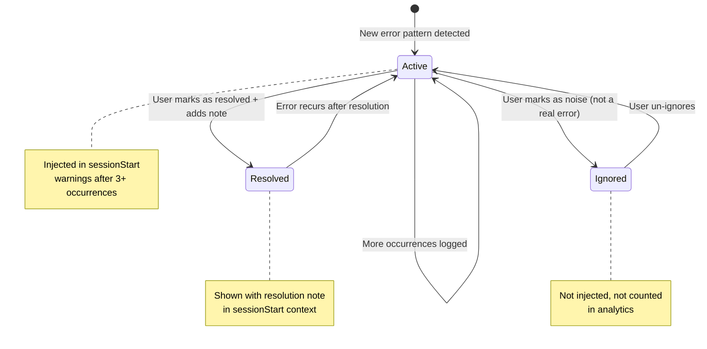

# ADR-031: Agent Error Intelligence

## Status
Accepted

## Context
When AI agents encounter errors during coding sessions, the error information is typically lost after the session ends. Recurring errors across sessions are never correlated, and developers can't see patterns in what goes wrong. The `errorOccurred` hook gives RenRe Kit access to every agent error — we can build an intelligence layer that tracks, correlates, and learns from these errors.

## Decision

### Core Feature: Error Intelligence
Capture every agent error, detect recurring patterns, and surface insights. On `sessionStart`, warn about known recurring issues. Console UI provides an error dashboard with trends and patterns.

### Data Model

```sql
CREATE TABLE _agent_errors (
  id TEXT PRIMARY KEY,
  project_id TEXT NOT NULL,
  session_id TEXT,
  agent TEXT,
  timestamp TEXT NOT NULL,

  -- Error details
  error_message TEXT NOT NULL,
  error_name TEXT,                     -- Error type/class name
  error_stack TEXT,                    -- Full stack trace
  error_fingerprint TEXT NOT NULL,     -- Normalized hash for dedup/correlation

  -- Context
  tool_name TEXT,                      -- Tool that was being used (if available)
  file_path TEXT,                      -- Extracted from stack/context if possible

  FOREIGN KEY (project_id) REFERENCES _projects(id)
);

-- Error patterns (aggregated recurring errors)
CREATE TABLE _error_patterns (
  id TEXT PRIMARY KEY,
  project_id TEXT NOT NULL,
  fingerprint TEXT NOT NULL UNIQUE,    -- Same as error_fingerprint

  error_message TEXT NOT NULL,         -- Representative message
  error_name TEXT,

  first_seen_at TEXT NOT NULL,
  last_seen_at TEXT NOT NULL,
  occurrence_count INTEGER DEFAULT 1,
  session_count INTEGER DEFAULT 1,     -- Distinct sessions where this occurred

  status TEXT DEFAULT 'active',        -- active, resolved, ignored
  resolution_note TEXT,                -- How it was fixed (if resolved)

  -- Auto-generated observation (links to _observations)
  observation_id TEXT,

  FOREIGN KEY (project_id) REFERENCES _projects(id)
);

CREATE INDEX idx_errors_project ON _agent_errors(project_id, timestamp DESC);
CREATE INDEX idx_patterns_project ON _error_patterns(project_id, status, occurrence_count DESC);
```

### Error Fingerprinting

To correlate errors across sessions, we normalize error messages into fingerprints:



Same underlying error → same fingerprint → correlation detected.

### Error Processing Flow



### Session Start — Error Warnings

On `sessionStart`, active error patterns with 3+ occurrences are included in injected context:

```
### Known Issues
- RECURRING (5x across 3 sessions): "ECONNREFUSED 127.0.0.1:5432"
  → PostgreSQL connection failing. Check if DB is running.
- RECURRING (3x across 2 sessions): Test "user login timeout" assertion failure
  → Flaky test, may be timing-related.
- RESOLVED: "Module not found: @auth/core" — fixed by installing missing dependency
```

### Console UI — Error Dashboard

```
┌─ Error Intelligence ───────────────────────────────────────┐
│                                                             │
│  Period: [Last 7 days ▼]  Status: [All ▼]                   │
│                                                             │
│  ┌─ Error Trends ────────────────────────────────────────┐  │
│  │                                                        │  │
│  │  Total errors (7d): 23  │  Patterns: 8  │  Resolved: 3│  │
│  │                                                        │  │
│  │  Mon  ██░░  4                                          │  │
│  │  Tue  █░░░  2                                          │  │
│  │  Wed  ████  7                                          │  │
│  │  Thu  ██░░  5                                          │  │
│  │  Fri  ██░░  3                                          │  │
│  │  Sat  █░░░  1                                          │  │
│  │  Sun  █░░░  1                                          │  │
│  │                                                        │  │
│  └────────────────────────────────────────────────────────┘  │
│                                                             │
│  ┌─ Error Patterns ──────────────────────────────────────┐  │
│  │                                                        │  │
│  │  🔴 ACTIVE  "ECONNREFUSED 127.0.0.1:5432"             │  │
│  │     5 occurrences │ 3 sessions │ Last: 2h ago          │  │
│  │     Auto-observation created                           │  │
│  │                  [View Details] [Resolve] [Ignore]     │  │
│  │  ──────────────────────────────────────────────────── │  │
│  │  🔴 ACTIVE  "Assertion failed: expected 200, got 401"  │  │
│  │     3 occurrences │ 2 sessions │ Last: yesterday       │  │
│  │                  [View Details] [Resolve] [Ignore]     │  │
│  │  ──────────────────────────────────────────────────── │  │
│  │  ✅ RESOLVED "Module not found: @auth/core"            │  │
│  │     4 occurrences │ 1 session │ Resolved: 3 days ago   │  │
│  │     Note: "Installed missing dependency with pnpm"     │  │
│  │                                      [View Details]    │  │
│  │  ──────────────────────────────────────────────────── │  │
│  │  ⚪ IGNORED  "Debugger listening on ws://..."          │  │
│  │     12 occurrences │ Not an error                      │  │
│  │                                      [Unignore]        │  │
│  │                                                        │  │
│  └────────────────────────────────────────────────────────┘  │
│                                                             │
└─────────────────────────────────────────────────────────────┘
```

### Pattern Status Workflow



### API Endpoints

| Endpoint | Method | Description |
|----------|--------|-------------|
| `GET /api/{pid}/errors` | GET | List raw errors (paginated) |
| `GET /api/{pid}/errors/patterns` | GET | List error patterns with counts |
| `GET /api/{pid}/errors/patterns/:id` | GET | Pattern detail with all occurrences |
| `POST /api/{pid}/errors/patterns/:id/resolve` | POST | Mark resolved `{ note }` |
| `POST /api/{pid}/errors/patterns/:id/ignore` | POST | Mark as noise |
| `GET /api/{pid}/errors/trends` | GET | Error count by day for chart |

## Consequences

### Positive
- Recurring errors are automatically detected and surfaced
- Auto-observations ensure agents are warned about known issues
- Resolution notes capture institutional knowledge
- Error trends reveal project health over time
- Ignore feature filters noise (debugger messages, etc.)

### Negative
- Error fingerprinting is heuristic — may over/under-group
- Storage grows with error volume
- False patterns from coincidental similar messages

### Mitigations
- Fingerprinting strips paths/lines but preserves error type — good enough for most cases
- Auto-purge raw errors after 30 days (patterns persist)
- Ignore status filters known false positives
- Minimum 3 occurrences before auto-observation (reduces noise)
