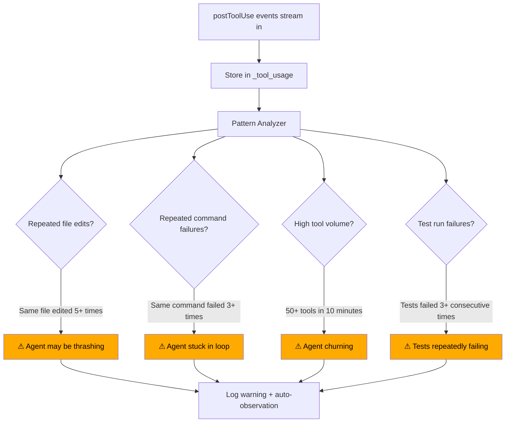

# ADR-032: Tool Usage Analytics

## Status
Accepted

## Context
AI agents use tools (bash, edit, view, create) throughout their sessions, but developers have no visibility into how effectively agents use these tools. Patterns like "agent edited the same file 15 times" or "agent ran tests 8 times in a row (all failing)" indicate the agent is stuck. The `postToolUse` hook captures every tool completion — we can build analytics to surface these patterns.

## Decision

### Core Feature: Tool Usage Analytics
Track every tool invocation via `postToolUse`, store structured data, detect inefficiency patterns, and surface insights in Console UI.

### Data Model

```sql
CREATE TABLE _tool_usage (
  id TEXT PRIMARY KEY,
  project_id TEXT NOT NULL,
  session_id TEXT NOT NULL,
  agent TEXT NOT NULL,
  timestamp TEXT NOT NULL,

  tool_name TEXT NOT NULL,             -- bash, edit, view, create
  tool_args_preview TEXT,              -- Short preview (first 100 chars)
  file_path TEXT,                      -- Extracted if tool targets a file

  result_type TEXT NOT NULL,           -- success, failure, denied
  duration_ms INTEGER,                 -- Execution time if available

  FOREIGN KEY (project_id) REFERENCES _projects(id),
  FOREIGN KEY (session_id) REFERENCES _sessions(id)
);

CREATE INDEX idx_tool_usage_session ON _tool_usage(session_id, timestamp);
CREATE INDEX idx_tool_usage_project ON _tool_usage(project_id, timestamp DESC);
```

### Pattern Detection



### Detected Patterns

| Pattern | Detection Rule | Severity | Action |
|---------|---------------|----------|--------|
| **File thrashing** | Same file edited 5+ times in session | Warning | Auto-observation, flag in session timeline |
| **Command loop** | Same command failed 3+ consecutive times | Warning | Auto-observation, flag in session timeline |
| **High churn** | 50+ tool calls in 10 minutes | Info | Flag in session analytics |
| **Test loop** | Test command failed 3+ consecutive runs | Warning | Auto-observation with test output |
| **Unused views** | File viewed but never edited (5+ files) | Info | Analytics insight |
| **Edit without test** | Files edited but no test run in session | Info | Analytics insight |

### Console UI — Tool Analytics

```
┌─ Tool Usage Analytics ─────────────────────────────────────┐
│                                                             │
│  Session: session-abc (Copilot) │ Period: [This session ▼]  │
│                                                             │
│  ┌─ Summary ─────────────────────────────────────────────┐  │
│  │                                                        │  │
│  │  Total tool calls: 34  │  Duration: 45 min             │  │
│  │                                                        │  │
│  │  bash   ████████████░░  15  (10 ✓, 3 ✗, 2 denied)     │  │
│  │  edit   ████████░░░░░░  10  (10 ✓)                     │  │
│  │  view   ██████░░░░░░░░   7  (7 ✓)                      │  │
│  │  create ██░░░░░░░░░░░░   2  (2 ✓)                      │  │
│  │                                                        │  │
│  │  Success rate: 85%  │  Avg tool calls/prompt: 4.3       │  │
│  │                                                        │  │
│  └────────────────────────────────────────────────────────┘  │
│                                                             │
│  ┌─ Warnings ────────────────────────────────────────────┐  │
│  │                                                        │  │
│  │  ⚠ File thrashing: auth.ts edited 7 times              │  │
│  │  ⚠ Test loop: "pnpm test" failed 3 consecutive times   │  │
│  │                                                        │  │
│  └────────────────────────────────────────────────────────┘  │
│                                                             │
│  ┌─ Most Touched Files ──────────────────────────────────┐  │
│  │                                                        │  │
│  │  src/auth.ts           7 edits  3 views                │  │
│  │  src/auth.test.ts      3 edits  2 views                │  │
│  │  src/utils.ts          1 edit   1 view                 │  │
│  │  package.json          1 edit                          │  │
│  │                                                        │  │
│  └────────────────────────────────────────────────────────┘  │
│                                                             │
│  ┌─ Command History ─────────────────────────────────────┐  │
│  │                                                        │  │
│  │  pnpm test            8 runs  (5 ✓, 3 ✗)              │  │
│  │  pnpm build           2 runs  (2 ✓)                    │  │
│  │  git status           3 runs  (3 ✓)                    │  │
│  │  pnpm lint            2 runs  (1 ✓, 1 ✗)              │  │
│  │                                                        │  │
│  └────────────────────────────────────────────────────────┘  │
│                                                             │
└─────────────────────────────────────────────────────────────┘
```

### Cross-Session Analytics (Project Level)

```
┌─ Project Tool Analytics (last 7 days) ─────────────────────┐
│                                                             │
│  Sessions: 12  │  Total tool calls: 347  │  Agents: 2       │
│                                                             │
│  ┌─ Efficiency Metrics ──────────────────────────────────┐  │
│  │                                                        │  │
│  │  Avg tools per session:  29                             │  │
│  │  Avg success rate:       88%                            │  │
│  │  Avg session duration:   38 min                         │  │
│  │  Thrashing incidents:    3                              │  │
│  │  Stuck loops:            2                              │  │
│  │                                                        │  │
│  └────────────────────────────────────────────────────────┘  │
│                                                             │
│  ┌─ Most Edited Files (7d) ──────────────────────────────┐  │
│  │                                                        │  │
│  │  src/auth.ts             23 edits across 5 sessions     │  │
│  │  src/api/users.ts        15 edits across 3 sessions     │  │
│  │  src/utils.ts            12 edits across 4 sessions     │  │
│  │                                                        │  │
│  └────────────────────────────────────────────────────────┘  │
│                                                             │
└─────────────────────────────────────────────────────────────┘
```

### API Endpoints

| Endpoint | Method | Description |
|----------|--------|-------------|
| `GET /api/{pid}/tools/usage` | GET | Tool usage list (paginated, filterable by session/tool) |
| `GET /api/{pid}/tools/analytics` | GET | Aggregated analytics (counts, rates, patterns) |
| `GET /api/{pid}/tools/analytics/session/:sid` | GET | Per-session analytics |
| `GET /api/{pid}/tools/files` | GET | Most touched files ranking |
| `GET /api/{pid}/tools/warnings` | GET | Active pattern warnings |

## Consequences

### Positive
- Visibility into agent behavior — no more black box
- Thrashing and stuck loops detected automatically
- File hotspot analysis reveals where agents spend effort
- Cross-session trends show agent effectiveness over time
- Efficiency metrics help tune agent instructions and context

### Negative
- Storage grows proportionally to agent activity
- Pattern detection thresholds may need tuning per-project
- postToolUse adds small overhead per tool call

### Mitigations
- Auto-purge raw tool usage after 30 days (aggregates persist)
- Pattern thresholds configurable in project settings
- postToolUse processing is async (doesn't block agent)
- In-memory batch inserts for high-volume sessions
