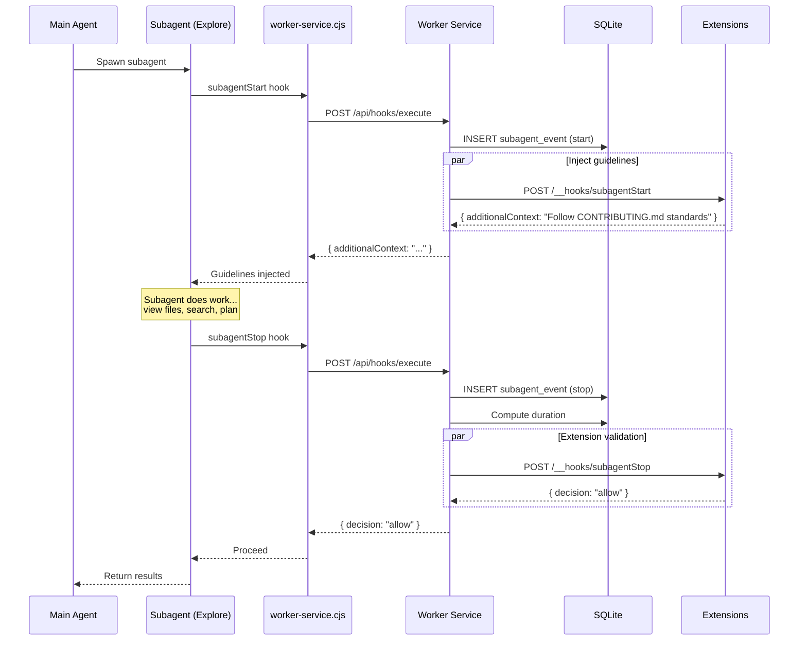
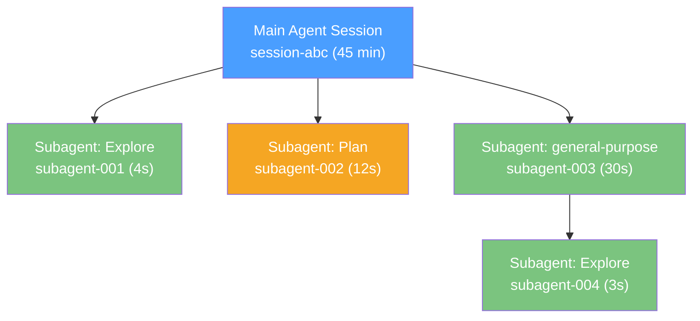

# ADR-034: Subagent Tracking

## Status
Accepted

## Context
Modern AI agents spawn **subagents** — nested agents that handle subtasks like code exploration, planning, or test execution. These subagents are invisible to the developer: you don't know when they spawn, what they do, or how long they take. The `subagentStart` and `subagentStop` hooks give RenRe Kit visibility into this hidden layer of agent behavior.

## Decision

### Core Feature: Subagent Tracking
Track every subagent lifecycle event, record what type of subagent was spawned, measure duration, and optionally inject guidelines. Surface subagent activity in the session timeline and project analytics.

### Data Model

```sql
CREATE TABLE _subagent_events (
  id TEXT PRIMARY KEY,
  project_id TEXT NOT NULL,
  session_id TEXT NOT NULL,
  agent TEXT NOT NULL,

  -- Subagent identity
  subagent_id TEXT NOT NULL,           -- Unique subagent ID from agent
  subagent_type TEXT,                  -- Plan, Explore, general-purpose, etc.
  parent_agent_id TEXT,                -- Parent agent/subagent ID (for nesting)

  -- Lifecycle
  event_type TEXT NOT NULL,            -- start, stop
  timestamp TEXT NOT NULL,

  -- Stop-specific fields
  duration_ms INTEGER,                 -- Computed on stop
  was_blocked INTEGER DEFAULT 0,       -- Whether a hook blocked completion
  block_reason TEXT,

  -- Context
  guidelines_injected TEXT,            -- What guidelines were injected on start

  FOREIGN KEY (project_id) REFERENCES _projects(id),
  FOREIGN KEY (session_id) REFERENCES _sessions(id)
);

CREATE INDEX idx_subagent_session ON _subagent_events(session_id, timestamp);
CREATE INDEX idx_subagent_project ON _subagent_events(project_id, timestamp DESC);
```

### Subagent Lifecycle



### Subagent Tree Visualization

Sessions can have nested subagents (subagent spawns another subagent). The tree structure is derived from `parent_agent_id`:



### Guidelines Injection

On `subagentStart`, RenRe Kit can inject project-specific guidelines:

**Core guidelines** (always injected):
- Active tool governance rules summary ("Never run `rm -rf /`")
- Project-level observations relevant to subagent type

**Extension guidelines**:
Each extension can contribute context specific to the subagent type:

```typescript
router.post("/__hooks/subagentStart", (req, res) => {
  const { input } = req.body;

  if (input.agent_type === "Plan") {
    res.json({
      additionalContext:
        "Planning guidelines from jira-plugin:\n" +
        "- Active sprint ends Friday\n" +
        "- PROJ-101 is high priority\n" +
        "- Avoid changes to payment module (code freeze)"
    });
    return;
  }

  if (input.agent_type === "Explore") {
    res.json({
      additionalContext:
        "Exploration context from jira-plugin:\n" +
        "- Related files: src/auth/, src/api/users/\n" +
        "- Recent changes in src/auth/validateToken.ts"
    });
    return;
  }

  res.json({});
});
```

### Console UI — Subagent View

Integrated into session timeline (ADR-033) with expandable detail:

```
┌─ Subagent Activity ────────────────────────────────────────┐
│                                                             │
│  Session: session-abc │ Subagents spawned: 4                │
│                                                             │
│  ┌─ Subagent Tree ───────────────────────────────────────┐  │
│  │                                                        │  │
│  │  Main Agent (Copilot) ─── 45 min                       │  │
│  │  ├── Explore (subagent-001) ─── 4s                     │  │
│  │  │   Viewed: auth.ts, types.ts                         │  │
│  │  │   Guidelines: jira-plugin context injected           │  │
│  │  │                                                     │  │
│  │  ├── Plan (subagent-002) ─── 12s                       │  │
│  │  │   Output: 5-step implementation plan                │  │
│  │  │   Guidelines: sprint context injected                │  │
│  │  │                                                     │  │
│  │  └── general-purpose (subagent-003) ─── 30s            │  │
│  │      Tool calls: 8 (6 ✓, 2 ✗)                         │  │
│  │      └── Explore (subagent-004) ─── 3s                 │  │
│  │          Viewed: utils.ts, helpers.ts                  │  │
│  │                                                        │  │
│  └────────────────────────────────────────────────────────┘  │
│                                                             │
│  ┌─ Subagent Analytics (Project, 7d) ────────────────────┐  │
│  │                                                        │  │
│  │  Total subagents spawned: 23                           │  │
│  │                                                        │  │
│  │  By type:                                              │  │
│  │    Explore          ████████████  52% (12)              │  │
│  │    general-purpose  ██████░░░░░░  30%  (7)              │  │
│  │    Plan             ████░░░░░░░░  17%  (4)              │  │
│  │                                                        │  │
│  │  Avg duration: Explore 5s, Plan 15s, general 45s        │  │
│  │  Blocked by hooks: 1 (Plan subagent missing tests)      │  │
│  │                                                        │  │
│  └────────────────────────────────────────────────────────┘  │
│                                                             │
└─────────────────────────────────────────────────────────────┘
```

### Blocking Subagent Completion

Extensions can block `subagentStop` to enforce quality gates:

```typescript
router.post("/__hooks/subagentStop", (req, res) => {
  const { input } = req.body;

  if (input.agent_type === "Plan") {
    // Check if plan includes test coverage
    // (This is a simplified example — real logic would parse subagent output)
    res.json({
      decision: "block",
      reason: "Plan does not include test steps. Please add test coverage to the plan."
    });
    return;
  }

  res.json({ decision: "allow" });
});
```

### API Endpoints

| Endpoint | Method | Description |
|----------|--------|-------------|
| `GET /api/{pid}/subagents` | GET | List subagent events (paginated) |
| `GET /api/{pid}/subagents/tree/:sessionId` | GET | Subagent tree for a session |
| `GET /api/{pid}/subagents/analytics` | GET | Subagent analytics (counts by type, avg duration) |

## Consequences

### Positive
- Previously invisible subagent behavior becomes trackable
- Guidelines injection ensures subagents follow project conventions
- Blocking capability enables quality gates on plans and explorations
- Tree visualization shows agent complexity
- Analytics reveal agent architecture patterns (too many subagents = potential issue)

### Negative
- Not all AI agents emit subagent hooks (depends on agent implementation)
- Nested subagent tracking requires parent_agent_id (may not always be available)
- Blocking subagents can slow agent workflow

### Mitigations
- Graceful handling when subagent hooks not supported (feature just doesn't activate)
- Parent ID defaults to session main agent if not provided
- Blocking is opt-in per extension — not enabled by default
- Duration tracking works regardless of nesting depth
