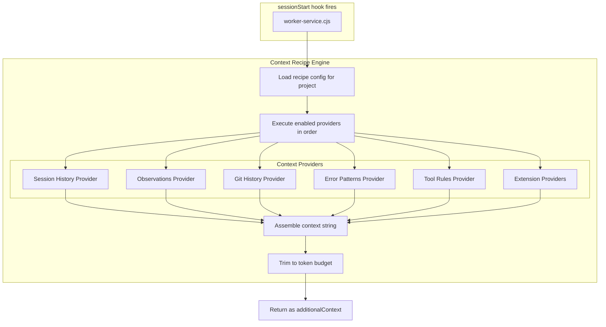
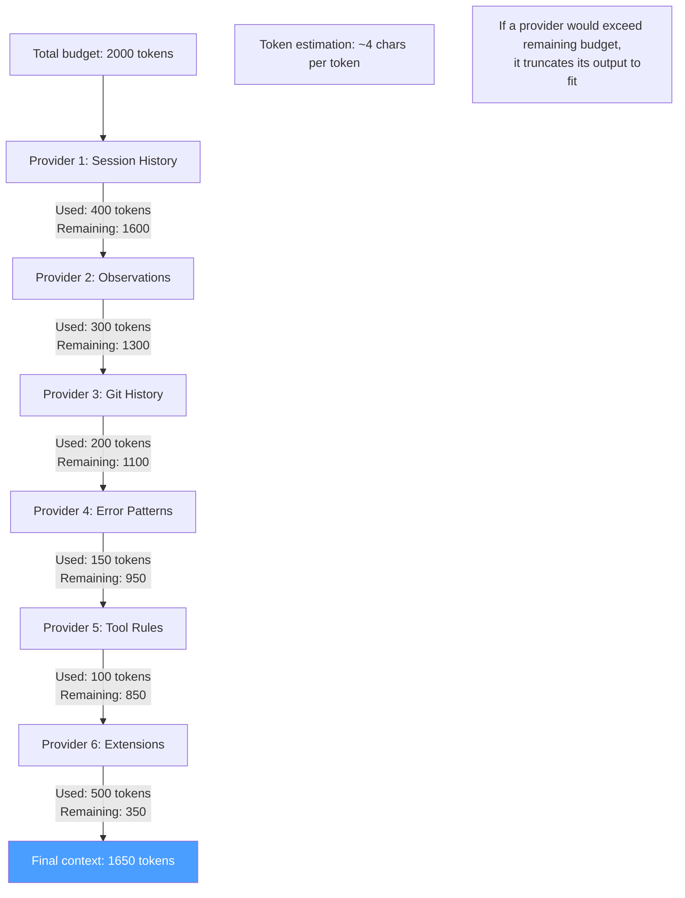

# ADR-035: Context Recipes — Configurable Session Start Injection

## Status
Accepted (extension discovery updated)

> **Note:** Extension context provider discovery and registration is defined in ADR-036 (manifest-based `contextProvider` field with `/__context` POST route). This supersedes the `GET /__context-provider` route-based discovery originally described in this ADR.

## Context
ADR-027 through ADR-034 define multiple sources of context that can be injected on `sessionStart`: session summaries, observations, git history, recurring errors, tool governance rules, and extension context. Developers need control over **what** gets injected — too much context wastes tokens, too little loses value. Context Recipes provide a UI-configurable system for composing the sessionStart payload.

## Decision

### Core Feature: Context Recipes
A configurable pipeline of context providers that assemble the `sessionStart` injection. Each provider is independently toggleable, orderable, and has configurable limits. Managed from Console UI, stored in project settings.

### Architecture



### Recipe Configuration

```json
{
  "contextRecipe": {
    "enabled": true,
    "maxTokens": 2000,
    "providers": [
      {
        "id": "session-history",
        "enabled": true,
        "order": 1,
        "config": {
          "maxSessions": 3,
          "maxAgeHours": 168
        }
      },
      {
        "id": "observations",
        "enabled": true,
        "order": 2,
        "config": {
          "maxItems": 10,
          "categories": ["all"],
          "confidenceFilter": "confirmed"
        }
      },
      {
        "id": "git-history",
        "enabled": true,
        "order": 3,
        "config": {
          "sinceHours": 24,
          "maxCommits": 10
        }
      },
      {
        "id": "error-patterns",
        "enabled": true,
        "order": 4,
        "config": {
          "minOccurrences": 3,
          "statusFilter": ["active"]
        }
      },
      {
        "id": "tool-rules",
        "enabled": true,
        "order": 5,
        "config": {
          "onlyDenyRules": true
        }
      },
      {
        "id": "extensions",
        "enabled": true,
        "order": 6,
        "config": {
          "enabledExtensions": ["all"]
        }
      }
    ]
  }
}
```

### Context Provider Interface

Each provider implements a simple interface:

```typescript
interface ContextProvider {
  id: string;
  name: string;
  description: string;

  // Generate context string for this provider
  getContext(
    projectId: string,
    config: Record<string, unknown>,
    input: SessionStartInput
  ): Promise<ContextResult>;
}

interface ContextResult {
  content: string;          // Markdown-formatted context
  estimatedTokens: number;  // Approximate token count
  itemCount: number;        // Number of items included
  truncated: boolean;       // Whether items were omitted due to limits
}
```

### Built-in Providers

| Provider | ID | Description | Default |
|----------|-----|-------------|---------|
| **Session History** | `session-history` | Last N session summaries | Enabled, 3 sessions |
| **Observations** | `observations` | Active project observations | Enabled, 10 items |
| **Git History** | `git-history` | Recent commits | Enabled, 24h |
| **Error Patterns** | `error-patterns` | Recurring errors with 3+ occurrences | Enabled |
| **Tool Rules** | `tool-rules` | Summary of deny/ask rules | Enabled, deny only |
| **Extensions** | `extensions` | Extension-contributed context | Enabled, all |

### Extension Context Providers

Extensions can register custom context providers that appear in the recipe configuration:

```typescript
// Extension registers a context provider
const factory: ExtensionRouterFactory = (ctx) => {
  const router = Router();

  // Register as context provider for sessionStart
  router.get("/__context-provider", (req, res) => {
    res.json({
      id: `ext:${ctx.extensionName}`,
      name: "Jira Context",
      description: "Open issues and sprint status"
    });
  });

  router.post("/__hooks/sessionStart", (req, res) => {
    const issues = ctx.db!.prepare(
      "SELECT key, summary, priority FROM jira_issues WHERE project_id = ? AND status = 'open' ORDER BY priority"
    ).all(ctx.projectId);

    res.json({
      additionalContext: issues.length > 0
        ? `## Jira Context\nOpen issues:\n${issues.map((i: any) => `- ${i.key}: ${i.summary} (${i.priority})`).join("\n")}`
        : ""
    });
  });

  return router;
};
```

### Token Budget Management



Providers execute in order. Each receives the remaining token budget. If a provider's output would exceed the budget, it truncates (fewer sessions, fewer observations, etc.). This ensures higher-priority providers always get their full allocation.

### Console UI — Context Recipes

```
┌─ Context Recipes ──────────────────────────────────────────┐
│                                                             │
│  Configure what context is injected when AI agent sessions  │
│  start. Drag to reorder. Higher = injected first.           │
│                                                             │
│  Token budget: [2000____] tokens                            │
│                                                             │
│  ┌─ Providers (drag to reorder) ─────────────────────────┐  │
│  │                                                        │  │
│  │  ☑ 1. Session History                    ~400 tokens   │  │
│  │     Last [3] sessions, max [7 days] old                │  │
│  │                                          [Configure]   │  │
│  │  ──────────────────────────────────────────────────── │  │
│  │  ☑ 2. Observations                      ~300 tokens   │  │
│  │     Max [10] items, categories: [All ▼]                │  │
│  │     Confidence: [Confirmed only ▼]                     │  │
│  │                                          [Configure]   │  │
│  │  ──────────────────────────────────────────────────── │  │
│  │  ☑ 3. Git History                       ~200 tokens   │  │
│  │     Last [24] hours, max [10] commits                  │  │
│  │                                          [Configure]   │  │
│  │  ──────────────────────────────────────────────────── │  │
│  │  ☑ 4. Error Patterns                    ~150 tokens   │  │
│  │     Min [3] occurrences, status: [Active ▼]            │  │
│  │                                          [Configure]   │  │
│  │  ──────────────────────────────────────────────────── │  │
│  │  ☑ 5. Tool Rules Summary                ~100 tokens   │  │
│  │     [Deny rules only ▼]                                │  │
│  │                                          [Configure]   │  │
│  │  ──────────────────────────────────────────────────── │  │
│  │  ☑ 6. Jira Context (extension)          ~250 tokens   │  │
│  │     Open issues and sprint status                      │  │
│  │                                          [Configure]   │  │
│  │  ──────────────────────────────────────────────────── │  │
│  │  ☐ 7. GitHub MCP (extension)             disabled      │  │
│  │     PR and issue context                               │  │
│  │                                          [Configure]   │  │
│  │                                                        │  │
│  └────────────────────────────────────────────────────────┘  │
│                                                             │
│  Estimated total: ~1400 / 2000 tokens                       │
│                                                             │
│  [Preview Context]  [Save]  [Reset to Defaults]             │
│                                                             │
│  ┌─ Preview ─────────────────────────────────────────────┐  │
│  │  ## Session Context (from RenRe Kit)                   │  │
│  │                                                        │  │
│  │  ### Previous Sessions                                 │  │
│  │  - **2h ago** (Copilot, 45min): Fixed login bug...     │  │
│  │  - **Yesterday** (Claude, 1h): Implemented profile...  │  │
│  │                                                        │  │
│  │  ### Active Observations (5)                           │  │
│  │  - Project uses pnpm (not npm)                         │  │
│  │  - Auth tokens expire after 1h...                      │  │
│  │  ...                                                   │  │
│  └────────────────────────────────────────────────────────┘  │
│                                                             │
└─────────────────────────────────────────────────────────────┘
```

### API Endpoints

| Endpoint | Method | Description |
|----------|--------|-------------|
| `GET /api/{pid}/context-recipe` | GET | Get recipe config |
| `PUT /api/{pid}/context-recipe` | PUT | Save recipe config |
| `POST /api/{pid}/context-recipe/preview` | POST | Preview assembled context |
| `GET /api/{pid}/context-providers` | GET | List available providers (including extensions) |
| `POST /api/{pid}/context-recipe/reset` | POST | Reset to defaults |

## Consequences

### Positive
- Developers control exactly what their agent knows at session start
- Token budget prevents context bloat
- Provider ordering ensures most important context is never truncated
- Extensions can contribute domain-specific context as first-class providers
- Preview shows exactly what the agent will see — no surprises
- Drag-to-reorder makes prioritization intuitive

### Negative
- Configuration overhead for new users (defaults must be good)
- Token estimation is approximate (actual tokenization depends on model)
- Many providers can make the config page complex

### Mitigations
- Sensible defaults work out of the box — most users never need to configure
- "Reset to Defaults" button available
- Token estimation uses conservative 4-chars-per-token heuristic
- Collapsed providers show only name + estimated tokens
- Preview button lets users test before saving
