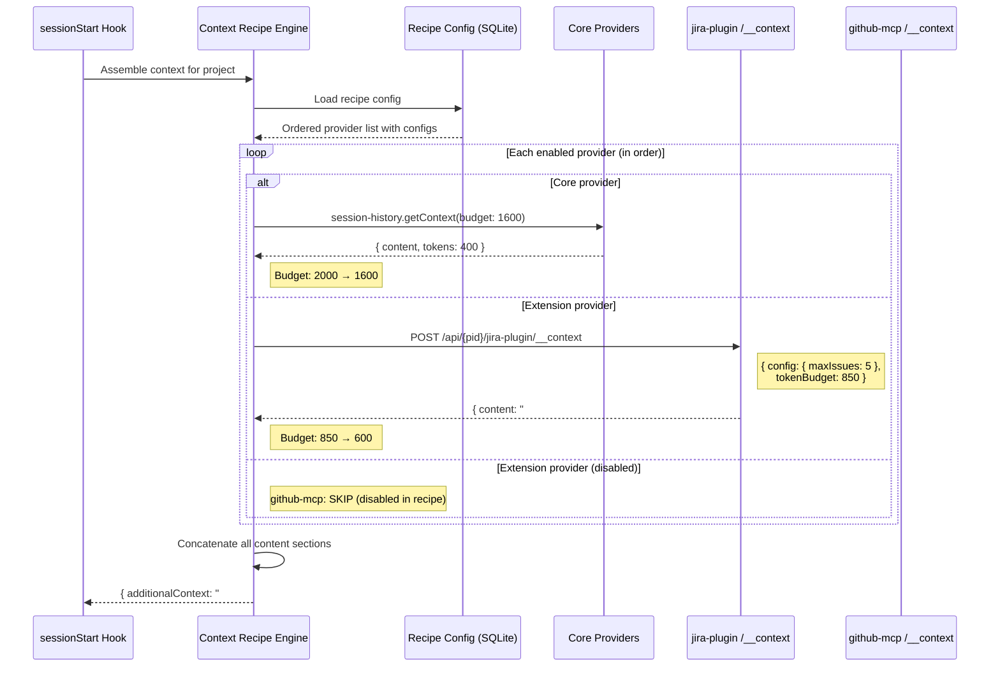
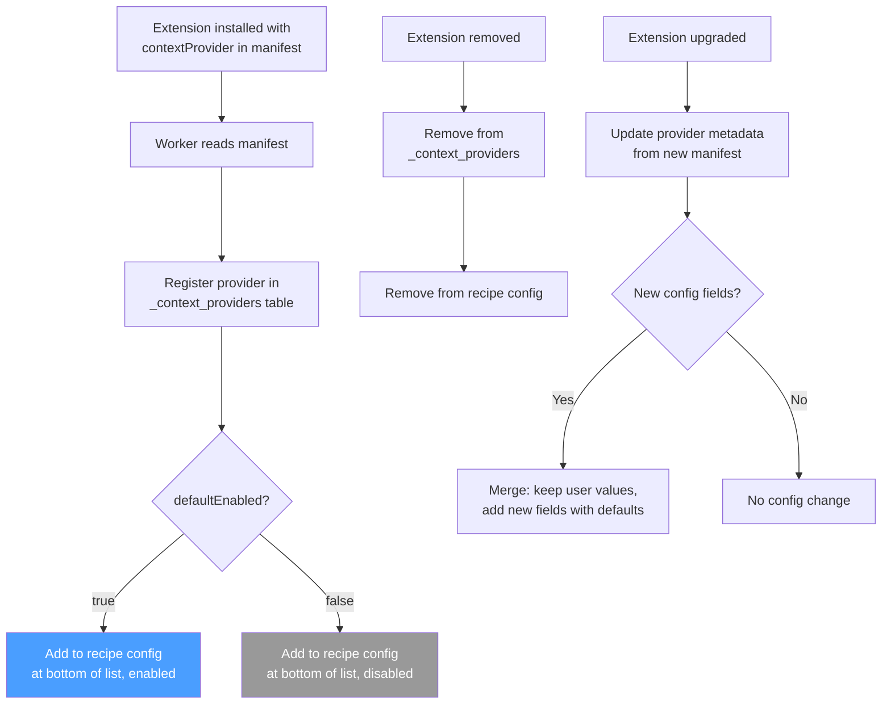
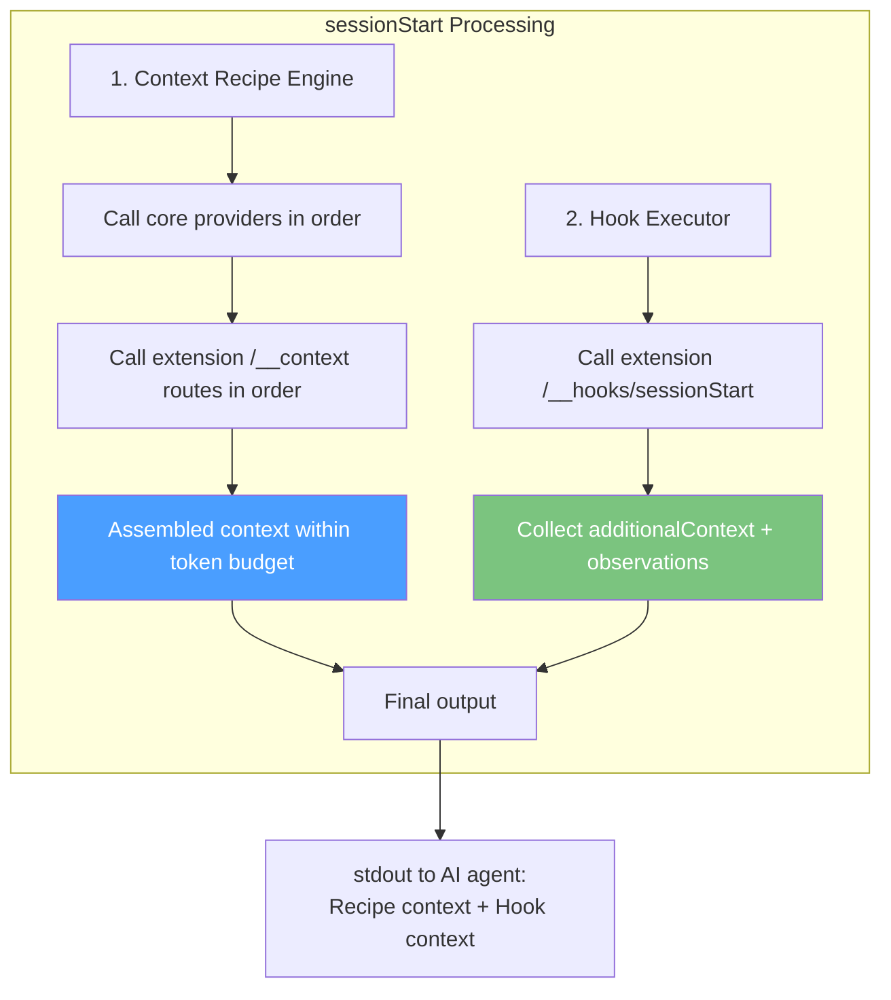

# ADR-036: Extension Context Provider — Manifest-Driven Context Recipes Integration

## Status
Accepted (extends ADR-035: Context Recipes)

## Context
ADR-035 defines Context Recipes — a configurable pipeline that assembles context injected on `sessionStart`. It mentions extensions can contribute context, but the mechanism was loosely defined (a `/__context-provider` route). We need a formal contract for how extensions:

1. **Declare** they are a context provider (in manifest — known at install time)
2. **Describe** their provider metadata (name, description, configurable options)
3. **Generate** context content (called during sessionStart recipe assembly)
4. **Appear** in the Console UI Context Recipes editor alongside core providers
5. **Receive** per-provider config from the recipe (user-tunable settings)

## Decision

### Manifest Declaration

Extensions declare a `contextProvider` field in `manifest.json`. This makes the provider known at install time — no runtime discovery needed.

```json
{
  "name": "jira-plugin",
  "version": "1.0.0",
  "displayName": "Jira Plugin",
  "description": "Jira integration for AI agents",
  "author": "renre-kit",

  "backend": {
    "entrypoint": "backend/index.js"
  },

  "contextProvider": {
    "name": "Jira Context",
    "description": "Injects open Jira issues, sprint status, and recent activity",
    "icon": "clipboard-list",
    "defaultEnabled": true,
    "configSchema": [
      {
        "key": "maxIssues",
        "label": "Max issues to include",
        "type": "number",
        "default": 5,
        "description": "Maximum number of open issues to inject"
      },
      {
        "key": "includeSprintInfo",
        "label": "Include sprint status",
        "type": "boolean",
        "default": true
      },
      {
        "key": "priorityFilter",
        "label": "Minimum priority",
        "type": "select",
        "default": "all",
        "options": [
          { "label": "All priorities", "value": "all" },
          { "label": "High and above", "value": "high" },
          { "label": "Critical only", "value": "critical" }
        ]
      }
    ]
  },

  "hooks": {
    "events": ["sessionStart", "sessionEnd", "userPromptSubmitted"]
  }
}
```

### Manifest Schema Addition

```typescript
interface ExtensionManifest {
  // ... existing fields ...

  contextProvider?: ContextProviderManifest;
}

interface ContextProviderManifest {
  name: string;                        // Display name in Context Recipes UI
  description: string;                 // What context this provider injects
  icon?: string;                       // Lucide icon name for UI display
  defaultEnabled: boolean;             // Whether enabled by default in new recipes
  configSchema?: ProviderSettingDefinition[];  // User-configurable options
}

interface ProviderSettingDefinition {
  key: string;
  label: string;
  type: "string" | "number" | "boolean" | "select";
  default: unknown;
  description?: string;
  options?: { label: string; value: string }[];  // For "select" type
}
```

### Backend Contract — Context Generation Route

When an extension declares `contextProvider`, it **must** implement a `/__context` POST route in its backend. The Context Recipe Engine calls this route during `sessionStart` assembly.

```typescript
// POST /__context
// Request body:
interface ContextRequest {
  projectId: string;
  config: Record<string, unknown>;    // User's config values from recipe settings
  tokenBudget: number;                // Remaining tokens available for this provider
  sessionInput: {                     // Original sessionStart hook input
    timestamp: number;
    cwd: string;
    source: string;
    initialPrompt?: string;
    sessionId?: string;
  };
}

// Response body:
interface ContextResponse {
  content: string;                    // Markdown-formatted context to inject
  estimatedTokens: number;           // Approximate token count of content
  itemCount: number;                 // Number of items included (for display)
  truncated: boolean;                // Whether content was trimmed to fit budget
  metadata?: {                       // Optional metadata for UI display
    lastUpdated?: string;            // When the underlying data was last refreshed
    source?: string;                 // Data source description
  };
}
```

### Implementation Example

```typescript
import { ExtensionRouterFactory } from "@renre-kit/extension-sdk";
import { Router } from "express";

const factory: ExtensionRouterFactory = (ctx) => {
  const router = Router();

  // Context provider route — called by Context Recipe Engine
  router.post("/__context", (req, res) => {
    const { config, tokenBudget } = req.body;

    const maxIssues = (config.maxIssues as number) ?? 5;
    const includeSprintInfo = (config.includeSprintInfo as boolean) ?? true;
    const priorityFilter = (config.priorityFilter as string) ?? "all";

    // Query issues from extension's DB tables
    let query = "SELECT key, summary, priority, assignee FROM jira_issues WHERE project_id = ? AND status = 'open'";
    const params: unknown[] = [ctx.projectId];

    if (priorityFilter === "high") {
      query += " AND priority IN ('high', 'critical')";
    } else if (priorityFilter === "critical") {
      query += " AND priority = 'critical'";
    }

    query += " ORDER BY priority DESC LIMIT ?";
    params.push(maxIssues);

    const issues = ctx.db!.prepare(query).all(...params) as any[];

    // Build context string
    const parts: string[] = [];

    if (issues.length > 0) {
      parts.push("### Jira — Open Issues");
      for (const issue of issues) {
        parts.push(`- **${issue.key}**: ${issue.summary} (${issue.priority}, ${issue.assignee ?? "unassigned"})`);
      }
    }

    if (includeSprintInfo) {
      const sprint = ctx.db!.prepare(
        "SELECT name, end_date FROM jira_sprints WHERE project_id = ? AND status = 'active' LIMIT 1"
      ).get(ctx.projectId) as any;

      if (sprint) {
        parts.push(`\n### Jira — Active Sprint`);
        parts.push(`Sprint "${sprint.name}" ends ${sprint.end_date}`);
      }
    }

    const content = parts.join("\n");
    const estimatedTokens = Math.ceil(content.length / 4);

    res.json({
      content,
      estimatedTokens,
      itemCount: issues.length,
      truncated: issues.length >= maxIssues,
      metadata: {
        lastUpdated: new Date().toISOString(),
        source: "Jira API via extension database"
      }
    });
  });

  // ... other extension routes ...

  return router;
};

export default factory;
```

### Context Recipe Engine — Extension Provider Flow



### Console UI — Extension Provider in Recipes Editor

Extension providers appear alongside core providers with their custom config UI auto-generated from `configSchema`:

```
┌─ Context Recipes ──────────────────────────────────────────┐
│                                                             │
│  Token budget: [2000____] tokens                            │
│                                                             │
│  ┌─ Providers ───────────────────────────────────────────┐  │
│  │                                                        │  │
│  │  ☑ 1. 📋 Session History (core)          ~400 tokens   │  │
│  │     Last [3] sessions, max [7 days] old                │  │
│  │                                                        │  │
│  │  ☑ 2. 💡 Observations (core)             ~300 tokens   │  │
│  │     Max [10] items, confidence: [Confirmed ▼]          │  │
│  │                                                        │  │
│  │  ☑ 3. 📝 Git History (core)              ~200 tokens   │  │
│  │     Last [24] hours                                    │  │
│  │                                                        │  │
│  │  ☑ 4. 📋 Jira Context (jira-plugin)      ~250 tokens   │  │
│  │     ┌─ Provider Settings ─────────────────────────┐    │  │
│  │     │ Max issues:        [5____]                  │    │  │
│  │     │ Include sprint:    [✓]                      │    │  │
│  │     │ Min priority:      [All priorities ▼]       │    │  │
│  │     └─────────────────────────────────────────────┘    │  │
│  │                                                        │  │
│  │  ☐ 5. 🔗 GitHub Context (github-mcp)      disabled     │  │
│  │     Open PRs and review requests                       │  │
│  │     [Enable to configure]                              │  │
│  │                                                        │  │
│  │  ☑ 6. ⚠ Error Patterns (core)            ~150 tokens   │  │
│  │     Min [3] occurrences                                │  │
│  │                                                        │  │
│  │  ☑ 7. 🛡 Tool Rules (core)               ~100 tokens   │  │
│  │     [Deny rules only ▼]                                │  │
│  │                                                        │  │
│  └────────────────────────────────────────────────────────┘  │
│                                                             │
│  Estimated total: ~1400 / 2000 tokens                       │
│                                                             │
│  [Preview Context]  [Save]  [Reset to Defaults]             │
│                                                             │
└─────────────────────────────────────────────────────────────┘
```

### Provider Registration Lifecycle



### Data Model

```sql
-- Provider registry (populated from manifests)
CREATE TABLE _context_providers (
  id TEXT PRIMARY KEY,                 -- 'core:session-history' or 'ext:jira-plugin'
  type TEXT NOT NULL,                  -- 'core' or 'extension'
  extension_name TEXT,                 -- NULL for core, extension name for ext
  name TEXT NOT NULL,                  -- Display name
  description TEXT NOT NULL,
  icon TEXT,                           -- Lucide icon name
  config_schema TEXT,                  -- JSON: ProviderSettingDefinition[]
  default_enabled INTEGER DEFAULT 1
);

-- Recipe config is stored per-project in extensions.json or dedicated table
-- See ADR-035 for recipe config structure
```

### Validation on Install

When an extension with `contextProvider` is installed:

1. Validate `contextProvider.name` and `description` are present
2. Validate `configSchema` field types are known (`string`, `number`, `boolean`, `select`)
3. Validate `select` type has `options` array
4. Validate defaults match their declared types
5. If extension has `contextProvider` but no `backend` — error (needs `/__context` route)
6. If extension has `contextProvider`, `hooks.events` **should** include `sessionStart` (warning if missing — provider can still work, but hooks provide additional integration)

### SDK Types

Added to `@renre-kit/extension-sdk`:

```typescript
// Context provider types for extension authors

export interface ContextProviderManifest {
  name: string;
  description: string;
  icon?: string;
  defaultEnabled: boolean;
  configSchema?: ProviderSettingDefinition[];
}

export interface ProviderSettingDefinition {
  key: string;
  label: string;
  type: "string" | "number" | "boolean" | "select";
  default: unknown;
  description?: string;
  options?: { label: string; value: string }[];
}

export interface ContextRequest {
  projectId: string;
  config: Record<string, unknown>;
  tokenBudget: number;
  sessionInput: {
    timestamp: number;
    cwd: string;
    source: string;
    initialPrompt?: string;
    sessionId?: string;
  };
}

export interface ContextResponse {
  content: string;
  estimatedTokens: number;
  itemCount: number;
  truncated: boolean;
  metadata?: {
    lastUpdated?: string;
    source?: string;
  };
}
```

### Multiple Context Providers per Extension (Future)

v1: one `contextProvider` per extension. If an extension needs multiple distinct contexts (e.g., Jira issues AND Jira sprint board), it combines them in one provider with boolean config toggles.

Future: `contextProviders: ContextProviderManifest[]` array for multiple independent providers from one extension.

### Interaction with sessionStart Hook

Extensions can have **both** a `contextProvider` and a `sessionStart` hook handler. They serve different purposes:

| Mechanism | Purpose | When Called | Output |
|-----------|---------|------------|--------|
| `contextProvider` (`/__context`) | Structured context for recipe pipeline | During recipe assembly, respects order/budget | `ContextResponse` |
| `sessionStart` hook (`/__hooks/sessionStart`) | Side effects + unstructured context | After recipe assembly, during hook execution | `{ additionalContext?, observations? }` |

If an extension has both:
1. Recipe engine calls `/__context` first (structured, budget-aware)
2. Hook executor calls `/__hooks/sessionStart` after (for side effects like creating session records)

The `additionalContext` from the hook is appended **after** the recipe output (outside the token budget).



## Consequences

### Positive
- Extensions declare context providers in manifest — discoverable at install time
- `configSchema` enables auto-generated settings UI — no custom components needed
- Extension providers sit alongside core providers in the same recipe editor
- Token budget is shared fairly between core and extension providers
- Per-provider config gives users fine-grained control (max issues, filters, toggles)
- Clear separation: `/__context` for structured recipe content, `/__hooks/sessionStart` for side effects
- Upgrade-safe: new config fields get defaults, user values preserved

### Negative
- Extension authors must implement `/__context` route (additional work)
- Config schema is limited to simple types (no nested objects or arrays)
- One provider per extension in v1

### Mitigations
- SDK provides types and example code — clear contract
- Simple config types cover most use cases (text, numbers, toggles, dropdowns)
- Extensions can use boolean toggles to include/exclude content sections within one provider
- Validation at install catches missing routes and invalid schemas
