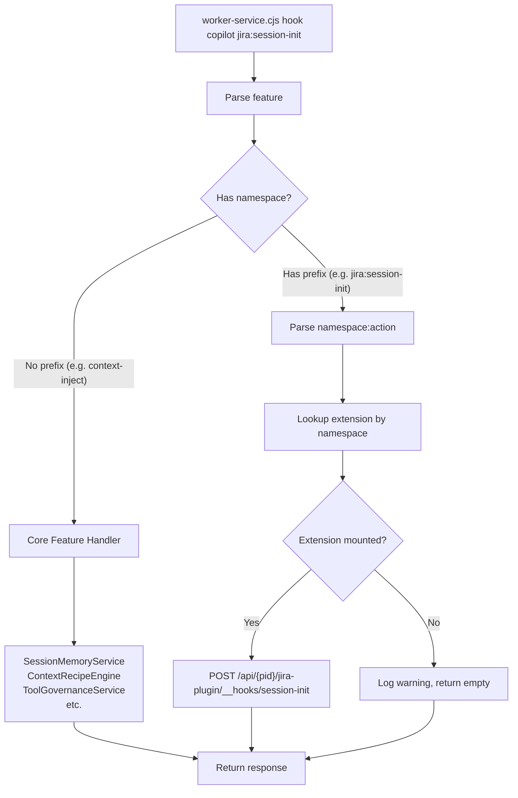
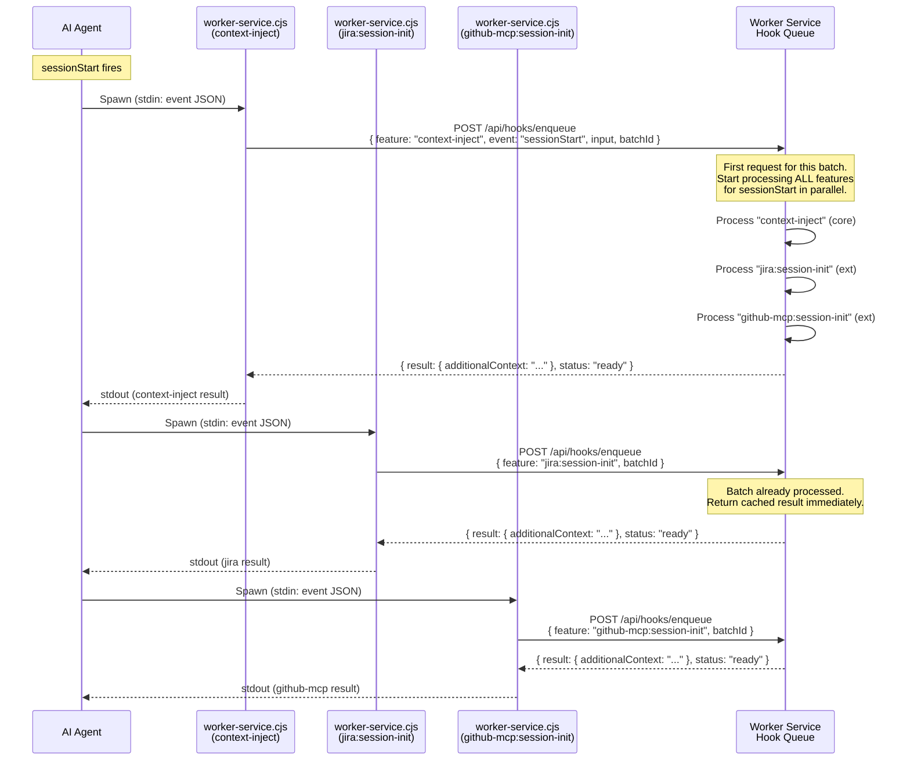
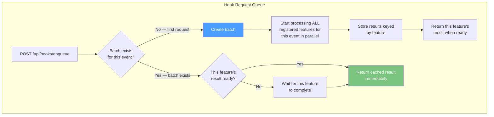
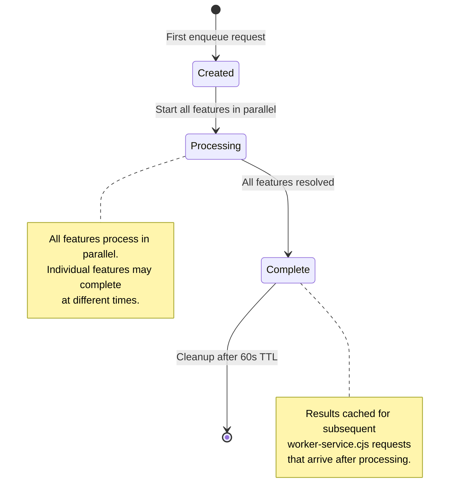
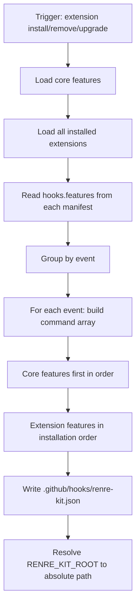

# ADR-037: Merged Hook File, Feature Routing & Hook Request Queue

## Status
Accepted (supersedes hook file generation in ADR-006 and ADR-026)

## Context
### The Problem with Per-Extension Hook Files

Previous design (ADR-026) generated one `.github/hooks/{extension-name}.json` per extension. With 5 extensions, the agent loads 5 files. If each registers `sessionStart`, the agent spawns `worker-service.cjs` **5 separate times** — 5 Node.js processes, 5 HTTP calls, all sequential and blocking.

Worse: we haven't defined how extensions register their **features** (hook handlers) with the worker service, or how the worker routes requests to the right handler.

### Key Insights

1. Copilot's hook schema uses **arrays** per event — one file can have multiple commands per event
2. Each command needs a unique **feature** identifier to route to the right handler
3. RenRe Kit core has its own hook features (session memory, tool governance, etc.)
4. Extensions register additional features
5. Sequential `worker-service.cjs` spawns are wasteful — the worker should **batch process** via a queue

## Decision

### Single Merged Hook File

One file: `.github/hooks/renre-kit.json`

Regenerated on every extension install/remove/upgrade. Contains ALL commands — core features + extension features — as array entries per event.

```json
{
  "version": 1,
  "hooks": {
    "sessionStart": [
      {
        "type": "command",
        "bash": "node \"/Users/dev/.renre-kit/scripts/worker-service.cjs\" hook copilot context-inject",
        "cwd": ".",
        "timeoutSec": 10,
        "comment": "renre-kit core: session memory + context recipes"
      },
      {
        "type": "command",
        "bash": "node \"/Users/dev/.renre-kit/scripts/worker-service.cjs\" hook copilot jira:session-init",
        "cwd": ".",
        "timeoutSec": 5,
        "comment": "jira-plugin: create session tracking + inject issues"
      },
      {
        "type": "command",
        "bash": "node \"/Users/dev/.renre-kit/scripts/worker-service.cjs\" hook copilot github-mcp:session-init",
        "cwd": ".",
        "timeoutSec": 5,
        "comment": "github-mcp: inject PR context"
      }
    ],
    "preToolUse": [
      {
        "type": "command",
        "bash": "node \"/Users/dev/.renre-kit/scripts/worker-service.cjs\" hook copilot tool-governance",
        "cwd": ".",
        "timeoutSec": 3,
        "comment": "renre-kit core: tool governance rules"
      },
      {
        "type": "command",
        "bash": "node \"/Users/dev/.renre-kit/scripts/worker-service.cjs\" hook copilot jira:tool-check",
        "cwd": ".",
        "timeoutSec": 3,
        "comment": "jira-plugin: validate DB operations"
      }
    ],
    "userPromptSubmitted": [
      {
        "type": "command",
        "bash": "node \"/Users/dev/.renre-kit/scripts/worker-service.cjs\" hook copilot prompt-journal",
        "cwd": ".",
        "timeoutSec": 5,
        "comment": "renre-kit core: prompt recording + context injection"
      },
      {
        "type": "command",
        "bash": "node \"/Users/dev/.renre-kit/scripts/worker-service.cjs\" hook copilot jira:prompt-context",
        "cwd": ".",
        "timeoutSec": 5,
        "comment": "jira-plugin: inject related issues based on prompt"
      }
    ],
    "sessionEnd": [
      {
        "type": "command",
        "bash": "node \"/Users/dev/.renre-kit/scripts/worker-service.cjs\" hook copilot session-capture",
        "cwd": ".",
        "timeoutSec": 10,
        "comment": "renre-kit core: capture session summary + observations"
      },
      {
        "type": "command",
        "bash": "node \"/Users/dev/.renre-kit/scripts/worker-service.cjs\" hook copilot jira:session-end",
        "cwd": ".",
        "timeoutSec": 5,
        "comment": "jira-plugin: update issue statuses"
      }
    ],
    "postToolUse": [
      {
        "type": "command",
        "bash": "node \"/Users/dev/.renre-kit/scripts/worker-service.cjs\" hook copilot tool-analytics",
        "cwd": ".",
        "timeoutSec": 5,
        "comment": "renre-kit core: tool usage tracking + pattern detection"
      }
    ],
    "errorOccurred": [
      {
        "type": "command",
        "bash": "node \"/Users/dev/.renre-kit/scripts/worker-service.cjs\" hook copilot error-intelligence",
        "cwd": ".",
        "timeoutSec": 5,
        "comment": "renre-kit core: error tracking + pattern detection"
      }
    ],
    "preCompact": [
      {
        "type": "command",
        "bash": "node \"/Users/dev/.renre-kit/scripts/worker-service.cjs\" hook copilot session-checkpoint",
        "cwd": ".",
        "timeoutSec": 10,
        "comment": "renre-kit core: mid-session checkpoint before context compaction"
      }
    ],
    "subagentStart": [
      {
        "type": "command",
        "bash": "node \"/Users/dev/.renre-kit/scripts/worker-service.cjs\" hook copilot subagent-track",
        "cwd": ".",
        "timeoutSec": 5,
        "comment": "renre-kit core: subagent tracking + guidelines injection"
      }
    ],
    "subagentStop": [
      {
        "type": "command",
        "bash": "node \"/Users/dev/.renre-kit/scripts/worker-service.cjs\" hook copilot subagent-complete",
        "cwd": ".",
        "timeoutSec": 5,
        "comment": "renre-kit core: subagent completion tracking"
      }
    ]
  }
}
```

### Feature Naming Convention

```
<feature> = <namespace>:<action>
```

| Namespace | Scope | Examples |
|-----------|-------|---------|
| _(no prefix)_ | Core RenRe Kit | `context-inject`, `tool-governance`, `prompt-journal`, `session-capture`, `session-checkpoint`, `tool-analytics`, `error-intelligence`, `subagent-track`, `subagent-complete` |
| `{extension-name}:` | Extension | `jira:session-init`, `jira:prompt-context`, `github-mcp:session-init` |

Core features have no namespace prefix. Extension features are prefixed with `{extension-name}:`.

### Core Features (Always Present)

These features are always in `renre-kit.json` regardless of installed extensions:

| Event | Feature | Description | ADR |
|-------|---------|-------------|-----|
| `sessionStart` | `context-inject` | Session memory + context recipes assembly | 027, 035 |
| `sessionEnd` | `session-capture` | Capture session summary + collect observations | 027, 028 |
| `userPromptSubmitted` | `prompt-journal` | Record prompt + extension context injection | 030 |
| `preToolUse` | `tool-governance` | Evaluate governance rules | 029 |
| `postToolUse` | `tool-analytics` | Track tool usage + detect patterns | 032 |
| `errorOccurred` | `error-intelligence` | Error tracking + pattern detection | 031 |
| `preCompact` | `session-checkpoint` | Mid-session checkpoint before compaction | 027 |
| `subagentStart` | `subagent-track` | Track subagent + inject guidelines | 034 |
| `subagentStop` | `subagent-complete` | Track subagent completion | 034 |

### Extension Hook Feature Registration

Extensions declare their hook features in `manifest.json`:

```json
{
  "name": "jira-plugin",
  "hooks": {
    "features": [
      {
        "event": "sessionStart",
        "feature": "session-init",
        "description": "Create session tracking record and inject open issues",
        "timeoutSec": 5
      },
      {
        "event": "sessionEnd",
        "feature": "session-end",
        "description": "Update Jira issue statuses based on session activity",
        "timeoutSec": 5
      },
      {
        "event": "userPromptSubmitted",
        "feature": "prompt-context",
        "description": "Inject related Jira issues based on prompt keywords",
        "timeoutSec": 5
      },
      {
        "event": "preToolUse",
        "feature": "tool-check",
        "description": "Validate database operations against Jira workflow rules",
        "timeoutSec": 3
      }
    ]
  }
}
```

The generated command becomes: `worker-service.cjs hook copilot jira:session-init`

Worker routes `jira:session-init` → jira-plugin extension → `POST /__hooks/session-init`

### Manifest Schema Update

```typescript
interface HookConfig {
  features: HookFeature[];
}

interface HookFeature {
  event: 'sessionStart' | 'sessionEnd' | 'userPromptSubmitted' |
         'preToolUse' | 'postToolUse' | 'errorOccurred' |
         'preCompact' | 'subagentStart' | 'subagentStop';
  feature: string;           // Feature name (becomes {ext-name}:{feature} in command)
  description: string;       // Human-readable description
  timeoutSec?: number;       // Per-feature timeout (default: 5)
}
```

### Feature Routing in Worker Service



### Worker Feature Registry

```typescript
interface FeatureHandler {
  feature: string;            // Full feature ID: 'context-inject' or 'jira:session-init'
  event: string;              // Hook event name
  type: 'core' | 'extension';
  extensionName?: string;     // Only for extension features
  handler: (req: HookRequest) => Promise<HookResponse>;
  timeoutMs: number;
}

class HookFeatureRegistry {
  private features = new Map<string, FeatureHandler>();

  // Register core features (at startup)
  registerCore(feature: string, event: string, handler, timeoutMs): void;

  // Register extension features (on extension mount)
  registerExtension(extensionName: string, feature: HookFeature): void;

  // Unregister extension features (on extension unmount)
  unregisterExtension(extensionName: string): void;

  // Resolve feature to handler
  resolve(feature: string): FeatureHandler | undefined;

  // List all features for an event (for hook file generation)
  listByEvent(event: string): FeatureHandler[];
}
```

---

### Hook Request Queue

The agent fires hook commands **sequentially** (command 1 → wait → command 2 → wait → ...). Without optimization, each `worker-service.cjs` spawns a Node process and makes an HTTP call independently.

The **Hook Request Queue** batches these into a single processing cycle.

#### How It Works



#### Queue Mechanics



#### Batch ID

The **batch ID** groups requests belonging to the same hook event firing:

```
batchId = SHA-256(event + timestamp + cwd)
```

All commands in the same Copilot event firing share the same `timestamp` and `cwd` from stdin JSON → same batch ID. This reliably groups them.

#### Queue Data Structure

```typescript
interface HookBatch {
  batchId: string;
  event: string;
  projectId: string;
  agent: string;
  input: Record<string, unknown>;     // Original stdin JSON
  createdAt: number;

  // Results keyed by feature
  results: Map<string, {
    status: 'pending' | 'processing' | 'ready' | 'error';
    response?: HookResponse;
    error?: string;
    durationMs?: number;
  }>;

  // Processing state
  processingStarted: boolean;
  allComplete: boolean;
}

class HookRequestQueue {
  private batches = new Map<string, HookBatch>();

  // Called by /api/hooks/enqueue
  async enqueue(req: EnqueueRequest): Promise<HookResponse> {
    const { batchId, feature, event, projectId, agent, input } = req;

    let batch = this.batches.get(batchId);

    if (!batch) {
      // First request in batch — create and start processing
      batch = this.createBatch(batchId, event, projectId, agent, input);
      this.batches.set(batchId, batch);
      this.processAllFeatures(batch);  // Fire-and-forget parallel processing
    }

    // Wait for this specific feature's result
    return this.waitForFeature(batch, feature);
  }

  private async processAllFeatures(batch: HookBatch): Promise<void> {
    const features = this.featureRegistry.listByEvent(batch.event);

    // Process ALL features in parallel
    await Promise.allSettled(
      features.map(async (handler) => {
        batch.results.get(handler.feature)!.status = 'processing';
        try {
          const result = await handler.handler({
            event: batch.event,
            projectId: batch.projectId,
            agent: batch.agent,
            input: batch.input
          });
          batch.results.set(handler.feature, { status: 'ready', response: result });
        } catch (err) {
          batch.results.set(handler.feature, { status: 'error', error: String(err) });
        }
      })
    );
    batch.allComplete = true;
  }

  private async waitForFeature(batch: HookBatch, feature: string): Promise<HookResponse> {
    const entry = batch.results.get(feature);
    if (entry?.status === 'ready') return entry.response!;
    if (entry?.status === 'error') return { error: entry.error };

    // Poll until ready (short intervals, bounded by timeout)
    return new Promise((resolve) => {
      const interval = setInterval(() => {
        const result = batch.results.get(feature);
        if (result?.status === 'ready' || result?.status === 'error') {
          clearInterval(interval);
          resolve(result.response ?? { error: result.error });
        }
      }, 10); // 10ms poll
    });
  }

  // Cleanup expired batches (older than 60s)
  private cleanup(): void { /* ... */ }
}
```

#### Why This Is Efficient

| Without Queue | With Queue |
|---|---|
| Agent fires 3 sessionStart commands sequentially | Same — agent still fires 3 commands |
| Each spawns Node.js + HTTP call | Same — each spawns Node.js + HTTP call |
| Worker processes core, then Jira, then GitHub **per request** | Worker processes ALL **in parallel** on first request |
| Command 2 waits for Command 1 to fully complete | Command 2 gets pre-computed result **instantly** |
| Total: 3 × (spawn + process) = ~450ms | Total: 1 × spawn + parallel process + 2 × spawn = ~200ms |

The first command triggers parallel processing of ALL features. Subsequent commands find their results already cached.

#### Batch Lifecycle



---

### Hook File Generation

The hook file is regenerated on:
- Extension install → add extension features to arrays
- Extension remove → remove extension features from arrays
- Extension upgrade → update if hook features changed
- `renre-kit init` → generate with core features only

#### Generation Algorithm



**Ordering within each event array:**
1. Core features first (deterministic, always same order)
2. Extension features in installation order (from `.renre-kit/extensions.json`)

This is important for `preToolUse` — core tool governance runs first, may deny before extensions are called. And for `sessionStart` — core context injection runs first, providing base context.

---

### Extension Backend — Hook Feature Handlers

Extensions implement hook features as `/__hooks/{feature}` routes:

```typescript
import { ExtensionRouterFactory } from "@renre-kit/extension-sdk";
import { Router } from "express";

const factory: ExtensionRouterFactory = (ctx) => {
  const router = Router();

  // Feature: session-init (called on sessionStart)
  router.post("/__hooks/session-init", (req, res) => {
    const { input } = req.body;

    // Create session tracking record
    ctx.db!.prepare(
      "INSERT INTO jira_sessions (project_id, session_id, agent, started_at) VALUES (?, ?, ?, ?)"
    ).run(ctx.projectId, input.sessionId, input.agent, new Date().toISOString());

    // Query open issues for context injection
    const issues = ctx.db!.prepare(
      "SELECT key, summary, priority FROM jira_issues WHERE project_id = ? AND status = 'open' ORDER BY priority LIMIT 5"
    ).all(ctx.projectId) as any[];

    res.json({
      additionalContext: issues.length > 0
        ? `### Jira — Open Issues\n${issues.map(i => `- **${i.key}**: ${i.summary} (${i.priority})`).join("\n")}`
        : "",
      observations: [
        { content: `${issues.length} open Jira issues`, category: "workflow", confidence: "auto-detected" }
      ]
    });
  });

  // Feature: prompt-context (called on userPromptSubmitted)
  router.post("/__hooks/prompt-context", (req, res) => {
    const { input } = req.body;
    const prompt = input.prompt?.toLowerCase() ?? "";

    // Search for related issues based on prompt keywords
    const related = ctx.db!.prepare(
      "SELECT key, summary FROM jira_issues WHERE project_id = ? AND (LOWER(summary) LIKE ? OR LOWER(description) LIKE ?) LIMIT 3"
    ).all(ctx.projectId, `%${prompt.slice(0, 50)}%`, `%${prompt.slice(0, 50)}%`) as any[];

    res.json({
      additionalContext: related.length > 0
        ? `Jira: Related issues — ${related.map(i => `${i.key}: ${i.summary}`).join(", ")}`
        : ""
    });
  });

  // Feature: tool-check (called on preToolUse)
  router.post("/__hooks/tool-check", (req, res) => {
    const { input } = req.body;

    // Extension-specific tool validation
    if (input.toolName === "bash" && input.toolArgs?.includes("jira-cli delete")) {
      res.json({
        permissionDecision: "deny",
        permissionDecisionReason: "Jira CLI delete operations are blocked. Use the Jira web UI."
      });
      return;
    }

    res.json({ permissionDecision: "allow" });
  });

  // ... standard routes ...
  router.get("/issues", (req, res) => { /* ... */ });

  return router;
};

export default factory;
```

---

### Console UI — Hook Features View

Developers can see and manage hook features in the Console:

```
┌─ Hook Features ────────────────────────────────────────────┐
│                                                             │
│  Event: [sessionStart ▼]                                    │
│                                                             │
│  ┌─ Execution Order ─────────────────────────────────────┐  │
│  │                                                        │  │
│  │  1. 🔷 context-inject (core)              timeout: 10s │  │
│  │     Session memory + context recipes assembly          │  │
│  │                                                        │  │
│  │  2. 🟢 jira:session-init (jira-plugin)    timeout: 5s  │  │
│  │     Create session tracking + inject issues            │  │
│  │     Last run: 14:00 (45ms, success)                    │  │
│  │                                            [Disable]   │  │
│  │                                                        │  │
│  │  3. 🟢 github-mcp:session-init (github-mcp) timeout: 5s│  │
│  │     Inject PR and review context                       │  │
│  │     Last run: 14:00 (30ms, success)                    │  │
│  │                                            [Disable]   │  │
│  │                                                        │  │
│  └────────────────────────────────────────────────────────┘  │
│                                                             │
│  ┌─ Queue Statistics ────────────────────────────────────┐  │
│  │                                                        │  │
│  │  Last batch: 14:00:00  │  Features: 3  │  Total: 95ms  │  │
│  │  Parallel processing: 45ms (core) + 30ms (extensions)  │  │
│  │  Saved: ~100ms vs sequential                           │  │
│  │                                                        │  │
│  └────────────────────────────────────────────────────────┘  │
│                                                             │
└─────────────────────────────────────────────────────────────┘
```

### API Endpoints

| Endpoint | Method | Description |
|----------|--------|-------------|
| `POST /api/hooks/enqueue` | POST | Enqueue hook request `{ batchId, feature, event, projectId, agent, input }` |
| `GET /api/hooks/features` | GET | List all registered features (core + extension) |
| `GET /api/hooks/features?event=sessionStart` | GET | List features for specific event |
| `GET /api/{pid}/hooks/batches` | GET | Recent batch history with timing |
| `POST /api/hooks/regenerate` | POST | Force regenerate `renre-kit.json` |

## Consequences

### Positive
- **Single file** — one `renre-kit.json` instead of N per-extension files
- **Feature routing** — clear `namespace:action` convention routes to right handler
- **Queue batching** — first request triggers parallel processing, subsequent get cached results
- **Performance** — parallel feature processing instead of sequential, ~50% faster total hook time
- **Extension contract** — clear manifest declaration of hook features with `/__hooks/{feature}` routes
- **Visibility** — Console UI shows execution order, timing, queue statistics
- **Core always first** — core features (governance, context) run before extensions

### Negative
- Single file means one corrupt file blocks all hooks
- Queue adds complexity vs simple sequential execution
- Batch ID collision (unlikely but possible with same timestamp + cwd)

### Mitigations
- Hook file generation is deterministic — regenerate with `renre-kit marketplace add/remove` or `POST /api/hooks/regenerate`
- Queue has 60s TTL — stale batches cleaned automatically
- Batch ID uses SHA-256 of event + timestamp + cwd — collision is effectively impossible
- If queue fails, fallback to direct feature execution (no caching, slower but works)
- Validation on hook file generation — verify JSON is valid before writing
