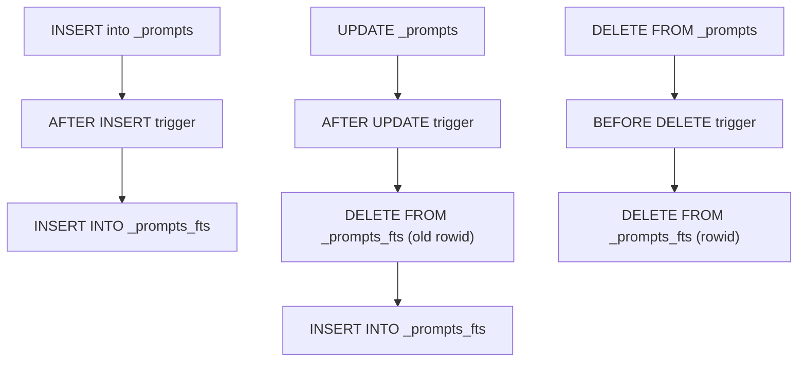
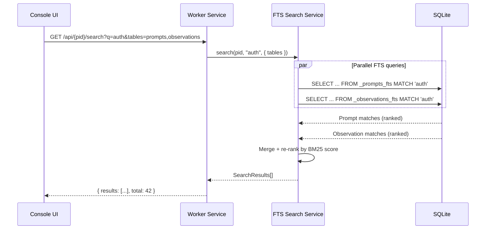

# ADR-038: FTS5 Full-Text Search for Intelligence Tables

## Status
Accepted

## Context

### The Problem with LIKE Queries

The hook intelligence system (ADRs 027–035) stores rich text data across multiple tables — prompt text, observation content, error messages, session summaries. Several API endpoints need text search:

| Endpoint | Table | Column(s) | Current Approach |
|----------|-------|-----------|-----------------|
| `GET /api/{pid}/prompts?q=` | `_prompts` | `prompt` | `LIKE '%term%'` |
| `GET /api/{pid}/observations?q=` | `_observations` | `content` | `LIKE '%term%'` |
| `GET /api/{pid}/errors?q=` | `_agent_errors` | `error_message`, `error_stack` | `LIKE '%term%'` |
| `GET /api/{pid}/sessions?q=` | `_sessions` | `summary`, `decisions` | `LIKE '%term%'` |

`LIKE '%term%'` has fundamental limitations:
1. **Full table scan** — SQLite cannot use indexes for leading-wildcard LIKE
2. **No ranking** — all matches are equal; no relevance sorting
3. **No tokenization** — can't match "authentication" when searching "auth"
4. **No phrase search** — can't search `"invalid token"` as an exact phrase
5. **No boolean operators** — can't search `error AND timeout NOT network`

As intelligence tables grow (thousands of prompts per project over weeks), search becomes the bottleneck.

### FTS5 in SQLite

SQLite ships with **FTS5** (Full-Text Search 5) — a virtual table module that creates an inverted index for fast text search. Key capabilities:

- **Inverted index** — O(log n) lookup vs O(n) table scan
- **BM25 ranking** — relevance-sorted results out of the box
- **Tokenizer** — word splitting, case folding, prefix matching (`auth*`)
- **Boolean queries** — `AND`, `OR`, `NOT`, phrase `"exact match"`
- **Snippet/highlight** — extract matching fragments with context
- **better-sqlite3 support** — FTS5 is compiled in by default, no extra dependencies

### Performance Comparison

| Operation | LIKE | FTS5 |
|-----------|------|------|
| Search 10K prompts | ~50ms | ~1ms |
| Search 100K prompts | ~500ms | ~2ms |
| Relevance ranking | N/A | Built-in (bm25) |
| Prefix search (`auth*`) | Requires GLOB | Native |
| Phrase search | N/A | Native |
| Boolean operators | N/A | Native |

## Decision

### External Content FTS5 Tables

Use **external content** FTS5 tables. These reference the original content tables rather than duplicating data. The FTS index stores only the inverted index — the actual text lives in the source table.

```
┌──────────────────────┐     ┌──────────────────────────┐
│    _prompts (source)  │────▶│  _prompts_fts (FTS5)     │
│  id, prompt, ...      │     │  inverted index only     │
└──────────────────────┘     │  content=_prompts        │
                              │  content_rowid=rowid     │
                              └──────────────────────────┘
```

Why external content:
- **No data duplication** — FTS table doesn't store original text
- **Single source of truth** — content table owns the data
- **Smaller DB size** — only inverted index stored in FTS table
- **Explicit sync** — we control when the index updates

### FTS5 Table Definitions

#### Prompts FTS
```sql
-- Full-text search index for prompt journal
CREATE VIRTUAL TABLE _prompts_fts USING fts5(
  prompt,                             -- Indexed: full prompt text
  intent_category,                    -- Indexed: for category filtering
  content=_prompts,                   -- External content table
  content_rowid=rowid,                -- Row ID mapping
  tokenize='porter unicode61'         -- Porter stemming + Unicode support
);
```

**Search examples:**
```sql
-- Basic search
SELECT p.*, rank
FROM _prompts_fts fts
JOIN _prompts p ON p.rowid = fts.rowid
WHERE _prompts_fts MATCH 'authentication'
  AND p.project_id = ?
ORDER BY rank;

-- Prefix search
WHERE _prompts_fts MATCH 'auth*'

-- Phrase search
WHERE _prompts_fts MATCH '"invalid token"'

-- Boolean: prompts about auth errors, not network
WHERE _prompts_fts MATCH 'auth AND error NOT network'

-- Category-scoped: only bug-fix prompts mentioning auth
WHERE _prompts_fts MATCH 'intent_category:bug-fix AND auth'

-- Snippet extraction for search results
SELECT p.id, snippet(_prompts_fts, 0, '<mark>', '</mark>', '...', 32) as preview
FROM _prompts_fts fts
JOIN _prompts p ON p.rowid = fts.rowid
WHERE _prompts_fts MATCH ?
ORDER BY rank;
```

#### Observations FTS
```sql
-- Full-text search index for observations
CREATE VIRTUAL TABLE _observations_fts USING fts5(
  content,                            -- Indexed: observation text
  category,                           -- Indexed: for category filtering
  content=_observations,
  content_rowid=rowid,
  tokenize='porter unicode61'
);
```

**Search examples:**
```sql
-- Search observations about testing patterns
SELECT o.*, rank
FROM _observations_fts fts
JOIN _observations o ON o.rowid = fts.rowid
WHERE _observations_fts MATCH 'testing'
  AND o.project_id = ?
  AND o.active = 1
ORDER BY rank;

-- Category-scoped search
WHERE _observations_fts MATCH 'category:security AND vulnerability'
```

#### Agent Errors FTS
```sql
-- Full-text search index for agent errors
CREATE VIRTUAL TABLE _agent_errors_fts USING fts5(
  error_message,                      -- Indexed: error message
  error_name,                         -- Indexed: error type
  error_stack,                        -- Indexed: stack trace
  content=_agent_errors,
  content_rowid=rowid,
  tokenize='porter unicode61'
);
```

**Search examples:**
```sql
-- Search errors by message content
SELECT e.*, rank
FROM _agent_errors_fts fts
JOIN _agent_errors e ON e.rowid = fts.rowid
WHERE _agent_errors_fts MATCH 'ENOENT'
  AND e.project_id = ?
ORDER BY rank;

-- Search across message + stack
WHERE _agent_errors_fts MATCH 'TypeError AND "Cannot read"'

-- Search by error type + keyword
WHERE _agent_errors_fts MATCH 'error_name:SyntaxError AND unexpected'
```

#### Sessions FTS
```sql
-- Full-text search index for session summaries
CREATE VIRTUAL TABLE _sessions_fts USING fts5(
  summary,                            -- Indexed: session summary text
  content=_sessions,
  content_rowid=rowid,
  tokenize='porter unicode61'
);
```

**Search examples:**
```sql
-- Search session summaries
SELECT s.*, rank
FROM _sessions_fts fts
JOIN _sessions s ON s.rowid = fts.rowid
WHERE _sessions_fts MATCH 'refactored authentication'
  AND s.project_id = ?
ORDER BY rank;
```

### Sync Strategy

External content FTS tables require **explicit sync** — they don't auto-update when the source table changes. We use SQLite triggers to keep the index in sync.



#### Sync Triggers (per table)

```sql
-- === _prompts sync triggers ===

-- After insert: add to FTS index
CREATE TRIGGER _prompts_fts_insert AFTER INSERT ON _prompts BEGIN
  INSERT INTO _prompts_fts(rowid, prompt, intent_category)
  VALUES (new.rowid, new.prompt, new.intent_category);
END;

-- After update: remove old entry, add new
CREATE TRIGGER _prompts_fts_update AFTER UPDATE ON _prompts BEGIN
  INSERT INTO _prompts_fts(_prompts_fts, rowid, prompt, intent_category)
  VALUES ('delete', old.rowid, old.prompt, old.intent_category);
  INSERT INTO _prompts_fts(rowid, prompt, intent_category)
  VALUES (new.rowid, new.prompt, new.intent_category);
END;

-- Before delete: remove from FTS index
CREATE TRIGGER _prompts_fts_delete BEFORE DELETE ON _prompts BEGIN
  INSERT INTO _prompts_fts(_prompts_fts, rowid, prompt, intent_category)
  VALUES ('delete', old.rowid, old.prompt, old.intent_category);
END;

-- === _observations sync triggers ===

CREATE TRIGGER _observations_fts_insert AFTER INSERT ON _observations BEGIN
  INSERT INTO _observations_fts(rowid, content, category)
  VALUES (new.rowid, new.content, new.category);
END;

CREATE TRIGGER _observations_fts_update AFTER UPDATE ON _observations BEGIN
  INSERT INTO _observations_fts(_observations_fts, rowid, content, category)
  VALUES ('delete', old.rowid, old.content, old.category);
  INSERT INTO _observations_fts(rowid, content, category)
  VALUES (new.rowid, new.content, new.category);
END;

CREATE TRIGGER _observations_fts_delete BEFORE DELETE ON _observations BEGIN
  INSERT INTO _observations_fts(_observations_fts, rowid, content, category)
  VALUES ('delete', old.rowid, old.content, old.category);
END;

-- === _agent_errors sync triggers ===

CREATE TRIGGER _agent_errors_fts_insert AFTER INSERT ON _agent_errors BEGIN
  INSERT INTO _agent_errors_fts(rowid, error_message, error_name, error_stack)
  VALUES (new.rowid, new.error_message, new.error_name, new.error_stack);
END;

CREATE TRIGGER _agent_errors_fts_update AFTER UPDATE ON _agent_errors BEGIN
  INSERT INTO _agent_errors_fts(_agent_errors_fts, rowid, error_message, error_name, error_stack)
  VALUES ('delete', old.rowid, old.error_message, old.error_name, old.error_stack);
  INSERT INTO _agent_errors_fts(rowid, error_message, error_name, error_stack)
  VALUES (new.rowid, new.error_message, new.error_name, new.error_stack);
END;

CREATE TRIGGER _agent_errors_fts_delete BEFORE DELETE ON _agent_errors BEGIN
  INSERT INTO _agent_errors_fts(_agent_errors_fts, rowid, error_message, error_name, error_stack)
  VALUES ('delete', old.rowid, old.error_message, old.error_name, old.error_stack);
END;

-- === _sessions sync triggers ===

CREATE TRIGGER _sessions_fts_insert AFTER INSERT ON _sessions BEGIN
  INSERT INTO _sessions_fts(rowid, summary)
  VALUES (new.rowid, new.summary);
END;

CREATE TRIGGER _sessions_fts_update AFTER UPDATE ON _sessions BEGIN
  INSERT INTO _sessions_fts(_sessions_fts, rowid, summary)
  VALUES ('delete', old.rowid, old.summary);
  INSERT INTO _sessions_fts(rowid, summary)
  VALUES (new.rowid, new.summary);
END;

CREATE TRIGGER _sessions_fts_delete BEFORE DELETE ON _sessions BEGIN
  INSERT INTO _sessions_fts(_sessions_fts, rowid, summary)
  VALUES ('delete', old.rowid, old.summary);
END;
```

### Rebuild Command

For maintenance or initial population of FTS tables from existing data:

```sql
-- Rebuild _prompts_fts from scratch
INSERT INTO _prompts_fts(_prompts_fts) VALUES('rebuild');

-- Same for all FTS tables
INSERT INTO _observations_fts(_observations_fts) VALUES('rebuild');
INSERT INTO _agent_errors_fts(_agent_errors_fts) VALUES('rebuild');
INSERT INTO _sessions_fts(_sessions_fts) VALUES('rebuild');
```

### Tokenizer Choice

```
tokenize='porter unicode61'
```

- **`unicode61`** — Unicode-aware tokenization (handles accented chars, CJK, etc.)
- **`porter`** — Porter stemming algorithm (English): "authentication" matches "auth", "debugging" matches "debug"

For code-heavy content (error stacks, file paths), consider a future custom tokenizer that preserves dots and slashes. The default tokenizer handles most search needs well.

### Migration Strategy

FTS tables are created as a **core migration** (not per-extension), since they index core intelligence tables.

```
migrations/
  core/
    001_create_sessions.up.sql
    001_create_sessions.down.sql
    002_create_observations.up.sql
    002_create_observations.down.sql
    003_create_prompts.up.sql
    003_create_prompts.down.sql
    004_create_agent_errors.up.sql
    004_create_agent_errors.down.sql
    005_create_fts_indexes.up.sql      ← NEW
    005_create_fts_indexes.down.sql    ← NEW
```

**`005_create_fts_indexes.up.sql`:**
```sql
-- FTS5 virtual tables for full-text search across intelligence tables

CREATE VIRTUAL TABLE IF NOT EXISTS _prompts_fts USING fts5(
  prompt, intent_category,
  content=_prompts, content_rowid=rowid,
  tokenize='porter unicode61'
);

CREATE VIRTUAL TABLE IF NOT EXISTS _observations_fts USING fts5(
  content, category,
  content=_observations, content_rowid=rowid,
  tokenize='porter unicode61'
);

CREATE VIRTUAL TABLE IF NOT EXISTS _agent_errors_fts USING fts5(
  error_message, error_name, error_stack,
  content=_agent_errors, content_rowid=rowid,
  tokenize='porter unicode61'
);

CREATE VIRTUAL TABLE IF NOT EXISTS _sessions_fts USING fts5(
  summary,
  content=_sessions, content_rowid=rowid,
  tokenize='porter unicode61'
);

-- Sync triggers (all tables)
-- [triggers as defined above]

-- Initial population from existing data
INSERT INTO _prompts_fts(_prompts_fts) VALUES('rebuild');
INSERT INTO _observations_fts(_observations_fts) VALUES('rebuild');
INSERT INTO _agent_errors_fts(_agent_errors_fts) VALUES('rebuild');
INSERT INTO _sessions_fts(_sessions_fts) VALUES('rebuild');
```

**`005_create_fts_indexes.down.sql`:**
```sql
-- Drop sync triggers
DROP TRIGGER IF EXISTS _prompts_fts_insert;
DROP TRIGGER IF EXISTS _prompts_fts_update;
DROP TRIGGER IF EXISTS _prompts_fts_delete;
DROP TRIGGER IF EXISTS _observations_fts_insert;
DROP TRIGGER IF EXISTS _observations_fts_update;
DROP TRIGGER IF EXISTS _observations_fts_delete;
DROP TRIGGER IF EXISTS _agent_errors_fts_insert;
DROP TRIGGER IF EXISTS _agent_errors_fts_update;
DROP TRIGGER IF EXISTS _agent_errors_fts_delete;
DROP TRIGGER IF EXISTS _sessions_fts_insert;
DROP TRIGGER IF EXISTS _sessions_fts_update;
DROP TRIGGER IF EXISTS _sessions_fts_delete;

-- Drop FTS virtual tables
DROP TABLE IF EXISTS _prompts_fts;
DROP TABLE IF EXISTS _observations_fts;
DROP TABLE IF EXISTS _agent_errors_fts;
DROP TABLE IF EXISTS _sessions_fts;
```

### API Integration

#### Search Service

```typescript
interface FTSSearchService {
  // Unified search across all intelligence tables
  search(projectId: string, query: string, options?: SearchOptions): SearchResults;

  // Table-specific search
  searchPrompts(projectId: string, query: string, options?: SearchOptions): PromptSearchResult[];
  searchObservations(projectId: string, query: string, options?: SearchOptions): ObservationSearchResult[];
  searchErrors(projectId: string, query: string, options?: SearchOptions): ErrorSearchResult[];
  searchSessions(projectId: string, query: string, options?: SearchOptions): SessionSearchResult[];

  // Rebuild index (admin/maintenance)
  rebuildIndex(table: FTSTable): void;
}

interface SearchOptions {
  limit?: number;           // Max results (default 20)
  offset?: number;          // Pagination offset
  snippet?: boolean;        // Return highlighted snippets (default true)
  snippetLength?: number;   // Max snippet tokens (default 32)
}

interface SearchResult {
  id: string;
  table: '_prompts' | '_observations' | '_agent_errors' | '_sessions';
  rank: number;             // BM25 relevance score
  snippet: string;          // Highlighted match preview
}

type FTSTable = 'prompts' | 'observations' | 'errors' | 'sessions';
```

#### Updated API Routes

```
GET /api/{pid}/prompts/search?q=auth&limit=20
GET /api/{pid}/observations/search?q=testing+pattern
GET /api/{pid}/errors/search?q="Cannot read property"
GET /api/{pid}/sessions/search?q=refactor+auth
GET /api/{pid}/search?q=auth&tables=prompts,observations   ← unified cross-table search
```

#### Unified Search Flow



### Console UI Integration

The search bar in Console UI uses FTS for instant search across all intelligence data:

```
┌─────────────────────────────────────────────────────────┐
│  🔍 Search across sessions, prompts, observations...    │
│  ┌───────────────────────────────────────────────────┐  │
│  │ auth                                              │  │
│  └───────────────────────────────────────────────────┘  │
│                                                         │
│  Prompts (12 results)                                   │
│  ┌─────────────────────────────────────────────────┐    │
│  │ "Fix the <mark>auth</mark>entication bug in     │    │
│  │  login flow when token expires..."               │    │
│  │  ─ 2h ago · bug-fix · session #a3f              │    │
│  ├─────────────────────────────────────────────────┤    │
│  │ "Add OAuth2 <mark>auth</mark> to the API..."    │    │
│  │  ─ yesterday · feature · session #b7c           │    │
│  └─────────────────────────────────────────────────┘    │
│                                                         │
│  Observations (3 results)                               │
│  ┌─────────────────────────────────────────────────┐    │
│  │ "This project uses JWT <mark>auth</mark> with   │    │
│  │  refresh tokens stored in httpOnly cookies"      │    │
│  │  ─ confirmed · architecture · injected 8×       │    │
│  └─────────────────────────────────────────────────┘    │
│                                                         │
│  Errors (5 results)                                     │
│  ┌─────────────────────────────────────────────────┐    │
│  │ "<mark>Auth</mark>enticationError: Invalid       │    │
│  │  bearer token format"                            │    │
│  │  ─ 3h ago · pattern #e2a (seen 4×)              │    │
│  └─────────────────────────────────────────────────┘    │
└─────────────────────────────────────────────────────────┘
```

### Query Sanitization

FTS5 `MATCH` syntax has special characters. User input must be sanitized:

```typescript
function sanitizeFTS5Query(input: string): string {
  // Preserve intentional FTS5 operators
  // AND, OR, NOT, quotes for phrases, * for prefix
  // Escape special chars that aren't operators: ^, :, {, }, (, )

  // Strip characters that could cause FTS5 parse errors
  const sanitized = input
    .replace(/[{}()^]/g, '')        // Remove grouping/boost chars
    .replace(/:/g, ' ')             // Remove column filters from user input
    .trim();

  // If empty after sanitize, return wildcard
  if (!sanitized) return '*';

  return sanitized;
}
```

Column-scoped searches (like `intent_category:bug-fix`) are constructed server-side from structured query parameters, not from raw user input.

## Consequences

### Positive
- **~50x faster text search** on large tables (inverted index vs full scan)
- **Relevance ranking** via BM25 — most relevant results first
- **Rich query syntax** — phrases, prefix, boolean operators
- **Snippet extraction** — highlighted search results for Console UI
- **No extra dependencies** — FTS5 is built into better-sqlite3
- **Minimal storage overhead** — external content tables store only the inverted index
- **Trigger-based sync** — zero application-level sync code

### Negative
- **Write overhead** — each INSERT/UPDATE/DELETE fires a trigger to update the FTS index (~5-10% slower writes)
- **Migration complexity** — FTS tables and triggers added as a separate migration
- **Rebuild needed** — if triggers are missed or corrupted, must run `rebuild` command
- **Tokenizer limitations** — default tokenizer may split code tokens (file paths, class names) in unexpected ways

### Neutral
- FTS5 `MATCH` syntax differs from SQL `LIKE` — search service abstracts this
- External content tables require the source table to have a `rowid` (SQLite default for non-WITHOUT-ROWID tables — our tables all qualify)
- FTS5 indexes are per-table, not per-project — the `JOIN` with `project_id = ?` filter happens after FTS lookup (still fast due to small result sets from FTS)
