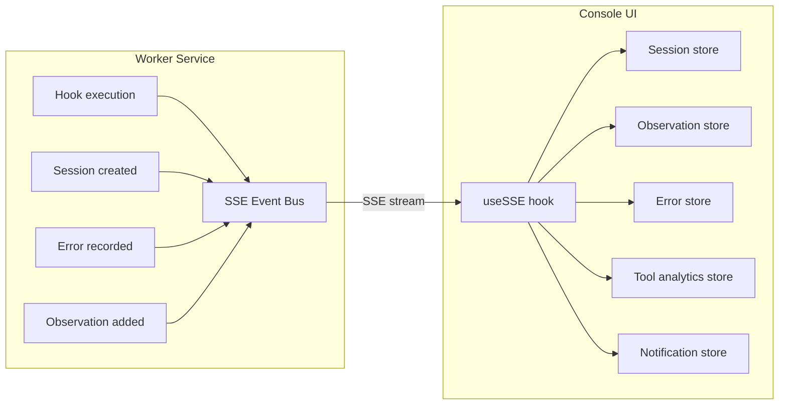
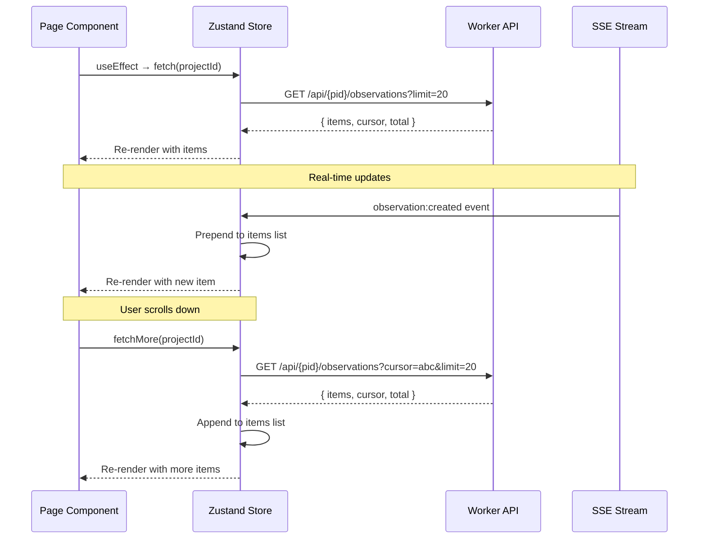

# ADR-039: Console Intelligence Pages — UI Architecture

## Status
Accepted

## Context

ADRs 027–035 define individual intelligence features (session memory, observations, tool governance, prompt journal, error intelligence, tool analytics, session timeline, subagent tracking, context recipes) — each with its own backend API and feature-specific Console UI mockup.

ADR-024 defines the core Console pages (System Home, Project Home, Vault, Logs, Settings) and sidebar structure. ADR-022 defines the tech stack (React 19, Zustand, shadcn/ui, Tailwind).

What's missing is the **holistic architecture** for intelligence pages in the Console:
- How do intelligence pages integrate into the existing sidebar and navigation?
- What shared UI patterns do all intelligence pages use?
- How does unified search (FTS5, ADR-038) surface across the Console?
- How do Project Home dashboard cards link to intelligence detail pages?
- What real-time updates (SSE) do intelligence pages subscribe to?
- What is the shared component architecture?

## Decision

### Navigation Hierarchy

Intelligence pages are organized into a collapsible **"Intelligence" group** in the sidebar, below core pages and above extension pages.

```
┌──────────────────┐
│ Sidebar           │
│                   │
│ Dashboard         │  ← Core page (ADR-024)
│ ──────────        │
│ Intelligence  ▼   │  ← Collapsible group
│   Sessions        │
│   Observations    │
│   Prompts         │
│   Errors          │
│   Tool Analytics  │
│   Context Recipes │
│ ──────────        │
│ Governance        │  ← Global (not project-scoped)
│ ──────────        │
│ Jira              │  ← Extension pages
│   Issues          │
│   Sessions        │
│ ──────────        │
│ GitHub MCP        │
│   Repos           │
│ ──────────        │
│ Extension Manager │  ← Core page
│ Logs              │  ← Core page
└──────────────────┘
```

**Key decisions:**
- **Intelligence group is collapsible** — defaults to expanded when project has session data
- **Tool Governance** is a top-level sidebar item (not in Intelligence group) because it's global + project-scoped, similar to Settings
- **Context Recipes** lives inside Intelligence because it's project-scoped configuration
- **Session Timeline** is not a sidebar item — accessed by clicking a session row on the Sessions page

### Route Map

| Page | Route | Scope | Sidebar |
|------|-------|-------|---------|
| Sessions List | `/:pid/sessions` | Project | Intelligence > Sessions |
| Session Timeline | `/:pid/sessions/:sid` | Project | — (click-through) |
| Observations | `/:pid/observations` | Project | Intelligence > Observations |
| Prompt Journal | `/:pid/prompts` | Project | Intelligence > Prompts |
| Error Intelligence | `/:pid/errors` | Project | Intelligence > Errors |
| Tool Analytics | `/:pid/tools` | Project | Intelligence > Tool Analytics |
| Context Recipes | `/:pid/context-recipes` | Project | Intelligence > Context Recipes |
| Tool Governance (global) | `/tool-governance` | Global | Governance |
| Tool Governance (project) | `/:pid/tool-governance` | Project | Governance |
| Unified Search | `/:pid/search?q=` | Project | — (toolbar search) |

### Project Home — Intelligence Cards

The Project Home dashboard (ADR-024) is extended with intelligence summary cards that link to detail pages.

```
┌─────────────────────────────────────────────────────────────┐
│  my-app — Dashboard                                         │
│                                                             │
│  ┌─ Extensions (3) ─────┐  ┌─ Running MCPs (1) ──────────┐ │
│  │  (existing cards)     │  │  (existing cards)           │ │
│  └───────────────────────┘  └─────────────────────────────┘ │
│                                                             │
│  ┌─ Intelligence ───────────────────────────────────────────┐│
│  │                                                          ││
│  │  ┌─────────────┐ ┌─────────────┐ ┌──────────────┐       ││
│  │  │  Sessions    │ │ Observations│ │ Errors       │       ││
│  │  │             │ │             │ │              │       ││
│  │  │  3 today     │ │ 12 active   │ │ 2 active     │       ││
│  │  │  ● 1 active  │ │ 3 suggested │ │ patterns     │       ││
│  │  │             │ │             │ │ 5 today      │       ││
│  │  └─────────────┘ └─────────────┘ └──────────────┘       ││
│  │                                                          ││
│  │  ┌─────────────┐ ┌─────────────┐ ┌──────────────┐       ││
│  │  │  Prompts     │ │ Tool Rules  │ │ Tool Usage   │       ││
│  │  │             │ │             │ │              │       ││
│  │  │  47 this wk  │ │ 8 rules     │ │ 34 today     │       ││
│  │  │  top: bugfix │ │ 3 deny      │ │ 88% success  │       ││
│  │  │             │ │             │ │              │       ││
│  │  └─────────────┘ └─────────────┘ └──────────────┘       ││
│  │                                                          ││
│  └──────────────────────────────────────────────────────────┘│
│                                                             │
│  ┌─ Recent Sessions ───────────────────────────────────────┐ │
│  │                                                         │ │
│  │  14:00  Copilot   45 min   8 prompts   2 errors [→]    │ │
│  │  11:30  Claude    22 min   3 prompts   0 errors [→]    │ │
│  │  Yesterday  Copilot  1h 15m  12 prompts  1 error [→]   │ │
│  │                                                         │ │
│  └─────────────────────────────────────────────────────────┘ │
│                                                             │
│  ┌─ Hook Activity ──────┐  ┌─ Recent Logs ────────────────┐ │
│  │  (existing cards)     │  │  (existing cards)            │ │
│  └───────────────────────┘  └──────────────────────────────┘ │
└─────────────────────────────────────────────────────────────┘
```

**Intelligence cards:**

| Card | Data Source | Content |
|------|------------|---------|
| Sessions | `GET /api/{pid}/sessions?limit=1&status=active` + count | Today's sessions, active count |
| Observations | `GET /api/{pid}/observations/stats` | Active count, suggested count |
| Errors | `GET /api/{pid}/errors/patterns/stats` | Active patterns, today's error count |
| Prompts | `GET /api/{pid}/prompts/analytics` | This week's total, top intent |
| Tool Rules | `GET /api/tool-rules/stats?pid={pid}` | Rule count, deny rule count |
| Tool Usage | `GET /api/{pid}/tools/analytics?period=today` | Today's total, success rate |

Each card is a clickable `<Link>` to the detail page. Cards use the shadcn `<Card>` component with a subtle hover effect.

### Unified Search Bar

A global search bar in the toolbar uses FTS5 (ADR-038) to search across all intelligence tables.

```
┌─────────────────────────────────────────────────────────────┐
│  [RenRe Kit]  [Project: my-app ▼]  [🔍 Search...]  [🔑] [⚙]│
└─────────────────────────────────────────────────────────────┘
```

On focus, the search bar expands into a **command palette**-style dropdown with categorized results:

```
┌─────────────────────────────────────────────────────────────┐
│  🔍 [auth                                              ]    │
│  ┌──────────────────────────────────────────────────────┐   │
│  │  ⏎ Search "auth" across all data              ⌘+Enter│   │
│  │                                                      │   │
│  │  Sessions (2)                                        │   │
│  │  ┊ "Fixed login bug in <b>auth</b>.ts"   2h ago     │   │
│  │  ┊ "Refactored <b>auth</b> middleware"    yesterday  │   │
│  │                                                      │   │
│  │  Observations (1)                                    │   │
│  │  ┊ "JWT <b>auth</b> with refresh tokens"  confirmed  │   │
│  │                                                      │   │
│  │  Prompts (4)                                         │   │
│  │  ┊ "Fix the <b>auth</b>entication bug..."  bug-fix   │   │
│  │  ┊ "Add OAuth2 <b>auth</b> to the API"     feature   │   │
│  │  ┊ +2 more                                           │   │
│  │                                                      │   │
│  │  Errors (1)                                          │   │
│  │  ┊ "<b>Auth</b>enticationError: Invalid..."  3×      │   │
│  │                                                      │   │
│  └──────────────────────────────────────────────────────┘   │
└─────────────────────────────────────────────────────────────┘
```

**Search behavior:**
- **Keystroke debounce**: 300ms delay before querying
- **Quick preview**: Top 3 results per category in dropdown (calls `GET /api/{pid}/search?q=&limit=3`)
- **Full results**: Press Enter or click "Search across all data" → navigates to `/:pid/search?q=auth`
- **Keyboard navigation**: Arrow keys to navigate results, Enter to select
- **Category click**: Click category header → navigates to that page with search pre-filled (e.g., `/:pid/prompts?q=auth`)
- **Shortcut**: `Cmd+K` / `Ctrl+K` to focus search bar

#### Full Search Results Page

```
┌─────────────────────────────────────────────────────────────┐
│  Search Results for "auth"                        42 results│
│                                                             │
│  Tables: [☑ All] [☐ Sessions] [☐ Observations]              │
│          [☐ Prompts] [☐ Errors]                             │
│                                                             │
│  ┌─ Prompts (12) ───────────────────────────────────────┐   │
│  │                                                       │   │
│  │  "Fix the <mark>auth</mark>entication bug in         │   │
│  │   login flow when token expires..."                   │   │
│  │   2h ago · bug-fix · session #a3f          [Open →]   │   │
│  │                                                       │   │
│  │  "Add OAuth2 <mark>auth</mark> to the API..."        │   │
│  │   yesterday · feature · session #b7c       [Open →]   │   │
│  │                                                       │   │
│  │  +10 more                              [View all →]   │   │
│  └───────────────────────────────────────────────────────┘   │
│                                                             │
│  ┌─ Observations (3) ───────────────────────────────────┐   │
│  │                                                       │   │
│  │  "JWT <mark>auth</mark> with refresh tokens stored    │   │
│  │   in httpOnly cookies"                                │   │
│  │   confirmed · architecture · injected 8×   [Open →]   │   │
│  │                                                       │   │
│  │  +2 more                               [View all →]   │   │
│  └───────────────────────────────────────────────────────┘   │
│                                                             │
│  ┌─ Sessions (5) ───────────────────────────────────────┐   │
│  │  ...                                                  │   │
│  └───────────────────────────────────────────────────────┘   │
│                                                             │
│  ┌─ Errors (22) ────────────────────────────────────────┐   │
│  │  ...                                                  │   │
│  └───────────────────────────────────────────────────────┘   │
└─────────────────────────────────────────────────────────────┘
```

### Shared UI Patterns

All intelligence pages follow consistent patterns for filtering, searching, empty states, and data fetching.

#### Pattern 1: Page Header with Search & Filters

Every intelligence list page has the same header layout:

```
┌─────────────────────────────────────────────────────────────┐
│  Page Title                                     action btns │
│                                                             │
│  🔍 [Search within this page...       ]                     │
│                                                             │
│  Filter: [Category ▼]  [Agent ▼]  [Period: Last 7 days ▼]  │
│          [Status ▼]                          [Clear filters]│
└─────────────────────────────────────────────────────────────┘
```

**Shared `<PageHeader>` component:**

```typescript
interface PageHeaderProps {
  title: string;
  subtitle?: string;           // e.g., "12 active observations"
  searchPlaceholder?: string;
  onSearch?: (query: string) => void;
  filters?: FilterConfig[];
  actions?: React.ReactNode;   // e.g., [+ Add Observation] button
}

interface FilterConfig {
  key: string;
  label: string;
  options: { label: string; value: string }[];
  value: string;
  onChange: (value: string) => void;
}
```

#### Pattern 2: Analytics Cards Row

Pages with analytics show summary cards above the main content:

```
┌─────────┐ ┌─────────┐ ┌─────────┐ ┌─────────┐
│ Total    │ │ Active  │ │ Success │ │ Trend   │
│    47    │ │    12   │ │   88%   │ │   ↑ 12% │
│ prompts  │ │ patterns│ │ rate    │ │ vs last │
└─────────┘ └─────────┘ └─────────┘ └─────────┘
```

**Shared `<StatsCard>` component:**

```typescript
interface StatsCardProps {
  label: string;
  value: string | number;
  subtitle?: string;
  trend?: { direction: "up" | "down" | "flat"; value: string };
  icon?: React.ReactNode;
}
```

#### Pattern 3: List with Expandable Rows

Most intelligence pages display items in a list where clicking expands to show details:

```
┌─────────────────────────────────────────────────────────────┐
│  Item summary line with badges and metadata          [→] ▸  │
├─────────────────────────────────────────────────────────────┤
│  ▾ Expanded detail view (only one expanded at a time)       │
│                                                             │
│  Full content text here with details, linked entities,      │
│  and action buttons for this specific item.                 │
│                                                             │
│  [Action 1]  [Action 2]  [Action 3]                        │
└─────────────────────────────────────────────────────────────┘
│  Next item summary line                              [→] ▸  │
├─────────────────────────────────────────────────────────────┤
│  Next item summary line                              [→] ▸  │
└─────────────────────────────────────────────────────────────┘
```

**Shared `<ExpandableList>` component:**

```typescript
interface ExpandableListProps<T> {
  items: T[];
  renderSummary: (item: T) => React.ReactNode;
  renderExpanded: (item: T) => React.ReactNode;
  keyExtractor: (item: T) => string;
  emptyState?: React.ReactNode;
  loading?: boolean;
}
```

#### Pattern 4: Empty States

Each page has a contextual empty state when there's no data:

```
┌─────────────────────────────────────────────────────────────┐
│                                                             │
│                      [icon]                                 │
│                                                             │
│               No observations yet                           │
│                                                             │
│    Observations are learned from your AI agent sessions.    │
│    Start a session with Copilot or Claude to begin          │
│    collecting project context automatically.                │
│                                                             │
│    [+ Add Observation Manually]                             │
│                                                             │
└─────────────────────────────────────────────────────────────┘
```

Empty states per page:

| Page | Title | Description | Action |
|------|-------|-------------|--------|
| Sessions | "No sessions recorded" | "Start an AI agent session in this project" | — |
| Observations | "No observations yet" | "Observations are learned from AI sessions" | [+ Add Observation] |
| Prompts | "No prompts recorded" | "Submit prompts via your AI agent" | — |
| Errors | "No errors detected" | "Errors from AI sessions appear here" | — |
| Tool Analytics | "No tool usage data" | "Tool usage is recorded during AI sessions" | — |
| Context Recipes | — (always has defaults) | — | — |
| Tool Governance | "No custom rules" | "Default safety rules are active" | [+ Add Rule] |

#### Pattern 5: Pagination

Intelligence pages use **cursor-based pagination** for large datasets:

```
┌───────────────────────────────────────────────────────────┐
│  Showing 1–20 of 47               [← Previous] [Next →]  │
└───────────────────────────────────────────────────────────┘
```

All list endpoints accept `?cursor=&limit=20`. The UI shows simple Previous/Next buttons rather than page numbers — this aligns with cursor-based pagination from the timeline API (ADR-033).

### Page Detail — Sessions List

The Sessions page is the primary entry point for intelligence data since most other data is linked to sessions.

```
┌─────────────────────────────────────────────────────────────┐
│  Sessions                                                   │
│                                                             │
│  🔍 [Search sessions...              ]                      │
│                                                             │
│  Filter: [Agent: All ▼]  [Status: All ▼]  [Last 7 days ▼]  │
│                                                             │
│  ┌─ Summary ─────┐ ┌─────────────┐ ┌─────────────┐         │
│  │ 15 sessions   │ │ 47 prompts  │ │ 88% tool    │         │
│  │ this week     │ │ submitted   │ │ success rate│         │
│  └───────────────┘ └─────────────┘ └─────────────┘         │
│                                                             │
│  ┌─────────────────────────────────────────────────────┐    │
│  │ Today                                               │    │
│  │                                                     │    │
│  │ ● 14:00–14:45  Copilot  45m                         │    │
│  │   8 prompts · 34 tools (88%) · 2 errors             │    │
│  │   "Fixed login bug, refactored auth middleware"     │    │
│  │   Files: auth.ts, auth.test.ts           [Open →]   │    │
│  │                                                     │    │
│  │ ● 11:30–11:52  Claude   22m                         │    │
│  │   3 prompts · 12 tools (100%) · 0 errors            │    │
│  │   "Added rate limiting to users endpoint"           │    │
│  │   Files: users.ts, middleware.ts          [Open →]   │    │
│  │                                                     │    │
│  │ Yesterday                                           │    │
│  │                                                     │    │
│  │ ● 16:00–17:15  Copilot  1h 15m                      │    │
│  │   12 prompts · 67 tools (82%) · 1 error             │    │
│  │   "Implemented user profile page with tests"        │    │
│  │   Files: profile.tsx, profile.test.tsx    [Open →]   │    │
│  │                                                     │    │
│  │ ● 10:00–10:30  Copilot  30m                         │    │
│  │   5 prompts · 18 tools (94%) · 0 errors             │    │
│  │   "Set up CI pipeline for the project"              │    │
│  │   Files: .github/workflows/ci.yml        [Open →]   │    │
│  │                                                     │    │
│  └─────────────────────────────────────────────────────┘    │
│                                                             │
│  Showing 1–4 of 15                 [← Previous] [Next →]    │
└─────────────────────────────────────────────────────────────┘
```

**Session row data:**

| Field | Source |
|-------|--------|
| Time range | `startedAt`, `endedAt` |
| Agent badge | `agent` field (color-coded) |
| Duration | Computed from start/end |
| Prompt count | `prompts_count` |
| Tool count + success % | `tools_used_count`, computed from `_tool_usage` |
| Error count | `errors_count` |
| Summary | `summary` (from sessionEnd) |
| Files modified | `files_modified` JSON array |

**Clicking a session row → Session Timeline page (ADR-033 mockup).**

### Page Detail — Observations

```
┌─────────────────────────────────────────────────────────────┐
│  Observations                              [+ Add Observation]│
│                                                             │
│  🔍 [Search observations...              ]                  │
│                                                             │
│  Category: [All ▼]  Confidence: [All ▼]  Source: [All ▼]    │
│                                                             │
│  ┌─ Suggested (3) ──────────────────────────────────────┐   │
│  │                                                       │   │
│  │  💡 "Tests always run with --coverage flag"           │   │
│  │     auto-detected · tooling · seen 5× sessions        │   │
│  │                           [✓ Confirm]  [✗ Dismiss]    │   │
│  │                                                       │   │
│  │  💡 "API responses use snake_case keys"               │   │
│  │     auto-detected · architecture · seen 3× sessions   │   │
│  │                           [✓ Confirm]  [✗ Dismiss]    │   │
│  │                                                       │   │
│  │  💡 "Recurring ECONNREFUSED on port 5432"             │   │
│  │     error-pattern · tooling · 5 occurrences           │   │
│  │                           [✓ Confirm]  [✗ Dismiss]    │   │
│  │                                                       │   │
│  └───────────────────────────────────────────────────────┘   │
│                                                             │
│  ┌─ Active (12) ────────────────────────────────────────┐   │
│  │                                                       │   │
│  │  🔧 Tooling (4)                                       │   │
│  │                                                       │   │
│  │  "Project uses pnpm, not npm"                         │   │
│  │  confirmed · user · injected 12×               [···]  │   │
│  │                                                       │   │
│  │  "Always run tests before committing"                 │   │
│  │  confirmed · agent · injected 8×               [···]  │   │
│  │  ─ ─ ─ ─ ─ ─ ─ ─ ─ ─ ─ ─ ─ ─ ─ ─ ─ ─ ─ ─ ─ ─ ─   │   │
│  │                                                       │   │
│  │  🏗 Architecture (3)                                   │   │
│  │                                                       │   │
│  │  "Auth tokens expire after 1h, use refresh flow"      │   │
│  │  confirmed · user · injected 8×                [···]  │   │
│  │                                                       │   │
│  │  "Database uses PostgreSQL with Prisma ORM"           │   │
│  │  confirmed · ext:jira-plugin · injected 6×     [···]  │   │
│  │  ─ ─ ─ ─ ─ ─ ─ ─ ─ ─ ─ ─ ─ ─ ─ ─ ─ ─ ─ ─ ─ ─ ─   │   │
│  │                                                       │   │
│  │  🔒 Security (2)                                      │   │
│  │  ...                                                  │   │
│  │                                                       │   │
│  │  🧪 Testing (3)                                       │   │
│  │  ...                                                  │   │
│  │                                                       │   │
│  └───────────────────────────────────────────────────────┘   │
│                                                             │
│  ┌─ Archived (5) ───────────────────────────────── [▸] ─┐   │
│  │  Collapsed by default — click to expand               │   │
│  └───────────────────────────────────────────────────────┘   │
└─────────────────────────────────────────────────────────────┘
```

**[···] overflow menu:** Edit, Archive, Delete

**Add Observation dialog:**

```
┌─ Add Observation ────────────────────────────────┐
│                                                   │
│  Content:                                         │
│  ┌─────────────────────────────────────────────┐  │
│  │ This project uses PostgreSQL 15 with        │  │
│  │ read replicas for query scaling             │  │
│  └─────────────────────────────────────────────┘  │
│                                                   │
│  Category: [Architecture ▼]                       │
│                                                   │
│  Categories: General, Tooling, Architecture,      │
│  Testing, Workflow, Security                      │
│                                                   │
│                       [Cancel]  [Add Observation]  │
└───────────────────────────────────────────────────┘
```

### Page Detail — Tool Governance

Tool Governance has two scopes — global rules (`/tool-governance`) and project overrides (`/:pid/tool-governance`). Both render the same component with a scope toggle.

```
┌─────────────────────────────────────────────────────────────┐
│  Tool Governance                              [+ Add Rule]  │
│                                                             │
│  Scope: (● Global)  (○ Project: my-app)                     │
│                                                             │
│  ┌─ Rules ────────────── sorted by priority ─── [drag ☰] ──┐│
│  │                                                          ││
│  │  P:10  ✗ DENY   bash   rm -rf /                         ││
│  │  "Recursive force delete of root is not allowed"         ││
│  │  System rule · Hits: 2 · Last: 2h ago                    ││
│  │                                         [⚙] [Toggle] [×]││
│  │  ─ ─ ─ ─ ─ ─ ─ ─ ─ ─ ─ ─ ─ ─ ─ ─ ─ ─ ─ ─ ─ ─ ─ ─ ─ ││
│  │  P:20  ✗ DENY   bash   git push.*--force                ││
│  │  "Force push can destroy remote history"                 ││
│  │  System rule · Hits: 0                                   ││
│  │                                         [⚙] [Toggle] [×]││
│  │  ─ ─ ─ ─ ─ ─ ─ ─ ─ ─ ─ ─ ─ ─ ─ ─ ─ ─ ─ ─ ─ ─ ─ ─ ─ ││
│  │  P:50  ? ASK    bash   git push                          ││
│  │  "Confirm before pushing to remote"                      ││
│  │  System rule · Hits: 5 · Last: 30min ago                 ││
│  │                                         [⚙] [Toggle] [×]││
│  │  ─ ─ ─ ─ ─ ─ ─ ─ ─ ─ ─ ─ ─ ─ ─ ─ ─ ─ ─ ─ ─ ─ ─ ─ ─ ││
│  │  P:100 ✓ ALLOW  bash   pnpm test                        ││
│  │  "Always allow running tests"                            ││
│  │  User rule · Hits: 23                                    ││
│  │                                         [⚙] [Toggle] [×]││
│  │                                                          ││
│  └──────────────────────────────────────────────────────────┘│
│                                                             │
│  ┌─ Audit Log ──────────────────────────────────────────┐   │
│  │                                                       │   │
│  │  Filter: [Decision: All ▼]  [Agent: All ▼]  [24h ▼]  │   │
│  │                                                       │   │
│  │  14:23  ✗ DENIED   rm -rf node_modules/ tmp/          │   │
│  │         Rule: "Block recursive force delete"          │   │
│  │         copilot · session-abc                         │   │
│  │                                                       │   │
│  │  14:10  ? ASKED    git push origin main → APPROVED    │   │
│  │         Rule: "Confirm git push"                      │   │
│  │         copilot · session-abc                         │   │
│  │                                                       │   │
│  │  14:05  ✓ ALLOWED  pnpm test                          │   │
│  │         Rule: "Always allow tests"                    │   │
│  │         copilot · session-abc                         │   │
│  │                                                       │   │
│  └───────────────────────────────────────────────────────┘   │
│                                                             │
└─────────────────────────────────────────────────────────────┘
```

**Decision badges:**
- `✗ DENY` — red badge
- `? ASK` — yellow badge
- `✓ ALLOW` — green badge

### Page Detail — Prompt Journal

```
┌─────────────────────────────────────────────────────────────┐
│  Prompt Journal                                             │
│                                                             │
│  🔍 [Search prompts...                   ]                  │
│                                                             │
│  Agent: [All ▼]  Intent: [All ▼]  Period: [Last 7 days ▼]  │
│                                                             │
│  ┌─────────┐ ┌──────────────────────────────────────┐       │
│  │ 47      │ │  By Intent                            │       │
│  │ prompts │ │                                       │       │
│  │ (7 day) │ │  bug-fix  ████████░░  34%  (16)      │       │
│  │         │ │  feature  █████░░░░░  21%  (10)      │       │
│  │ Top:    │ │  debug    ████░░░░░░  17%  ( 8)      │       │
│  │ bugfix  │ │  refactor ███░░░░░░░  13%  ( 6)      │       │
│  │         │ │  question ██░░░░░░░░   9%  ( 4)      │       │
│  │ Agents: │ │  test     █░░░░░░░░░   4%  ( 2)      │       │
│  │ copilot │ │  other    █░░░░░░░░░   2%  ( 1)      │       │
│  │  62%    │ │                                       │       │
│  │ claude  │ │  Top keywords: "auth" (12), "test"    │       │
│  │  38%    │ │  (8), "API" (7), "user" (5)           │       │
│  └─────────┘ └──────────────────────────────────────┘       │
│                                                             │
│  ┌─ History ────────────────────────────────────────────┐   │
│  │                                                       │   │
│  │  14:23  copilot  [bug-fix]  session-abc               │   │
│  │  "Fix the login bug in auth.ts — token validation     │   │
│  │   fails for expired refresh tokens"                   │   │
│  │   ▸ Context injected: Jira PROJ-123               ▾   │   │
│  │                                                       │   │
│  │  14:01  copilot  [feature]  session-abc               │   │
│  │  "Add rate limiting to the /api/users endpoint"       │   │
│  │                                                   ▸   │   │
│  │                                                       │   │
│  │  Yesterday 16:30  claude  [debug]  session-xyz        │   │
│  │  "Why is the API returning 401 for valid tokens?"     │   │
│  │   ▸ Context: Jira PROJ-101, github-mcp PR #42     ▾   │   │
│  │                                                       │   │
│  └───────────────────────────────────────────────────────┘   │
│                                                             │
│  Showing 1–20 of 47               [← Previous] [Next →]    │
└─────────────────────────────────────────────────────────────┘
```

Expanding a prompt row (▾) reveals:

```
│  ▾ Expanded prompt detail                                    │
│                                                             │
│  Full prompt:                                               │
│  "Fix the login bug in auth.ts — token validation fails     │
│   for expired refresh tokens. The validateToken function     │
│   doesn't handle the refresh flow correctly."               │
│                                                             │
│  Context injected by extensions:                            │
│  ┌───────────────────────────────────────────────────────┐  │
│  │ Jira (jira-plugin):                                   │  │
│  │ "PROJ-123: Login fails with expired token — Sprint 5" │  │
│  └───────────────────────────────────────────────────────┘  │
│                                                             │
│  Session: session-abc  [Open Timeline →]                    │
│                                                             │
```

### Page Detail — Error Intelligence

```
┌─────────────────────────────────────────────────────────────┐
│  Error Intelligence                                         │
│                                                             │
│  🔍 [Search errors...                    ]                  │
│                                                             │
│  Status: [All ▼]  Period: [Last 7 days ▼]                   │
│                                                             │
│  ┌─ Trends (7 days) ───────────────────────────────────┐    │
│  │                                                      │    │
│  │  23 errors · 8 patterns · 3 resolved                 │    │
│  │                                                      │    │
│  │  Mon  ██░░  4                                        │    │
│  │  Tue  █░░░  2                                        │    │
│  │  Wed  ████  7                                        │    │
│  │  Thu  ██░░  5                                        │    │
│  │  Fri  ██░░  3                                        │    │
│  │  Sat  █░░░  1                                        │    │
│  │  Sun  █░░░  1                                        │    │
│  │                                                      │    │
│  └──────────────────────────────────────────────────────┘    │
│                                                             │
│  ┌─ Active Patterns (5) ────────────────────────────────┐   │
│  │                                                       │   │
│  │  🔴  "ECONNREFUSED 127.0.0.1:5432"                   │   │
│  │      5 occurrences · 3 sessions · Last: 2h ago        │   │
│  │      Auto-observation created                         │   │
│  │                      [Occurrences ▸] [Resolve] [Ignore]│   │
│  │                                                       │   │
│  │  🔴  "Assertion failed: expected 200, got 401"        │   │
│  │      3 occurrences · 2 sessions · Last: yesterday     │   │
│  │                      [Occurrences ▸] [Resolve] [Ignore]│   │
│  │                                                       │   │
│  └───────────────────────────────────────────────────────┘   │
│                                                             │
│  ┌─ Resolved (3) ────────────────────────────── [▸] ────┐   │
│  │                                                       │   │
│  │  ✅  "Module not found: @auth/core"                   │   │
│  │      4 occurrences · Resolved 3 days ago              │   │
│  │      Note: "Installed missing dependency with pnpm"   │   │
│  │                                                       │   │
│  └───────────────────────────────────────────────────────┘   │
│                                                             │
│  ┌─ Ignored (2) ─────────────────────────────── [▸] ────┐   │
│  │  Collapsed                                            │   │
│  └───────────────────────────────────────────────────────┘   │
└─────────────────────────────────────────────────────────────┘
```

**Resolve dialog:**

```
┌─ Resolve Error Pattern ──────────────────────────┐
│                                                   │
│  Pattern: "ECONNREFUSED 127.0.0.1:5432"           │
│  Occurrences: 5 across 3 sessions                 │
│                                                   │
│  Resolution note:                                 │
│  ┌─────────────────────────────────────────────┐  │
│  │ Started PostgreSQL with `pg_ctl start`.     │  │
│  │ Added to project README startup steps.      │  │
│  └─────────────────────────────────────────────┘  │
│                                                   │
│  ☑ Create observation from resolution note        │
│                                                   │
│                     [Cancel]  [Mark as Resolved]  │
└───────────────────────────────────────────────────┘
```

### Page Detail — Tool Analytics

```
┌─────────────────────────────────────────────────────────────┐
│  Tool Analytics                                             │
│                                                             │
│  View: (● Project overview)  (○ Session: [Select... ▼])     │
│  Period: [Last 7 days ▼]                                    │
│                                                             │
│  ┌────────┐ ┌────────┐ ┌────────┐ ┌────────┐               │
│  │ 347    │ │ 88%    │ │ 29     │ │ 3      │               │
│  │ tools  │ │ success│ │ avg/   │ │ warnings│               │
│  │ total  │ │ rate   │ │ session│ │         │               │
│  └────────┘ └────────┘ └────────┘ └────────┘               │
│                                                             │
│  ┌─ Tool Type Breakdown ────────────────────────────────┐   │
│  │                                                       │   │
│  │  bash    ████████████░░  152  (130 ✓  15 ✗  7 denied)│   │
│  │  edit    ████████░░░░░░   98  (96 ✓   2 ✗)           │   │
│  │  view    ██████░░░░░░░░   72  (72 ✓)                 │   │
│  │  create  ██░░░░░░░░░░░░   18  (18 ✓)                 │   │
│  │  other   █░░░░░░░░░░░░░    7  (5 ✓   2 ✗)            │   │
│  │                                                       │   │
│  └───────────────────────────────────────────────────────┘   │
│                                                             │
│  ┌─ Warnings ───────────────────────────────────────────┐   │
│  │                                                       │   │
│  │  ⚠ File thrashing: auth.ts edited 7× in session-abc  │   │
│  │  ⚠ Test loop: "pnpm test" failed 3× in session-def   │   │
│  │  ⚠ High churn: 52 tools in 10 min (session-abc)      │   │
│  │                                                       │   │
│  └───────────────────────────────────────────────────────┘   │
│                                                             │
│  ┌─ Most Edited Files ──────┐ ┌─ Top Commands ──────────┐   │
│  │                           │ │                         │   │
│  │  auth.ts       23 edits  │ │  pnpm test    45 runs   │   │
│  │  users.ts      15 edits  │ │  pnpm build   12 runs   │   │
│  │  utils.ts      12 edits  │ │  git status   18 runs   │   │
│  │  profile.tsx    8 edits  │ │  pnpm lint     8 runs   │   │
│  │                           │ │                         │   │
│  └───────────────────────────┘ └─────────────────────────┘   │
└─────────────────────────────────────────────────────────────┘
```

### Real-Time Updates via SSE

Intelligence pages subscribe to SSE events (ADR-023) for live updates without polling.



**SSE events consumed by intelligence pages:**

| SSE Event | Affected Pages | Store Update |
|-----------|---------------|--------------|
| `session:started` | Dashboard, Sessions | Append to session list |
| `session:ended` | Dashboard, Sessions | Update session row |
| `observation:created` | Dashboard, Observations | Append to list |
| `observation:updated` | Observations | Update in list |
| `error:recorded` | Dashboard, Errors | Update pattern counts |
| `prompt:recorded` | Prompts | Append to history |
| `tool:used` | Tool Analytics | Update counters |
| `tool:denied` | Tool Governance | Append to audit log |
| `hook:executed` | Dashboard | Update hook activity |

**Live update behavior:**
- New items appear at the top of lists with a subtle fade-in animation
- Counter badges in sidebar update in real-time (e.g., "Sessions (●)" when active)
- Dashboard cards update numbers without full page refresh
- Toast notification for significant events: "New error pattern detected", "Session ended"

### Component Architecture

```
packages/console-ui/src/
  components/
    intelligence/
      shared/
        PageHeader.tsx              # Title, search, filters (Pattern 1)
        StatsCard.tsx               # Summary metric card (Pattern 2)
        StatsRow.tsx                # Row of StatsCards
        ExpandableList.tsx          # List with expand/collapse (Pattern 3)
        EmptyState.tsx              # Contextual empty state (Pattern 4)
        Pagination.tsx              # Cursor-based pagination (Pattern 5)
        BadgeDecision.tsx           # deny/ask/allow badges
        BadgeIntent.tsx             # bug-fix/feature/debug badges
        BadgeAgent.tsx              # copilot/claude agent badges
        BadgeConfidence.tsx         # confirmed/suggested/auto badges
        TimeAgo.tsx                 # Relative timestamp display
        BarChart.tsx                # Horizontal bar chart (intent, tools)
        TrendChart.tsx              # Vertical bar chart (daily trends)
        SearchHighlight.tsx         # Render <mark> from FTS5 snippets
      sessions/
        SessionList.tsx             # Session list with date groups
        SessionRow.tsx              # Single session summary row
        SessionTimeline.tsx         # Full timeline view (ADR-033)
        TimelineEvent.tsx           # Single timeline event renderer
        SubagentGroup.tsx           # Nested subagent events
      observations/
        ObservationList.tsx         # Grouped observation list
        ObservationForm.tsx         # Add/edit dialog
        SuggestedBanner.tsx         # Suggested observations section
      governance/
        RuleList.tsx                # Draggable rule list
        RuleForm.tsx                # Add/edit rule dialog
        PatternPreview.tsx          # Live pattern match preview
        AuditLog.tsx                # Decision audit log
      prompts/
        PromptAnalytics.tsx         # Intent chart + keywords
        PromptHistory.tsx           # Expandable prompt list
        PromptDetail.tsx            # Expanded prompt with context
      errors/
        ErrorTrends.tsx             # Daily error chart
        PatternList.tsx             # Error pattern list
        PatternDetail.tsx           # Occurrences + resolution
        ResolveDialog.tsx           # Resolution note dialog
      tools/
        ToolSummary.tsx             # Stats cards + type breakdown
        ToolWarnings.tsx            # Detected pattern warnings
        FileHotspots.tsx            # Most edited files
        CommandFrequency.tsx        # Top commands
      recipes/
        RecipeEditor.tsx            # Provider list with drag-reorder
        ProviderConfig.tsx          # Per-provider settings panel
        ContextPreview.tsx          # Preview assembled context
        TokenBudgetBar.tsx          # Visual token budget indicator
      search/
        SearchPalette.tsx           # Command palette dropdown
        SearchResults.tsx           # Full search results page
        ResultGroup.tsx             # Category group with items
  routes/
    [projectId]/
      sessions/
        index.tsx                   # Sessions list page
        [sessionId].tsx             # Session timeline page
      observations.tsx              # Observations page
      prompts.tsx                   # Prompt journal page
      errors.tsx                    # Error intelligence page
      tools.tsx                     # Tool analytics page
      context-recipes.tsx           # Context recipes page
      tool-governance.tsx           # Project tool governance
      search.tsx                    # Full search results page
    tool-governance.tsx             # Global tool governance
  stores/
    session-store.ts
    observation-store.ts
    tool-rules-store.ts
    error-store.ts
    tool-analytics-store.ts
    prompt-store.ts
    context-recipe-store.ts
    search-store.ts
```

### Data Fetching Strategy

All intelligence pages use **Zustand stores** with an async fetch pattern. Each store has:

```typescript
interface IntelligenceStore<T> {
  // Data
  items: T[];
  loading: boolean;
  error: string | null;

  // Pagination
  cursor: string | null;
  hasMore: boolean;

  // Filters
  filters: Record<string, string>;
  searchQuery: string;

  // Actions
  fetch: (projectId: string) => Promise<void>;
  fetchMore: (projectId: string) => Promise<void>;   // Load next page
  setFilter: (key: string, value: string) => void;
  setSearch: (query: string) => void;
  reset: () => void;

  // SSE updates
  onEvent: (event: SSEEvent) => void;   // Handle real-time updates
}
```

**Fetching flow:**



## Consequences

### Positive
- **Consistent UX** — shared patterns (PageHeader, StatsCard, ExpandableList, EmptyState) make all intelligence pages feel unified
- **Fast navigation** — sidebar Intelligence group provides one-click access to all pages
- **Real-time** — SSE updates keep pages live without polling
- **Discoverable** — Dashboard intelligence cards surface key metrics, link to detail pages
- **Searchable** — Unified FTS5-powered search across all intelligence data from toolbar
- **Scalable** — cursor-based pagination handles large datasets
- **Modular** — each page is a separate route with its own store; can be lazy-loaded

### Negative
- **Many pages** — 8 intelligence pages + search = significant UI surface area
- **Dashboard data** — intelligence cards require additional stats endpoints
- **Store count** — 8 Zustand stores for intelligence data

### Mitigations
- Intelligence sidebar group is collapsible — doesn't overwhelm users who don't use it
- Stats endpoints are simple aggregation queries with project_id filter
- Stores are lightweight (Zustand has near-zero overhead) and lazy-initialized on page visit
- Pages are code-split via React Router lazy loading — only loaded when navigated to
