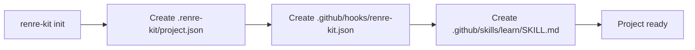
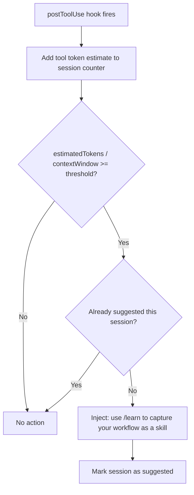
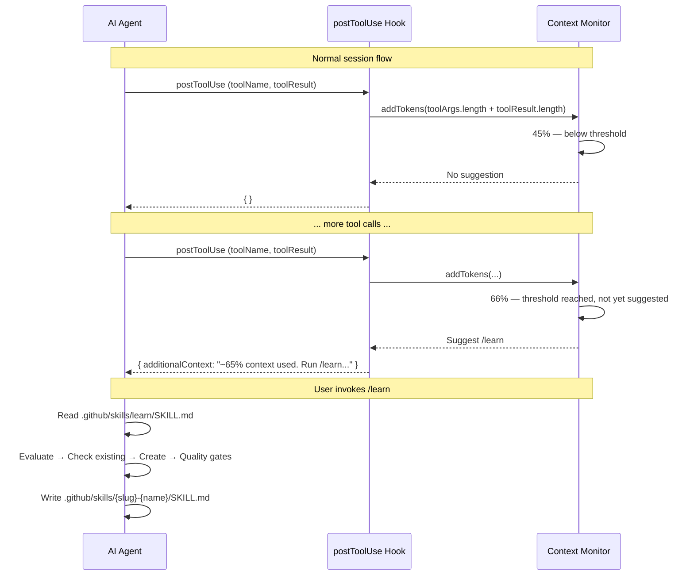

# ADR-040: Default `/learn` Skill & Context Usage Monitor

## Status
Accepted

## Context

AI agent sessions accumulate valuable knowledge — debugging insights, workarounds, multi-step workflows, tool integration patterns. This knowledge is lost when the session ends or context is compacted. While session memory (ADR-027) captures summaries, it doesn't capture **reusable procedural knowledge** — the kind that turns into skills.

Two problems to solve:

1. **Knowledge capture**: Give users a way to extract reusable workflows from sessions into skill files
2. **Timely nudge**: Remind users to capture knowledge *before* context is compacted — at 60-70% context usage, not after it's too late

## Decision

### 1. Default `/learn` Skill

When `renre-kit init` or `renre-kit marketplace add` sets up a project, a built-in `/learn` skill is installed at `.github/skills/learn/SKILL.md`. This is a **core skill** — not an extension skill — always present in every RenRe Kit project.

#### Skill File: `.github/skills/learn/SKILL.md`

```markdown
---
description: Use after significant debugging, workarounds, or multi-step workflows worth standardizing for future sessions
model: sonnet
---

# /learn - Online Learning System

**Extract reusable knowledge from this session into skills.** Evaluates what was learned, checks for existing skills, creates new ones when valuable.

---

## Phase 0: Reference

### Triggers

| Trigger | Example |
|---------|---------|
| **Non-obvious debugging** | Spent 10+ minutes; solution wasn't in docs |
| **Misleading errors** | Error message pointed wrong direction; found real cause |
| **Workarounds** | Found limitation and creative solution |
| **Tool integration** | Undocumented API/tool usage |
| **Trial-and-error** | Tried multiple approaches before finding what worked |
| **Repeatable workflow** | Multi-step task that will recur |
| **External service queries** | Fetched from Jira, GitHub, Confluence |
| **User-facing automation** | Reports, status checks user will ask for again |

### Quality Criteria

- **Reusable**: Will help future tasks, not just this instance
- **Non-trivial**: Required discovery or is a valuable workflow pattern
- **Verified**: Solution actually worked

**Do NOT extract:** Single-step tasks, one-off fixes, knowledge in official docs.

### Project Slug

Prefix ALL created skills with the project slug to avoid name collisions across repos.

\```bash
SLUG=$(basename "$(git remote get-url origin 2>/dev/null | sed 's/\.git$//')" 2>/dev/null || basename "$PWD")
\```

Skill directory: `.github/skills/{slug}-{name}/SKILL.md`

**Keep names short.** The slug provides context; the name should be 1-3 words max.
Examples: `pilot-shell-lsp-cleaner`, `my-api-auth-flow`, `acme-deploy`.

### Skill Structure

**Location:** `.github/skills/{slug}-{skill-name}/SKILL.md`

\```markdown
---
name: {slug}-descriptive-kebab-case-name
description: |
  [CRITICAL: Describe WHEN to use, not HOW it works.
   Include trigger conditions, scenarios, exact error messages.]
author: Claude Code
version: 1.0.0
---

# Skill Name

## Problem
## Context / Trigger Conditions
## Solution
## Verification
## Example
## References
\```

**The Description Trap:** If description summarizes the workflow, the agent follows the
short description as a shortcut instead of reading SKILL.md. Always describe trigger
conditions, not process.

**Guidelines:** Concise. Under 1000 lines. Examples over explanations.

---

## Phase 1: Evaluate

Ask yourself:

1. "What did I learn that wasn't obvious before starting?"
2. "Would future-me benefit from having this documented?"
3. "Was the solution non-obvious from docs alone?"
4. "Is this a multi-step workflow I'd repeat?"
5. "Did I query an external service the user will ask about again?"

**If NO to all → Skip, nothing to learn.**

---

## Phase 2: Check Existing

\```bash
ls .github/skills/ 2>/dev/null
rg -i "keyword" .github/skills/ 2>/dev/null
\```

| Found | Action |
|-------|--------|
| Nothing related | Create new |
| Same trigger/fix | Update existing (bump version) |
| Partial overlap | Update with new variant |

---

## Phase 3: Create Skill

Write to `.github/skills/{slug}-{skill-name}/SKILL.md` using the template from Phase 0.
Ensure description contains specific trigger conditions and the name is prefixed with
the project slug.

---

## Phase 4: Quality Gates

- [ ] Description contains specific trigger conditions
- [ ] Solution verified to work
- [ ] Specific enough to be actionable
- [ ] General enough to be reusable
- [ ] No sensitive information
```

#### Installation

The `/learn` skill is installed as part of `renre-kit init`:



- Installed by CLI `init` command — not by marketplace
- Not listed in any extension manifest — it's a core skill
- Can be customized by the user (it's just a markdown file)
- Not overwritten on `renre-kit` upgrades if user has modified it (checksum comparison)

### 2. Context Usage Monitor

A lightweight tracker that runs on `postToolUse`. It estimates how much of the agent's context window has been consumed and suggests `/learn` once when usage hits 60-70%.

#### Token Estimation

Each hook event adds to a running token counter per session:

| Event | Token Estimate |
|-------|---------------|
| `userPromptSubmitted` | `prompt.length / 4` |
| `postToolUse` | `(toolArgs.length + toolResult.length) / 4` |
| `errorOccurred` | `(error.message.length + (error.stack?.length ?? 0)) / 4` |

`~4 chars per token` — same heuristic as the context recipe engine (ADR-035).

#### Agent Context Window Sizes

Derived from the `agent` field in the session:

| Agent | Estimated Context Window |
|-------|------------------------|
| `copilot` | 128,000 tokens |
| `claude-code` | 200,000 tokens |
| `cursor` | 128,000 tokens |
| default | 128,000 tokens |

Configurable in project settings:

```json
{
  "contextMonitor": {
    "enabled": true,
    "agentContextWindows": {
      "copilot": 128000,
      "claude-code": 200000,
      "cursor": 128000
    },
    "suggestThreshold": 0.65
  }
}
```

#### Monitor Flow

Simple: accumulate tokens → check threshold → suggest once.



No pattern analysis, no trigger detection. The `/learn` skill itself (Phase 1: Evaluate) decides whether the session contains anything worth extracting. The monitor's only job is **timing the nudge**.

#### Suggestion

When threshold is reached, the monitor returns `additionalContext` in the `postToolUse` response:

```json
{
  "additionalContext": "You've used ~65% of your context window. Consider running /learn to capture reusable knowledge from this session before context is compacted."
}
```

- **Once per session** — flag prevents repeated suggestions
- **Non-blocking** — `additionalContext` only, no deny/block
- **Early enough** — 60-70% gives plenty of time before compaction (~90%)

### 3. Data Flow — End to End



### 4. Session Timeline Integration

The suggestion appears in the session timeline (ADR-033):

```
│  14:30 🔧 bash: pnpm test                             ✓     │
│         │                                                    │
│  14:31 💡 Context monitor: ~65% — suggested /learn           │
│         │                                                    │
│  14:32 💬 "/learn"                                           │
│         │                                                    │
│  14:33 🔧 create .github/skills/myapp-auth-refactor/SKILL.md │
```

### 5. Console UI — Context Usage Indicator

The session timeline page (ADR-039) shows a context usage bar in the session header:

```
┌─ Session Timeline ─────────────────────────────────────────┐
│                                                             │
│  Session: session-abc │ Agent: Claude Code │ Duration: 45m  │
│  Context: ████████████████░░░░░░░░  66%  │  /learn suggested│
│                                                             │
```

API: `GET /api/{pid}/sessions/:id/context-usage` — returns token estimate for the session.

## Consequences

### Positive
- **Knowledge capture at the right time** — before compaction, when full context is still available
- **Simple mechanism** — just a token counter + threshold, no complex heuristics
- **Self-improving projects** — skills accumulate over time, each session builds on previous ones
- **Non-intrusive** — single `additionalContext` suggestion, once per session
- **Portable** — skills are plain markdown in `.github/skills/`, work with any agent
- **Composable** — `/learn` is itself a skill, users can customize it

### Negative
- **Token estimation is approximate** — `length / 4` is a heuristic, not exact
- **Agent may ignore the suggestion** — `additionalContext` is advisory, not forced
- **Skill quality varies** — depends on agent's ability to extract and structure knowledge

### Mitigations
- Token estimation errs conservative (suggest at 60-65%, well before compaction at ~90%)
- Suggestion text is explicit and actionable — agents reliably surface these
- `/learn` skill has built-in quality gates (Phase 4)
- Users can edit generated skills — they're just markdown files
