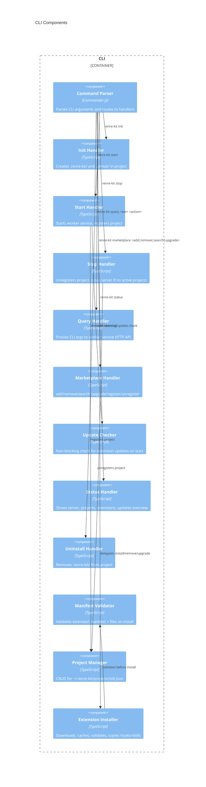
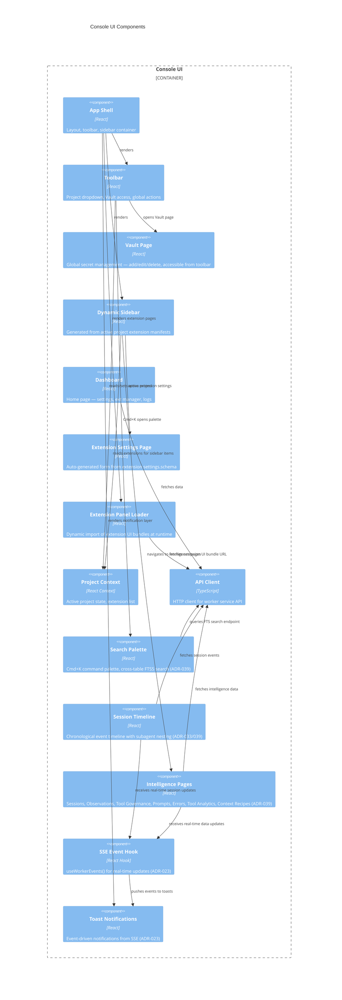

# C4 Level 3 — Component Diagram

## Description
Shows internal components within each container.

---

## CLI Components

```mermaid
C4Component
    title CLI Components

    Container_Boundary(cli, "CLI") {
        Component(cmdParser, "Command Parser", "Commander.js", "Parses CLI arguments and routes to handlers")
        Component(initCmd, "Init Handler", "TypeScript", "Creates .renre-kit/ and .github/ in project")
        Component(startCmd, "Start Handler", "TypeScript", "Starts worker service, registers project")
        Component(stopCmd, "Stop Handler", "TypeScript", "Unregisters project, stops server if no active projects")
        Component(queryCmd, "Query Handler", "TypeScript", "Proxies CLI args to worker service HTTP API")
        Component(marketplaceCmd, "Marketplace Handler", "TypeScript", "add/remove/search/upgrade/register/unregister")
        Component(updateChecker, "Update Checker", "TypeScript", "Non-blocking check for extension updates on start")
        Component(statusCmd, "Status Handler", "TypeScript", "Shows server, projects, extensions, updates overview")
        Component(uninstallCmd, "Uninstall Handler", "TypeScript", "Removes .renre-kit/ from project")
        Component(manifestValidator, "Manifest Validator", "TypeScript", "Validates extension manifest + files on install")
        Component(projectMgr, "Project Manager", "TypeScript", "CRUD for ~/.renre-kit/projects/{id}.json")
        Component(extInstaller, "Extension Installer", "TypeScript", "Downloads, caches, validates, copies hooks/skills")
    }

    Rel(cmdParser, initCmd, "renre-kit init")
    Rel(cmdParser, startCmd, "renre-kit start")
    Rel(cmdParser, stopCmd, "renre-kit stop")
    Rel(cmdParser, queryCmd, "renre-kit query <ext> <action>")
    Rel(cmdParser, marketplaceCmd, "renre-kit marketplace <add|remove|search|upgrade>")
    Rel(startCmd, updateChecker, "non-blocking update check")
    Rel(cmdParser, statusCmd, "renre-kit status")
    Rel(cmdParser, uninstallCmd, "renre-kit uninstall")
    Rel(extInstaller, manifestValidator, "validates before install")
    Rel(marketplaceCmd, extInstaller, "delegates install/remove/upgrade")
    Rel(startCmd, projectMgr, "registers project")
    Rel(stopCmd, projectMgr, "unregisters project")
```

---

## Worker Service Components

```mermaid
C4Component
    title Worker Service Components

    Container_Boundary(worker, "Worker Service") {
        Component(app, "Express App", "Express.js", "Core HTTP server, middleware, static serving")
        Component(healthRoute, "Health Route", "Express Router", "GET /health — built-in")
        Component(projectRouter, "Project Router", "Express.js", "Namespace routes by /api/{project-id}/...")
        Component(extLoader, "Extension Loader", "TypeScript", "Lazy-loads extension routers on project activation")
        Component(extRegistry, "Extension Registry", "TypeScript", "Tracks loaded extensions per project, mount/unmount")
        Component(vault, "Vault (Core)", "TypeScript", "Global secret store — encrypted SQLite, resolves ${VAULT:key} at mount time")
        Component(vaultApi, "Vault API (Internal)", "Express Router", "Internal routes for Console UI CRUD — never exposes secret values to extensions")
        Component(settingsResolver, "Settings Resolver", "TypeScript", "Resolves extension settings + Vault refs at mount time")
        Component(dbManager, "DB Manager", "better-sqlite3", "Connection pool, migration runner, project-scoped queries")
        Component(scopedDb, "ScopedDatabase", "TypeScript", "Table prefix enforcement, automatic project_id injection (ADR-019)")
        Component(uiServer, "UI Asset Server", "Express Static", "Serves React SPA + extension UI bundles")
        Component(projectApi, "Project API", "Express Router", "GET /api/projects — list active projects")
        Component(extApi, "Extension API", "Express Router", "GET /api/{project-id}/extensions — list extensions")
        Component(eventBus, "EventBus", "Node.js EventEmitter", "Typed event system for SSE broadcasting (ADR-023)")
        Component(sseEndpoint, "SSE Endpoint", "Express Router", "GET /api/events — Server-Sent Events to Console UI (ADR-023)")
        Component(hookFeatureRegistry, "Hook Feature Registry", "TypeScript", "Tracks core + extension hook features per event (ADR-037)")
        Component(hookRequestQueue, "Hook Request Queue", "TypeScript", "Batch processing, parallel execution, cache (ADR-037)")
        Component(hookResponseAggregator, "Hook Response Aggregator", "TypeScript", "Merges responses from multiple features (ADR-037)")
        Component(extCircuitBreaker, "Extension Circuit Breaker", "TypeScript", "5-error suspension, cooldown doubling, memory monitoring (ADR-002)")
        Component(backupManager, "Backup Manager", "TypeScript", "Pre-migration backups, retention, integrity checks (ADR-042)")
        Component(sessionMemory, "Session Memory Service", "TypeScript", "Session capture, context injection, checkpoints (ADR-027)")
        Component(observations, "Observations Service", "TypeScript", "CRUD, dedup, injection priority (ADR-028)")
        Component(toolGovernance, "Tool Governance Service", "TypeScript", "Rule evaluation, audit logging (ADR-029)")
        Component(promptJournal, "Prompt Journal Service", "TypeScript", "Prompt recording, intent detection (ADR-030)")
        Component(errorIntelligence, "Error Intelligence Service", "TypeScript", "Fingerprinting, pattern detection (ADR-031)")
        Component(toolAnalytics, "Tool Analytics Service", "TypeScript", "Usage tracking, pattern detection (ADR-032)")
        Component(subagentTracking, "Subagent Tracking Service", "TypeScript", "Lifecycle tracking, tree construction (ADR-034)")
        Component(contextRecipeEngine, "Context Recipe Engine", "TypeScript", "Provider pipeline, token budget (ADR-035)")
        Component(contextMonitor, "Context Monitor", "TypeScript", "Token usage tracking, /learn suggestion (ADR-040)")
        Component(ftsSearch, "FTS Search Service", "better-sqlite3 FTS5", "Full-text search across tables (ADR-038)")
        Component(autoPurge, "Auto-Purge Scheduler", "TypeScript", "Daily cleanup of aged data (ADR-027-032)")
        Component(mcpValidator, "MCP Command Validator", "TypeScript", "Allowlist enforcement, metacharacter rejection (ADR-008)")
    }

    Rel(app, vaultApi, "/api/vault/* (internal)")
    Rel(vaultApi, vault, "CRUD operations")
    Rel(app, healthRoute, "/health")
    Rel(app, projectRouter, "/api/{project-id}/*")
    Rel(app, projectApi, "/api/projects")
    Rel(app, uiServer, "/ static assets")
    Rel(app, sseEndpoint, "/api/events")
    Rel(sseEndpoint, eventBus, "subscribes to typed events")
    Rel(projectRouter, extRegistry, "resolve extension router")
    Rel(extRegistry, extLoader, "lazy load on first request")
    Rel(extRegistry, extCircuitBreaker, "checks circuit state before routing")
    Rel(extLoader, settingsResolver, "resolve extension settings")
    Rel(settingsResolver, vault, "resolve ${VAULT:key} references")
    Rel(extLoader, dbManager, "run migrations if needed")
    Rel(extLoader, mcpValidator, "validates MCP commands on spawn")
    Rel(dbManager, scopedDb, "provides scoped access per extension")
    Rel(dbManager, backupManager, "pre-migration backup")
    Rel(extApi, extRegistry, "list loaded extensions")
    Rel(hookRequestQueue, hookFeatureRegistry, "resolves features for event")
    Rel(hookRequestQueue, hookResponseAggregator, "collects and merges responses")
    Rel(sessionMemory, dbManager, "persists session data")
    Rel(sessionMemory, eventBus, "emits session events")
    Rel(observations, dbManager, "persists observations")
    Rel(toolGovernance, dbManager, "persists rules and audit logs")
    Rel(promptJournal, dbManager, "persists prompts")
    Rel(errorIntelligence, dbManager, "persists error fingerprints")
    Rel(toolAnalytics, dbManager, "persists tool usage")
    Rel(subagentTracking, dbManager, "persists subagent trees")
    Rel(contextRecipeEngine, dbManager, "reads recipe definitions")
    Rel(contextRecipeEngine, contextMonitor, "checks token budget")
    Rel(ftsSearch, dbManager, "queries FTS5 indexes")
    Rel(autoPurge, dbManager, "deletes aged records")
```

---

## Console UI Components

```mermaid
C4Component
    title Console UI Components

    Container_Boundary(ui, "Console UI") {
        Component(shell, "App Shell", "React", "Layout, toolbar, sidebar container")
        Component(toolbar, "Toolbar", "React", "Project dropdown, Vault access, global actions")
        Component(vaultUI, "Vault Page", "React", "Global secret management — add/edit/delete, accessible from toolbar")
        Component(sidebar, "Dynamic Sidebar", "React", "Generated from active project extension manifests")
        Component(dashboard, "Dashboard", "React", "Home page — settings, ext manager, logs")
        Component(extSettingsPage, "Extension Settings Page", "React", "Auto-generated form from extension settings.schema")
        Component(extPanelLoader, "Extension Panel Loader", "React", "Dynamic import of extension UI bundles at runtime")
        Component(projectCtx, "Project Context", "React Context", "Active project state, extension list")
        Component(apiClient, "API Client", "TypeScript", "HTTP client for worker service API")
        Component(searchPalette, "Search Palette", "React", "Cmd+K command palette, cross-table FTS5 search (ADR-039)")
        Component(sessionTimeline, "Session Timeline", "React", "Chronological event timeline with subagent nesting (ADR-033/039)")
        Component(intelligencePages, "Intelligence Pages", "React", "Sessions, Observations, Tool Governance, Prompts, Errors, Tool Analytics, Context Recipes (ADR-039)")
        Component(sseEventHook, "SSE Event Hook", "React Hook", "useWorkerEvents() for real-time updates (ADR-023)")
        Component(toastNotifications, "Toast Notifications", "React", "Event-driven notifications from SSE (ADR-023)")
    }

    Rel(shell, toolbar, "renders")
    Rel(toolbar, vaultUI, "opens Vault page")
    Rel(shell, sidebar, "renders")
    Rel(shell, extPanelLoader, "renders extension pages")
    Rel(shell, toastNotifications, "renders notification layer")
    Rel(sidebar, extSettingsPage, "opens extension settings")
    Rel(sidebar, intelligencePages, "navigates to intelligence pages")
    Rel(toolbar, projectCtx, "reads/sets active project")
    Rel(toolbar, searchPalette, "Cmd+K opens palette")
    Rel(sidebar, projectCtx, "reads extensions for sidebar items")
    Rel(extPanelLoader, apiClient, "fetches extension UI bundle URL")
    Rel(dashboard, apiClient, "fetches data")
    Rel(searchPalette, apiClient, "queries FTS search endpoint")
    Rel(sessionTimeline, apiClient, "fetches session events")
    Rel(intelligencePages, apiClient, "fetches intelligence data")
    Rel(sseEventHook, toastNotifications, "pushes events to toasts")
    Rel(sessionTimeline, sseEventHook, "receives real-time session updates")
    Rel(intelligencePages, sseEventHook, "receives real-time data updates")
```
