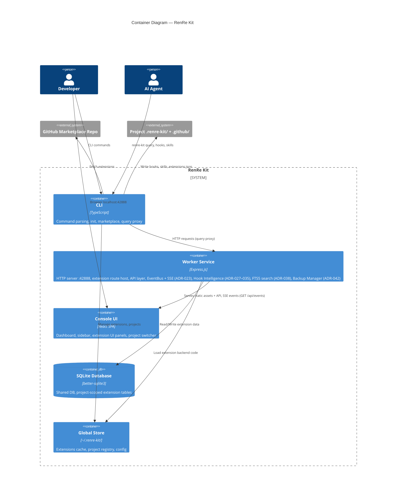

# C4 Level 2 — Container Diagram

## Description
Shows the major runtime containers within RenRe Kit and their responsibilities.

## Containers

| Container | Technology | Responsibility |
|-----------|-----------|----------------|
| CLI | TypeScript (Node.js) | Command parsing, project init, extension management, query proxy |
| Worker Service | Express.js (Node.js), EventEmitter (SSE), FTS5 (search), worker-service.cjs (hook entry point) | HTTP server on port 42888, hosts extension routes, serves UI, EventBus + SSE endpoint for real-time communication (ADR-023), Hook Intelligence services (ADR-027–035), FTS5 full-text search (ADR-038), Backup Manager for database backup/recovery (ADR-042) |
| Console UI | React SPA | Dashboard, project switcher, extension UI panels, sidebar |
| SQLite Database | better-sqlite3 (WAL mode, FTS5) | Shared DB with project-scoped tables for extensions, full-text search indexes |
| Global Store | File System | `~/.renre-kit/` — extensions cache, project registry, config |
| Project Store | File System | `.renre-kit/` + `.github/` — per-project extension config, hooks, skills |

## Key Interactions
1. **CLI → Worker Service**: The `query` command proxies to worker service routes
2. **Worker Service → DB**: Extensions read/write project-scoped data; FTS5 indexes enable full-text search (ADR-038); Backup Manager handles database backup/recovery (ADR-042)
3. **Worker Service → UI**: Serves the React SPA and extension UI bundles; pushes real-time updates via SSE events on `GET /api/events` through the internal EventBus (ADR-023)
4. **CLI → File System**: `init`, `marketplace add/remove` modify project and global stores
5. **AI Agent → Worker Service**: Hooks executed via `worker-service.cjs` entry point; Hook Intelligence services provide smart context (ADR-027–035)
