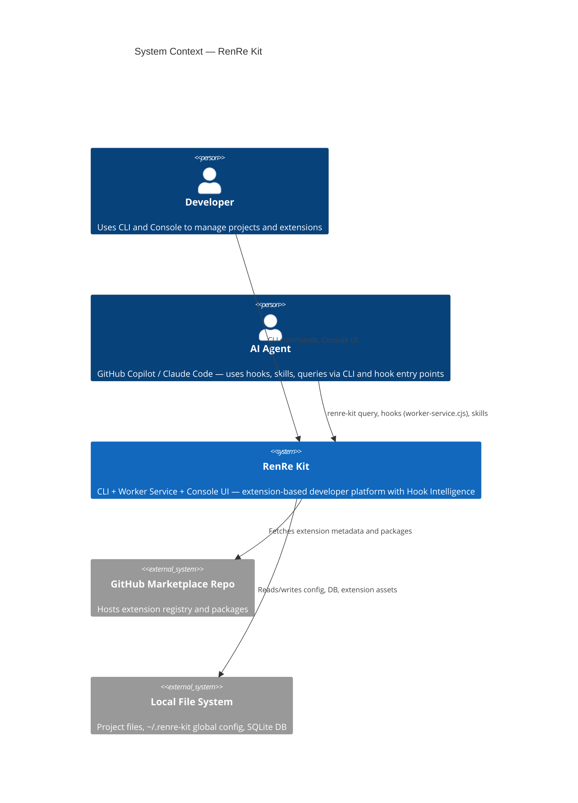

# C4 Level 1 — System Context Diagram

## Description
Shows RenRe Kit as a whole and how it interacts with external actors and systems.

## Actors & Systems
- **Developer** — Uses CLI commands and Console UI to manage projects and extensions
- **AI Agent** (GitHub Copilot / Claude Code) — Consumes hooks, skills, and queries worker service via CLI and hook entry points (worker-service.cjs)
- **GitHub Marketplace Repo** — Source of extension packages
- **Local File System** — Project files, global config, SQLite database

## Narrative
RenRe Kit sits between the developer/AI agent and their project tooling. It provides both a CLI and Console UI for developers to manage projects and extensions, and intelligent context management for AI agents. Instead of MCP, context is delivered through a local worker service accessible via CLI (`renre-kit query`), hook entry points (`worker-service.cjs`) for event capture and context injection, and file-based integration (hooks in `.github/hooks/`, skills in `.github/skills/`). Hook Intelligence captures session data, tool usage patterns, error patterns, and observations via Copilot hooks to provide AI agents with contextual intelligence. Extensions are the primary unit of functionality — RenRe Kit itself is a minimal OS-like shell.
