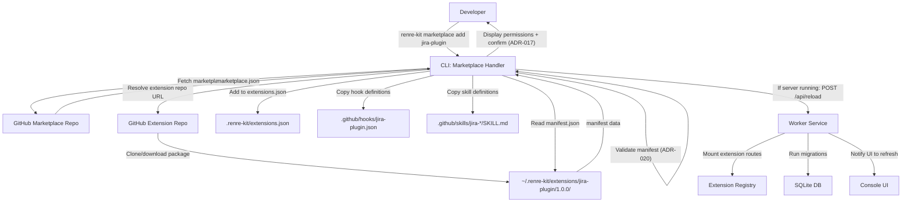

# DFD — Extension Install Flow

## Description
Data flow when a user installs an extension via `renre-kit marketplace add <extension-name>`.

## Data Stores Affected
| Store | Operation | Data |
|-------|-----------|------|
| `~/.renre-kit/extensions/{name}/{version}/` | Write | Full extension package |
| `.renre-kit/extensions.json` | Update | Add extension entry |
| `.github/hooks/{name}.json` | Write | Hook definitions from manifest |
| `.github/skills/{skill}/SKILL.md` | Write | Skill files from extension |
| SQLite DB | Migrate | Extension tables (project-scoped) |

## Notes
- Extension packages are cached globally — shared across projects
- Only hooks/skills and extensions.json are project-specific
- If the server is not running, route mounting and migrations happen on next `renre-kit start`
