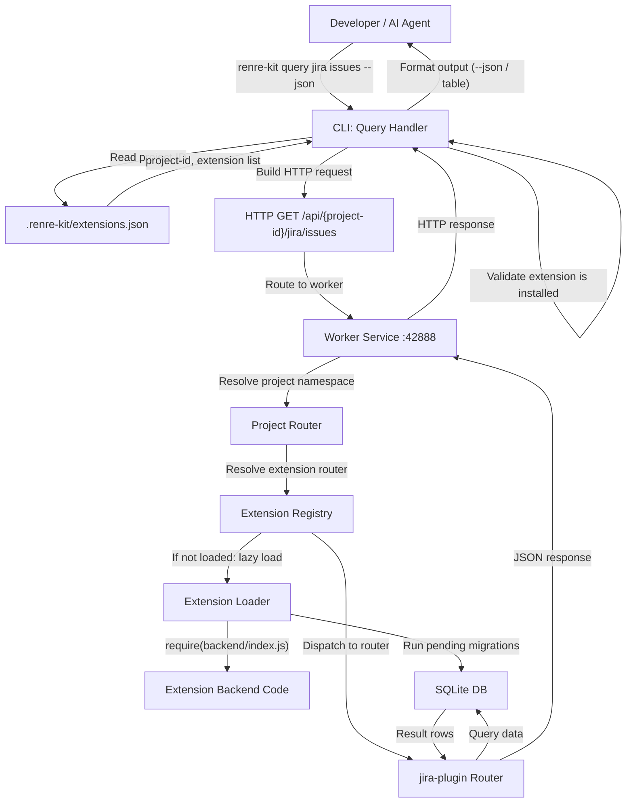

# DFD — CLI Query Command Flow

## Description
Data flow when an AI agent or developer uses `renre-kit query <extension> <action>`.

## Data Flow Summary
| Step | From | To | Data |
|------|------|----|------|
| 1 | Actor | CLI | Command args: extension, action, flags |
| 2 | CLI | Project Config | Read project ID |
| 3 | CLI | Worker Service | HTTP request with project-scoped URL |
| 4 | Worker | Extension Registry | Route resolution |
| 5 | Extension Router | SQLite DB | Query with project_id scope |
| 6 | Worker | CLI | JSON response body |
| 7 | CLI | Actor | Formatted output (JSON or table) |

## Notes
- The CLI never talks to SQLite directly — always proxies through the worker service
- Extension routers are lazy-loaded on first request (see ADR-002)
- All DB queries are scoped by project ID
- `--json` flag outputs raw JSON; default is human-readable table format
