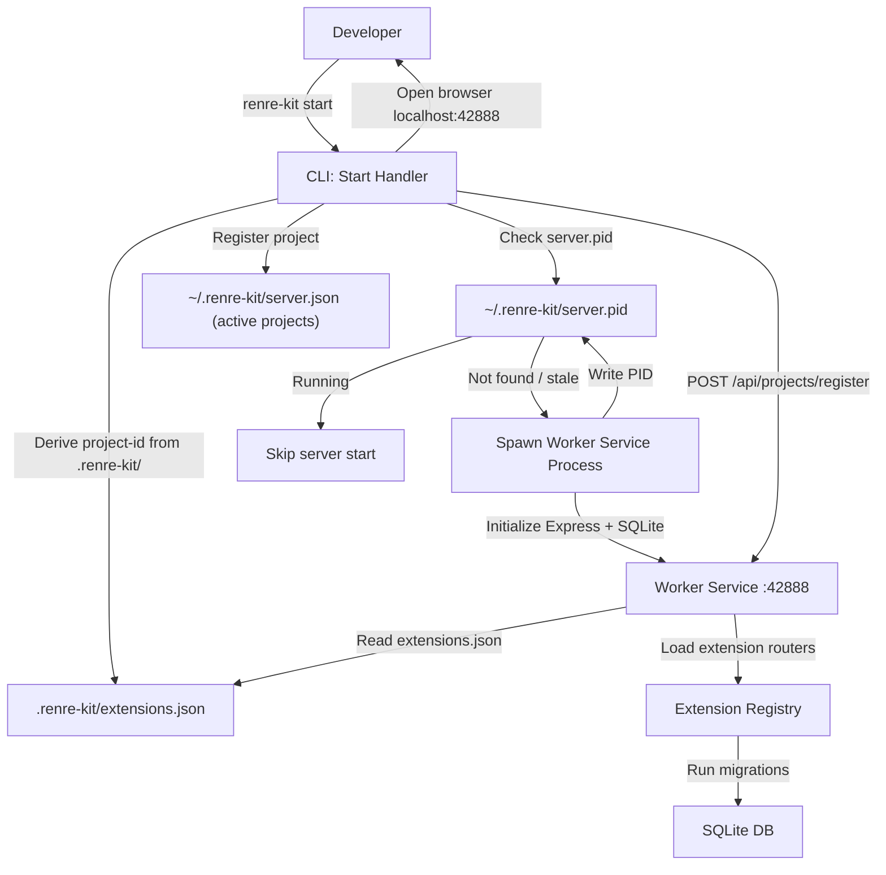
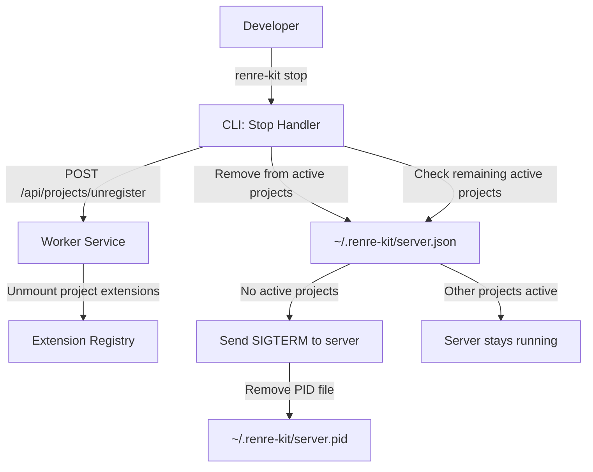

# DFD — Server Lifecycle Flow

## Description
Data flow for server start, project registration, and server stop.

---

## Server Start (`renre-kit start`)

---

## Server Stop (`renre-kit stop`)

---

## Data Stores
| Store | Purpose |
|-------|---------|
| `~/.renre-kit/server.pid` | Tracks server process PID |
| `~/.renre-kit/server.json` | List of active project registrations |
| `.renre-kit/extensions.json` | Project's installed extensions |
| SQLite DB | Extension data (migrated on mount) |
