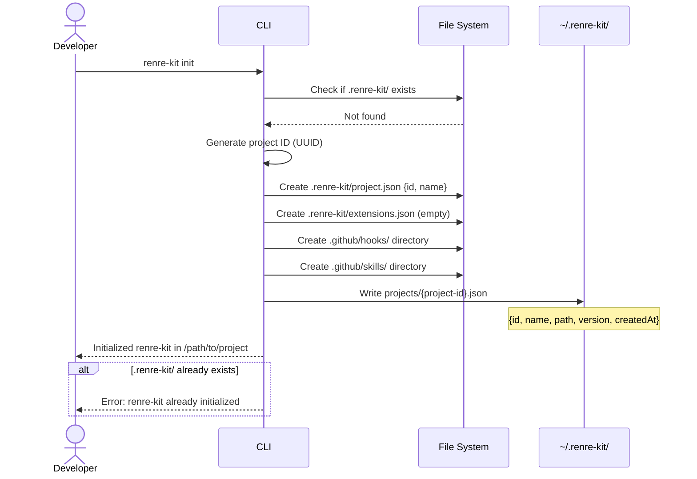

# Sequence Diagram — `renre-kit init`

## Description
Initializes RenRe Kit in the current project directory.

## Files Created
| File | Content |
|------|---------|
| `.renre-kit/project.json` | `{ "id": "<uuid>", "name": "<folder-name>" }` |
| `.renre-kit/extensions.json` | `{ "extensions": [] }` |
| `.github/hooks/` | Empty directory |
| `.github/skills/` | Empty directory |
| `~/.renre-kit/projects/{id}.json` | Project metadata |

## CLI Project Resolution
When any CLI command runs (e.g., `renre-kit query`), it resolves the project by:
1. Looking for `.renre-kit/project.json` in the current directory
2. If not found, walking up parent directories until found
3. Reading `project.json` to get the project `id`
4. Using that `id` for API route namespacing (`/api/{project-id}/...`)
