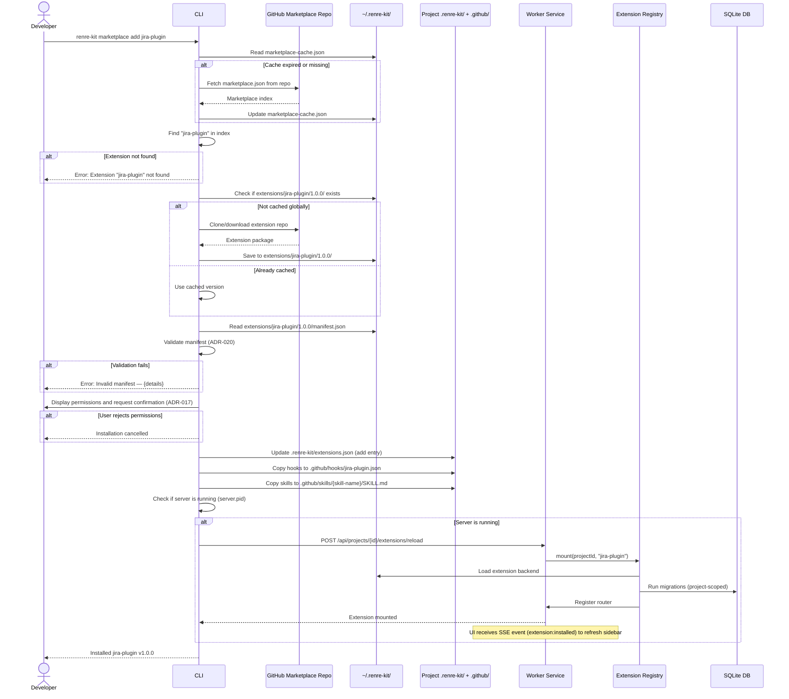

# Sequence Diagram — `renre-kit marketplace add`

## Description
Installs an extension from the marketplace into the current project.

## Error Cases
| Error | Handling |
|-------|----------|
| Extension not in marketplace | Show error, suggest `marketplace search` |
| Extension already installed in project | Show warning, offer `--force` to reinstall |
| Download failure | Retry once, then show error with manual install instructions |
| Migration failure | Rollback, unmount extension, show error |
