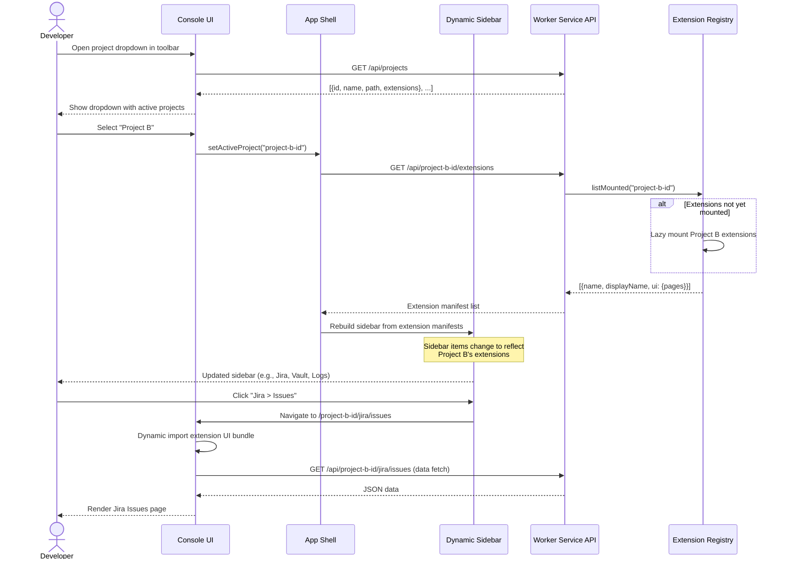

# Sequence Diagram — Console Project Switch

## Description
User switches between active projects in the Console UI toolbar dropdown.

## State Management
| State | Scope | Storage |
|-------|-------|---------|
| Active project ID | UI session | React Context + localStorage |
| Project list | Server | `~/.renre-kit/server.json` |
| Extension manifests | Per-project | Loaded from extension registry |
| Sidebar items | UI | Derived from active project's extensions |

## Notes
- Project switch is instant — no page reload required
- Extension UI bundles are loaded lazily on first navigation
- Sidebar completely rebuilds when switching projects
- URL structure includes project ID: `/{project-id}/{extension}/{page}`
