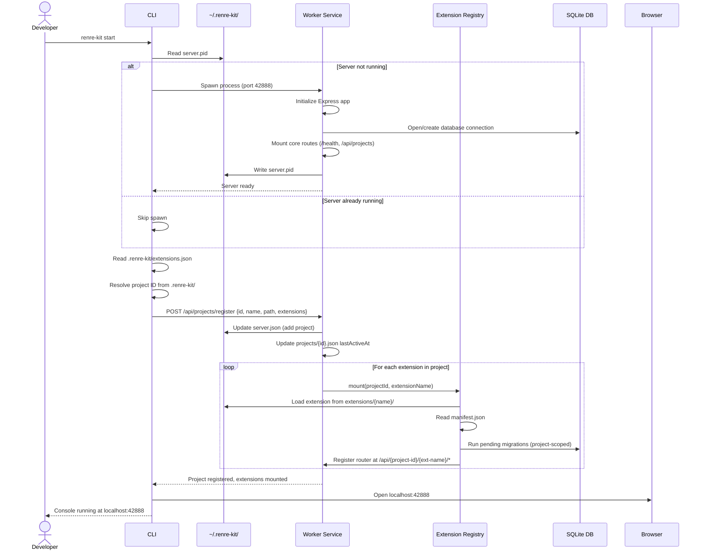

# Sequence Diagram — `renre-kit start`

## Description
Starts the worker service (if not running) and registers the current project.

```mermaid
sequenceDiagram
    actor Dev as Developer
    participant CLI as CLI
    participant GlobalStore as ~/.renre-kit/
    participant Worker as Worker Service
    participant ExtRegistry as Extension Registry
    participant DB as SQLite DB
    participant Browser as Browser

    Dev->>CLI: renre-kit start
    CLI->>GlobalStore: Read server.pid

    alt Server not running
        CLI->>Worker: Spawn process (port 42888)
        Worker->>Worker: Initialize Express app
        Worker->>DB: Open/create database connection
        Worker->>Worker: Mount core routes (/health, /api/projects)
        Worker->>GlobalStore: Write server.pid
        Worker-->>CLI: Server ready
    else Server already running
        CLI->>CLI: Skip spawn
    end

    CLI->>CLI: Read .renre-kit/extensions.json
    CLI->>CLI: Resolve project ID from .renre-kit/

    CLI->>Worker: POST /api/projects/register {id, name, path, extensions}
    Worker->>GlobalStore: Update server.json (add project)
    Worker->>Worker: Update projects/{id}.json lastActiveAt

    loop For each extension in project
        Worker->>ExtRegistry: mount(projectId, extensionName)
        ExtRegistry->>GlobalStore: Load extension from extensions/{name}/
        ExtRegistry->>ExtRegistry: Read manifest.json
        ExtRegistry->>DB: Run pending migrations (project-scoped)
        ExtRegistry->>Worker: Register router at /api/{project-id}/{ext-name}/*
    end

    Worker-->>CLI: Project registered, extensions mounted

    CLI->>Browser: Open localhost:42888
    CLI-->>Dev: Console running at localhost:42888
```
