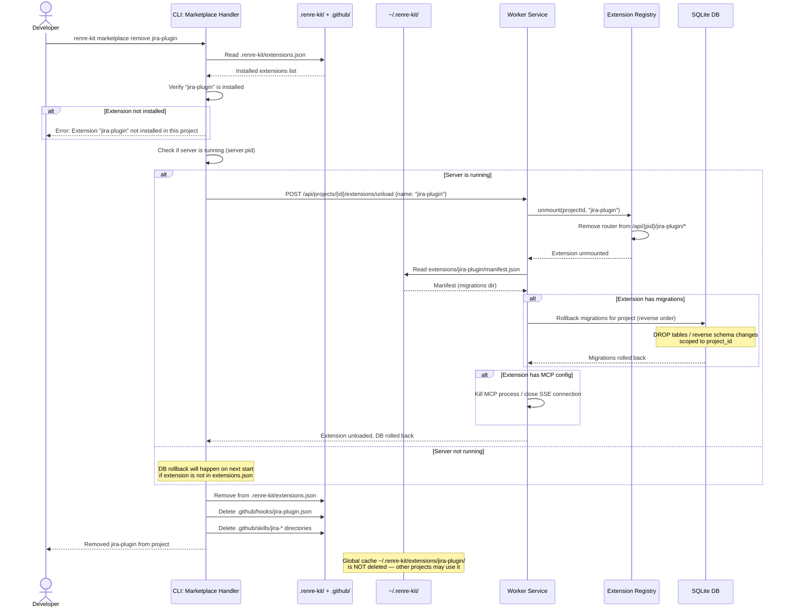

# Sequence Diagram — `renre-kit marketplace remove`

## Description
Uninstalls an extension from the current project. Rolls back DB migrations, removes hooks/skills, and unmounts from worker service.

## Cleanup Summary
| Artifact | Action |
|----------|--------|
| `.renre-kit/extensions.json` | Remove extension entry + settings |
| `.github/hooks/{ext-name}.json` | Delete file |
| `.github/skills/{skill-name}/` | Delete directories for this extension's skills |
| SQLite DB tables | Rollback migrations (project-scoped rows/tables) |
| Extension routes | Unmount from worker service |
| MCP process/connection | Kill (stdio) or close (SSE) |
| `~/.renre-kit/extensions/{name}/` | **Kept** — shared global cache |

## Error Cases
| Error | Handling |
|-------|----------|
| Extension not installed | Show error |
| Migration rollback fails | Abort uninstall, show error, suggest manual cleanup |
| Server not running | Remove files, mark DB rollback as pending |
| Hook/skill files already deleted | Skip silently |
